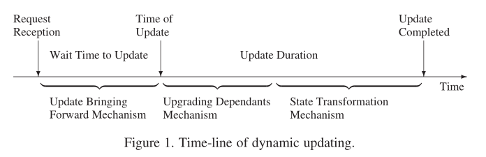
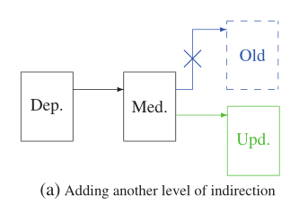
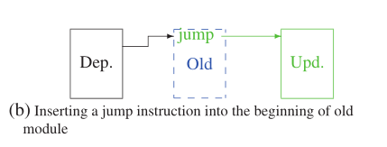
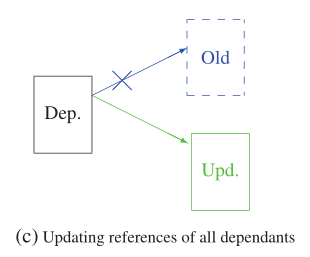
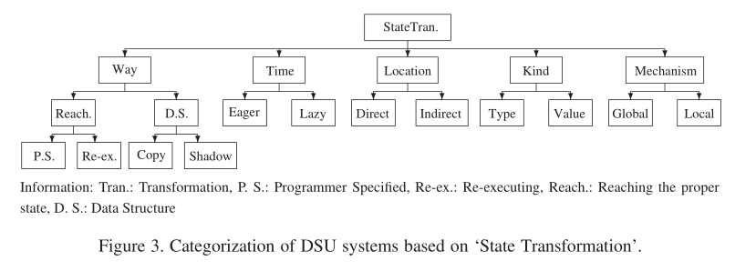
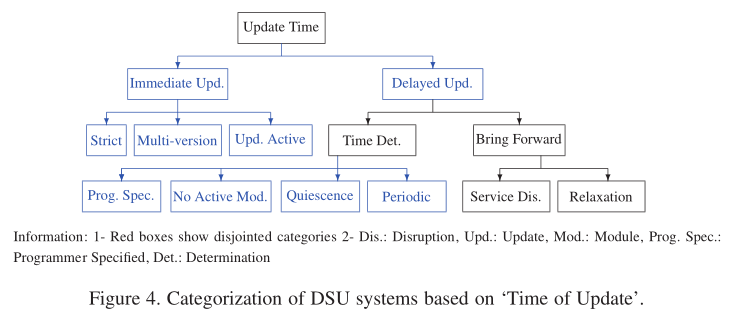
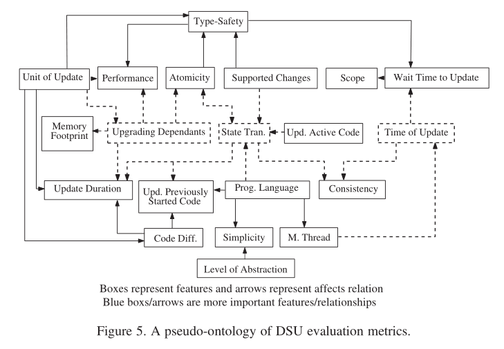

# dynamic software updating 

## 1. 评价指标

### 1.1 Capabilities and constraints

#### 1.1.1 根据 DSU 系统的范围进行分类

根据 DSU 文献为动态更新系统指定了以下范围：

- server applications，服务器应用程序
- desktop applications，桌面应用程序
- operating systems，操作系统
- real-time and embedded systems，实时和嵌入式系统
- distributed systems，分布式系统
- business applications and databases，业务应用程序和数据库

#### 1.1.2 抽象级别

程序员指定其程序更新的抽象级别对简化 DSU 系统的使用起着关键作用。迄今为止，几乎所有 DSU 系统都通过编程器提供给系统的源代码发现新程序版本和旧程序版本之间的差异。将现有DSU研究工作分为：

- code level ，代码级别
- design level ，设计水平

#### 1.1.3 能够更新以前启动的代码

大多数动态更新系统要求其目标程序嵌入动态更新功能，而一些系统可以动态更新应用程序而不需要这种要求。重要的是，这个评估指标确定了动态更新长期使用的遗留系统的能力，这些系统是在没有考虑动态更新思想的情况下创建和执行的。

- 可以更新以前启动的代码
- 无法更新以前启动的代码

是否需要存在旧版本的程序源代码，以发现它与新版本源代码之间的差异。

- 需要较旧的源代码版本
- 不需要较旧源代码版本

#### 1.1.4 简单性

尽管简单性是软件系统的一个重要评估指标，但如果想要避免主观结果，测量它也不是一项微不足道的任务。为了尽可能客观地对 DSU 系统进行简单性分类，我们指定了一些固定标准：

- DSU 目标编程语言的流行程度
- DSU 目标抽象级别
- 系统为自动化一些常规例程提供的工具（或GUI）

如果动态更新系统提供了以上两个以上的标准，我们将其归类为“非常简单”子类。

如果动态更新系统提供了其中一个标准，我们将其归类为“简单”子类。

如果动态更新系统不提供任何标准，我们将其归类为“硬”DSU。

#### 1.1.5 一致性

将“一致性”和“类型安全性”作为不同的 DSU 评估指标，以区别于动态更新文献。

如果一个程序按照用户的期望“行为”，那么它就是一致的。

- 一致
- 与备注一致
- 不一致

#### 1.1.6 等待更新的时间和可预测性

仅在特殊程序点应用更新的动态软件更新系统应等到达到这些点后才进行更新，尽管系统会立即应用更新。在这种 DSU 系统中，需要减少等待时间。此外，在一些特殊的、确定性的系统中，适当更新点的等待时间也应该提前知道。

这个评估指标将动态更新系统分为三个子类：

- 即时的
- 可预测的
- 不可预测的

#### 1.1.7 更新持续时间

更新持续时间定义将更新应用于正在运行的程序的时间量。

如果DSU系统以原子方式应用更新，“更新持续时间”从客户端的角度转化为“中断持续时间”，这意味着更新越短，对使用程序的客户端的中断越少。

即使以非原子方式注入程序更新的 DSU 系统也应该具有短的更新持续时间，因为长的更新持续会导致与程序的正常执行并行地执行长的额外进程。

#### 1.1.8 代码清理

如果更新后未从内存中删除旧模块，则会出现内存占用。如果定期更新正在运行的应用程序，则情况会随着正在运行应用程序的每次更新而恶化。

因此，构建动态更新框架时应考虑代码清理，特别是当程序定期更新时。

#### 1.1.9 性能开销

动态软件更新系统通常在应用程序中嵌入额外的代码以简化其更新。然而，额外的代码会降低程序的性能。如果很少收到动态更新，这种性能下降会变得更严重。因此，在经常更新的程序中，应避免使用此类代码扩展应用程序。

#### 1.1.10 支持的更改

当向应用程序添加功能或从应用程序中删除错误时，它们的源代码不可避免地发生变化，有时会发生剧烈变化。如果使用中的 DSU 系统无法支持某些此类更改，例如对正在运行的程序的模块接口的更改，则系统成功应用各种更新的可能性较低。然而，过多的受支持更改也使得动态更新系统难以实现。

本调查中讨论的研究基于此评估指标将 DSU 系统分为两个子类：

- 可以更改模块接口，
- 不能更改模块接口

#### 1.1.11 编程语言

我们决定根据两个编程语言标准对 DSU 研究工作进行分类：编程语言的流行程度，将 DSU 系统分为三个子类：

- 使用流行的编程语言不变
- 使用不受欢迎的编程语言
- 修改流行的编程语言以添加动态更新功能

以及编程语言的类型，它将 DSU 系统分为其他三个子类：

- 过程型
- 函数型
- 面向对象型

#### 1.1.12 多线程支持

如今，由于多核系统的普及，多线程支持成为一个重要的评估指标。我们将 DSU 系统分为两类：

- 支持多线程
- 不支持多线程

### 1.2 处理动态软件更新问题的技术

#### 1.2.1 更新单位

在具有 `DSU` 功能的软件应用程序中，一旦运行程序的新版本准备就绪，应从旧版本中执行，并使用新版本继续执行。因此，关于应该将程序的哪些部分重新加载到内存中的决定可能是一个问题。动态更新系统采用三种不同的途径：

1. 更新程序的整个代码被加载到内存中
2. 只加载更新程序的修改模块
3. 程序被分成几个更新单元，如果更新单元的任何模块已被修改，则将更新单元的整个代码加载到内存中。

根据这些评估指标，我们将 `DSU` 系统分为三类：

1. 整个程序更换
2. 模块更新
3. 更新单元

#### 1.2.2 升级更新模块的从属项

- 升级更新模块的从属项指定了从属项重定向到更新模块的方式。当更新单元为 `2.模块更新` 或 `3.更新单元` 时，这是动态更新过程的重要步骤。
- 如果没有，因为模块通常可以加载到内存中而不会出现任何特殊问题，我们知道 `将模块加载到内存` 是 `升级更新模块的依赖项` 功能的强制部分，而不是单独的评估指标。

##### 1.2.2.1 第一种方法

**通过向程序中的所有访问添加一个间接级别来简化依赖项的更新**。每个函数调用或数据访问都是通过通常称为 `动态符号表`、`包装类`、`函数指针` 等的数据结构来执行的。然后，只要更新该数据结构即可升级更新模块的所有从属模块。

- 框表示程序的模块
- 从框 `Dep` 到框 `Old/New` 的箭头表示模块 `Dep` 依赖于模块 `Old/Nnew`

##### 1.2.2.2 第二种方法

**将跳转指令添加到旧模块的开头，以便将访问重定向到新模块**。与前一个一样，该技术消除了升级更新模块的每个从属模块的需要。

##### 1.2.2.3 第三种方法

模块的旧版本在同一位置被其新版本替换。尽管存在实现问题，特别是因为新代码的大小超过了旧版本，但这种方法不需要对依赖模块中更改的模块进行地址校正。

##### 1.2.2.4 第四种方法

许多 `DSU` 系统扫描整个程序，并纠正新加载模块及其从属模块的地址。

##### 1.2.2.5 总结

因此，我们将升级更新模块的从属项的技术分为四项：

1. 添加另一个间接级别
2. 代理（我们借用了动态通信框架（`DCF`）中的代理一词）
3. 替换
4. 升级所有更新模块的从属项

#### 1.2.3 更新原子性

原子性是指 `DSU` 系统在应用所请求的动态更新期间停止整个程序的执行，而不是与程序的正常执行并行应用。更新原子性在**保持一致性和服务中断持续时间之间的平衡方面**起着至关重要的作用。

##### 1.2.3.1 整个程序更换

以完全原子的步骤执行整个更新过程。这是在更新期间使系统不可用的同时进行最一致的更新方式。

##### 1.2.3.2 模块更新

整个更新过程与程序的正常执行并行执行。

##### 1.2.3.3 更新单元

更新过程被分成几个步骤，这些步骤要么不会危害一致性，要么会带来一些风险。然后，无风险步骤将与程序的执行并行运行，而风险步骤将在单独的原子操作中运行。实现一致性的无风险步骤包括将更新的模块加载到内存中或将传入请求排队，而有风险的步骤包括状态转换。

第三种技术平衡了被更新的应用程序的一致性和由于应用更新而导致的服务中断，因此，这比该领域的其他技术更强大。

基于原子性，`DSU` 系统分为三类：

1. 原子性
2. 非原子性
3. 部分原子性

#### 1.2.4 状态转换

`DSU` 系统的状态转换技术将更新模块的旧版本状态转换为新版本状态。如果没有状态转换，动态更新系统就变成了停止/启动服务，这与离线更新方法相比没有任何优势。

状态转换包括六个 `DSU` 类别：

##### 1.2.4.1 用于传输状态的数据结构

第一类是指用于传输状态的数据结构，分为两个子类：

- `copy`，更新的数据结构的值被转移到新位置。
- `shadow`，更新后继续使用旧的数据结构，但向添加的字段添加了一些指针。

##### 1.2.4.2 第二类方法

考虑到新应用程序达到正确状态的方法，第二类包括两个子类：

- `programmer-specified state transformers` ，一些负责在运行时传输状态的函数由程序员指定，然后嵌入到动态补丁或旧应用程序中，以便在更新时执行
- `re-executing` ，执行将回滚到最近的检查点，在该检查点中，旧应用程序及其新版本的状态相同

##### 1.2.4.3 第三类方法

关于正在传输的内容，第三类创建了两个子类：

- 转移程序全局变量状态的全局状态转换，
- 活动函数状态转换，传递活动更新函数的局部状态。
- 本地状态转换更加困难，因为运行程序的堆栈段也应该被传输（除了数据段和堆之外）。因此，只有少数 `DSU` 系统支持这种转换。

##### 1.2.4.4 第四类方法

与状态转换时间相关的其他分类将现有 `DSU` 系统分为两个子类：

- `eager state transformation` ，整个应用程序的状态在升级更新模块的从属模块之后立即转移。
- `lazy state transformation`，在应用动态更新之后第一次访问该模块之前转移该模块的状态。

从 `HotSwap` 中借用了术语“急切”和“懒惰”，如果使用得当，`DSU` 系统中最近出现的延迟状态转换可以缩短更新持续时间，而不会导致程序不一致。

##### 1.2.4.5 第五类方法

关于状态转换的类型，我们将状态转换技术分为两个子类：

- 仅传输数据值的值状态转换
- 类型状态转换，其中数据类型除了其值之外还可以更改

##### 1.2.4.6 第六类方法

执行状态转换的地方将 `DSU` 系统分为两个子类：

如果我们假设状态转换是将状态从源模块转移到目标模块的过程，

- 在直接变换中，传输由目标模块或 `DSU `执行
- 在间接转化中，状态首先由源模块导出为标准格式，然后由目标模块导入该标准化状态

#### 1.2.5 版本安全

如果程序中的每个模块都具有其依赖者期望的类型，则程序是类型安全的。只有当系统支持模块接口和非原子性的更改或模块接口和更新单元的更改小于整个程序时，`DSU` 系统才会发生类型安全违规。

当程序类型被动态更新时，有四种不同的技术可以保证程序类型的安全：

##### 1.2.5.1 第一种技术

`DSU` 系统不保持类型安全。

这种方法背后的想法是，程序员通常同时更新模块及其依赖项，而不是更改函数的签名，而是不更新调用该修改函数的函数。

##### 1.2.5.2 第二种技术

程序员需要为每个修改的模块提供一个存根函数。

这个存根函数负责从老家属那里获取请求，并在更新的模块中转换为可理解的格式。

##### 1.2.5.3 第三种技术

`DSU` 系统重新排序接收到的更新，以确保类型安全。

如果模块的更新到达，它会推迟更新，直到收到其从属模块的更新。在第四种也是最后一种技术中，`DSU` 系统对更新集设置了一些约束，以确保更新集是类型安全的。作为最常见的约束，动态更新系统可能要求如果一个模块在更新集中，那么它的所有从属模块也应该在更新集中。这四种技术将 `DSU` 系统分为以下类别之一：

- ostrich
- stub modules
- update reordering
- type-checked updates

#### 1.2.6 更新时间

由于更新时间对许多其他 `DSU` 评估指标（如一致性）有重大影响，因此它是动态更新系统中最重要的指标之一。更新定时的最大挑战是在快速和一致地应用更新之间建立权衡。基于此评估指标，`DSU` 系统通常分为两类：

1. 立即应用更新的即时 `DSU` 系统

   1. `Strict systems` ，每次收到更新请求时都会检查标准，例如更新功能的不活动性，如果未满足标准，则立即拒绝该请求。
   2. `Multi-version systems` ，更新每个修改的模块，而不管其活动如何。每个活动函数都继续其旧版本，而新的调用会导致新版本运行。
   3. `Updating active code systems`

2. 延迟应用更新的延迟 `DSU` 系统，直到它们估计更新的适当时间不会违反程序的一致性。

   1. 用于确定适当更新时间的技术，

      1. 第一种也是最流行的技术会推迟更新，直到在运行的程序中没有更新的模块保持活动状态。系统要么定期检查条件，要么在每次函数返回时进行检查。

      2. 在第二种技术中，程序员通过在其程序中指定更新点来确定更新时间。当执行到达更新请求到达后的第一个更新点时，`DSU` 系统动态更新程序。

      3. 第三种技术推迟应用更新，直到要更新的模块都没有参与任何活动事务。

      4. 在第四种技术中，`DSU` 系统定期检查是否由于上次检查而在过渡期间收到任何更新请求，如果有则应用更新。因此，延迟 `DSU` 系统在确定适当的更新时间方面分为四个子类：

         1. 无活动模块
         2. 编程器指定的更新点
         3. 静止
         4. 周期性

         值得注意的是，大多数使用编程器指定的更新时间的 `DSU` 系统建议编程器在应用程序的配置主循环结束时指定更新点。我们认为程序员指定方法的这种特殊情况等同于静止技术，因为在无限主循环的末尾不存在活动事务。

   2. 用于提前更新的技术，

      1. 在第一种情况下，运行的程序拒绝传入的请求，直到到达更新点，导致程序的不同部分更快地汇聚到更新点。
      2. 在第二种技术中，找到程序的点，这些点相当于程序员指定的更新点，并标记为进一步的更新点。

#### 1.2.7 更新激活（非静态）代码

更新活动代码是指在执行过程中升级函数。设计用于根据请求应用更新的 `DSU` 系统应支持活动代码更新。更新活动代码的困难来自两个问题：

- 首先是在更新后的代码中找到一个点，从该点可以继续执行活动函数
  - 在第一种技术中，程序员指定了在执行过程中可以更新的函数，以及一个对应表，该对应表包含从旧函数的几个点到更新函数中的等价函数的映射。在更新请求的情况下，`DSU` 系统会一直等待，直到执行达到对应表中指定的一个点，然后使用表中提供的信息将执行从旧功能切换到新版本。
- 第二种是转移活动函数的本地状态，以便它们能够以正确的状态继续执行。
  - 第二种技术对于更新活动函数非常有用，这些函数虽然从未处于非活动状态，但在执行过程中会定期被阻塞。
- 在第三种技术中，更新在到达之后立即应用，而不管它在活动代码中的何处被接收。采用这种方法的 `DSU` 系统通常重复使用旧活动代码的状态，直到新旧代码相同，并从该点开始执行新代码，直到达到正确的状态。

#### 1.2.8 代码差异级别

动态软件更新系统（仅更新应用程序的修改部分）应在采取行动之前发现这些升级。我们称之为`代码差异`的过程是通过比较新旧应用程序代码来执行的。

到目前为止，这一特性已经受到了广泛的工作，包括比较低层次结构（如目标代码）和比较高层结构（如抽象语法树）的 `DSU` 系统。声称使用较低级别结构的动机是，与较高结构的代码相比，这种结构有助于代码差异发现。

另一方面，由于可忽略的差异导致运行时不必要的代码替换，较低级别的结构会进行不必要的更新。例如，如果函数中的两个连续的独立行被交换，则尽管函数的总体行为保持不变，目标代码仍会触发函数更新。这种不必要的替换会导致更新持续时间更长，这也是某些 `DSU` 系统的目标代码比目标代码更高的主要原因。

在其他 `DSU` 系统中，编程器通过语言明确指定修改后的模块。因此，在这些系统中，差异工具应该成为差异语言。关于此评估指标，我们将动态更新系统分为四个子类：

- 使用目标代码的 `DSU` 系统
- 使用源代码的 `DSO` 系统
- 使用比源代码更高级别结构的 `DSU` 系统
- 程序员明确描述程序的哪些部分已更改的 `DSU` 系统

### 1.3 评估指标之间的依赖关系

因为 `depend` 和 `affect` 是相反的（如果A影响B，那么B依赖于A），指示一种关系就意味着指示另一种关系。

为了避免冗余，我们将只考虑 `影响` 关系，除了一些评估指标，如类型安全性和简单性，因为它们的相互依赖性更复杂。

此外，还建立了一个 `pseudo-ontology` ，以图形方式说明不同评估指标之间的所有依赖/影响关系。

#### 1.3.1 层次的抽象

程序员所采用的更新抽象级别会影响所使用的动态更新系统的 `简单性` ，抽象级别越高，`DSU`系统就越简单。

#### 1.3.2 等待时间更新和可预测性

可预测性在实时或操作系统应用程序中非常重要； `更新的等待时间和可预测性` 影响 `DSU` 系统的 `范围` 评估指标。其他`DSU` 评价指标 `对范围` 的影响在本次调查中没有详细说明，因为它们的显著性要低得多。

#### 1.3.3 支持更改

如果 `DSU` 系统能够更改模块的接口（当结合非原子性或当更新单元小于整个程序时），则更新应用程序的类型安全可能会被违反。

这样做的原因是，更新模块的依赖者可能仍然期望该模块的旧接口。避免这种情况的技术在 `1.2.5 版本安全` 中提到。`受支持的更改` 也会影响 `状态转换`。如果 `DSU` 系统的 `支持更改` 能够更改模块的接口，那么它的状态转换机制应该支持除值外的类型转换。

#### 1.3.4 编程语言

这个特性会影响 `State Transformation` ，`Ability to Update Previously Started Code` ，`Simplicity` 和 `Multi-Threading Support` 的评估指标。

因为在一个面向对象应用程序中，大量对象通常由一个类初始化，因为所有这些对象在更新它们的类时都需要状态转换，面向对象会影响状态转换。此外，建立一个不受欢迎的支持 `DSU` 的编程语言会使该语言无法动态更新由其他日常使用的语言编译的正在运行的程序，而这些语言不具有动态更新功能。

根据 `简单性`，使用一种不受欢迎的编程语言迫使程序员学习一种在其他领域无法使用的语言。类似地，使用经过修改的流行编程语言会使程序员学习该语言的具体化部分。这些习得的修改降低了 `DSU` 系统的简单性。至于最后一个相关度量，只有用多线程语言实现的DSU系统才可能支持多线程。

#### 1.3.5 多线程支持

支持多线程的延迟 `DSU` 系统必须等待，直到所有线程都满足延迟约束。这意味着多线程支持指标会影响 `更新时间`，进而影响 `更新等待时间`。因此，从多线程的角度来看，最好的延迟 `DSU` 系统是那些使更新提前时间最大化的系统。

#### 1.3.6 单位的更新

更新单元可以影响 `更新模块的升级依赖项`、 `代码差异级别` 、 `更新持续时间` 、 `性能开销` 以及 `类型安全` 。对于 `更新模块的升级依赖项` 和 `代码差异级别` ，如果其更新单位是 `整个程序替换` ，则系统不要求对它们采取任何方法。

根据 `更新持续时间` 和 `性能开销` 评估指标，更新单位变大，更新持续时间降低，但性能提高，反之亦然。

因为大多数 `DSU` 系统在更新单元之间放置额外的代码以简化更新过程，较大的更新单元需要更少的单元和更少的代码添加到应用程序的原始代码中。这转化为更好的动态更新性能。

`类型安全` 是最后一个依赖于更新单元的评估指标。在 `DSU` 系统中，如果更新的单元小于整个程序，并且允许修改被修改模块的接口，则可能违反类型安全，这种情况在运行的程序中不应该发生。

#### 1.3.7 升级已更新模块的依赖项

这个评估指标会影响 `性能开销`、`更新时间持续时间` 、`代码清理` 以及 `原子性` 。利用额外间接级别的系统会降低程序的性能，因为它们转换了所有变量和函数访问间接访问。

另一方面，在更新时扫描整个程序的系统需要较长的更新持续时间，因为整个程序扫描需要时间。关于 `Code cleanup`，如果 `DSU` 系统在更新其依赖项后不删除更新的模块，就会发生内存泄漏

最后，如果 `更新模块的升级依赖项` 与模块的正常执行不一致，则DSU系统将成为非原子系统。如果只有不违反程序一致性的更新步骤（例如，将更新的模块加载到内存中）与程序的执行并行执行，则系统将部分地原子化。

#### 1.3.8 更新事务原子性

原子性评估指标影响 `状态转换` 和 `类型安全` 指标。正如前面提到的讨论原子性，非原子更新会破坏程序的一致性。

为了避免这种情况，状态转换应该涵盖更新期间的程序访问，以便每个函数只访问正确的数据版本。

换句话说，如果以非原子的方式应用更新，那么状态转换机制应该成为一种状态同步机制，以防止程序不一致。根据 `类型安全` ，非原子性，当与 `可更改模块` 的 `支持更改` 的 `接口` 方法相结合时，可能会导致类型安全违反。

#### 1.3.9 状态转换

这个评估指标影响 `一致性` ，`原子性` ，`更新持续时间` ，以及“更新之前启动的代码的能力”。根据“一致性”，在应用非原子更新的系统中，应该将转换转换为同步机制，以避免程序不一致。选择“Lazy”技术作为状态转换时间使DSU系统非原子化。这就解释了为什么状态转换会影响原子性。

关于 `更新持续时间` ，它与状态转换有直接关系。较短的状态转换会导致较短的更新持续时间，反之亦然。关于最后一个评估指标，如果状态转换的位置在 `DSU` 系统中是间接的，那么组件的新旧版本应该协商转移状态，因此旧版本应该知道动态更新。因此，以前启动的不具有动态更新功能的应用程序无法通过该系统进行更新。

#### 1.3.10 类型安全

因为存根模块可能被放置在每个更新的模块及其依赖模块之间，所以当 `DSU` 系统希望避免违反类型安全时，运行系统的性能可能会下降。此外，这里使用的更新重排序会导致更新的 `更新等待时间` 被更改。因此，类型安全会影响 `性能开销` 和 `更新等待时间` 评估指标。

#### 1.3.11 更新的时间

`更新时间` 指标会影响 `一致性` 和 `更新等待时间和可预测性` 功能。我们再次向读者推荐 `1.1.5`  中给出的示例，该示例展示了糟糕的时间安排如何导致程序不一致。`更新时间` 的哪种技术更好将在   **111111111**

中讨论，但仅说明上述示例表明 `无有源模块` 技术不能在所有情况下保持一致性，不幸的是，许多`DSU` 系统都使用这种技术。

`更新时间` 也会影响 `更新等待时间` 评估指标，如果DSU系统在较长延迟后应用更新，则该指标会变长。在理想情况下，如果 `DSU` 系统真正立即应用更新，则更新的等待时间为零。此外，不提前更新的延迟 `DSU` 系统在不可预测的时间应用更新。

#### 1.3.12 更新活动(非静止)代码

具有非静止代码更新能力的 `DSU` 系统还应支持局部状态转换，以便能够传输正在更新的活动代码的状态。因此，更新活动代码会影响 `状态转换` 评估指标。

#### 1.3.13 代码差异的级别

`代码差异水平` 影响 `更新持续时间` 和 `更新之前启动的代码的能力` 的评估指标。它对前者产生影响，因为较低级别代码的代码差异迫使 `DSU` 系统应用不必要的更新，导致更新持续时间变长。代码差异对后者产生影响，因为在使用源代码或者更高层次的框架的时候，必须提供当前运行的应用程序的源代码。因此，除非手头有应用程序的源代码，否则应用程序不能动态升级。

为了像上面讨论的那样图形化地表示评估指标之间的影响/依赖关系，我们构建了一个伪本体图

在这个图中，一个方框表示一个评估指标，而方框之间的箭头表示一个评估指标影响另一个评估指标，或者另一个评估指标依赖于一个评估指标。此图表的目的是帮助那些希望设计关注于一个或多个感兴趣的评估指标的动态更新系统的人。

例如，如果一个人想设计一个关注性能的 `DSU` 系统，那么应该考虑类型安全、更新单元和更新模块评估指标的升级依赖项，并将其纳入 `DSU` 组合中。

我们有意地从图中省略了某些关系，如反向关系或间接关系。例如，性能和更新持续时间通常有相反的关系，或者更新时间通过更新活动代码评估指标间接影响状态转换，但为了增强阅读体验，这些关系没有在图中显示出来。此外，由于三个 `DSU` 评估指标 `更新时间` 、`更新模块的升级依赖项`、 `状态转换` 以及它们之间的关系在本次调查中非常重要，因此这些指标用虚线表示，以提供基于它们重要性的自上而下的评估指标视图。

这三个特性对我们来说很重要，因为如果在应用程序中不采取适当的方法来处理它们，就会导致应用程序不一致，或者严重限制系统中 `DSU` 的范围。例如，如果没有“状态转换”机制，`DSU` 系统就只是一个停止/启动服务。值得注意的是，性能或抽象级别等其他特性也很重要，但在 `DSU` 系统中并不起如此关键的作用。

## 2. 动态软件更新系统的回顾

在本节中，我们根据 `1` 中描述的评价指标，继续回顾和比较最具影响力的 `DSU` 研究论文。每个评估指标在本节中都有一个单独的段落，`DSU` 系统在该段落中根据相关评估指标的技术进行分类。

### 2.1 基于权力审查

#### 2.1.1 范围

