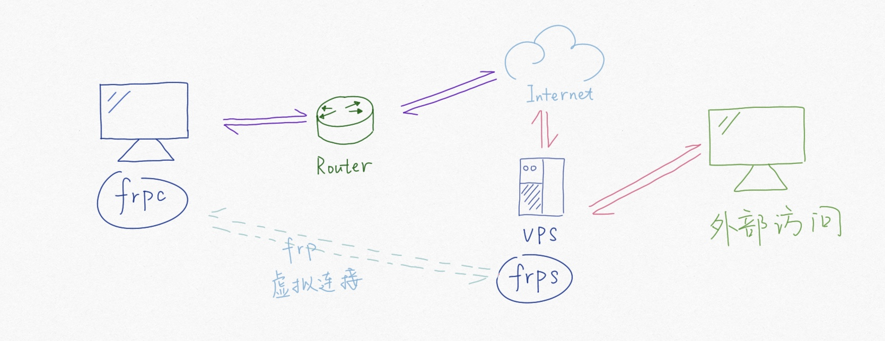

#! https://zhuanlan.zhihu.com/p/644528742
# frp 内网穿透

## Resources

- github：https://github.com/fatedier/frp
- document：https://gofrp.org/docs/
- finalshell：https://sourceforge.net/projects/finalshell/
- vscode remote ssh：https://code.visualstudio.com/docs/remote/ssh

下面给出一些blog，都详细写了如何使用frp搭建内网穿透，在本文中就不再赘述。

- 使用frp进行内网穿透：https://sspai.com/post/52523
- 基于frp docker 进行内网穿透：https://izhaong.com/pages/b387de/
- CentOS7下通过frp做内网穿透：https://blog.fengdis.com/2019/12/25/CentOS%E4%B8%8B%E9%80%9A%E8%BF%87frp%E5%81%9A%E5%86%85%E7%BD%91%E7%A9%BF%E9%80%8F/

这一篇blog的**05节**写了遇到的常见问题，这也是本文关心的。

- 常见问题：https://www.derrors.cn/index.php/it-tech/frp.html

## Questions

大部分都是网络端口上的问题，下面先给出一张frp的原理图。



**ssh: connect to host xx.xx.xx.xx port xx: Operation timed out**

- 使用ssh连接时，连接超时
- 原因：服务器防火墙未开放frp配置中对应的**remote_port**端口；
- 解决：在服务器的防火墙中开放相应端口。

**ssh: connect to host xx.xx.xx.xx port xx:  Connection refused**

- 连接被拒绝
- 原因：服务器防火墙未开放frp配置中对应的**server_port**端口；
- 解决：在服务器的防火墙中开放相应端口。

当然云服务器端，也会有**安全组**或者**防火墙**，需要把相应的都开起来

```bash
#开放端口
firewall-cmd --zone=public --add-port=7000/tcp --permanent
firewall-cmd --zone=public --add-port=6000/tcp --permanent

#查看开放端口列表
firewall-cmd --permanent --zone=public --list-ports

#防火墙reload
firewall-cmd --reload
```

## firewalld 拓展

这边很多的问题都跟防火墙有关系，这边给出 firewalld 的相关指令。

```bash
source: 根据源地址过滤（优先级最高）
interface: 根据网卡过滤（优先级次高）
service: 根据服务名过滤
port: 根据端口过滤
icmp-block: icmp 报文过滤，按照 icmp 类型配置
masquerade: ip 地址伪装
forward-port: 端口转发
rule: 自定义规则
# 查看是否开启
systemctl status firewalld.service
# 打开防火墙
systemctl start firewalld.service
# 停用防火墙
systemctl disable firewalld
# 禁用防火墙
systemctl stop firewalld.service

# 开机启动
systemctl enable firewalld
# 取消开机启动
systemctl disable firewalld

# 查看运行状态
firewall-cmd --state
# 查看接口信息
firewall-cmd --list-all

# 更新防火墙规则方法1:无需断开连接，动态更改规则
firewall-cmd --reload
# 更新防火墙规则方法2:断开连接，以重启的方式更改规则
firewall-cmd --complete-reload

# 查看帮助
firewall-cmd --help
--zone=NAME # 指定 Zone
--permanent # 为永久生效
--timeout=seconds # 持续一段时间，到期后自动移除，经常用于调试，且不能与 --permanent 同时使用

# 追加一个8181端口，永久有效
firewall-cmd --add-port=8181/tcp --permanent
# 追加一段端口范围
firewall-cmd --add-port=6000-6600/tcp
# 开放 ftp 服务
firewall-cmd --add-service=ftp
# 添加eth0 接口至 public 信任等级，永久有效
firewall-cmd --zone=public --add-interface=eth0 --permanent

# 关闭防火墙
sudo systemctl stop firewalld
# 关闭端口
sudo firewall-cmd --remove-port=3000/tcp --permanent

# 配置 public zone 的端口转发
firewall-cmd --zone=public --add-masquerade
# 然后转发 tcp 22 端口至 9527
firewall-cmd --zone=public --add-forward-port=port=22:proto=tcp:toport=9527
# 转发 22 端口数据至另一个 ip 的相同端口上
firewall-cmd --zone=public --add-forward-port=port=22:proto=tcp:toaddr=192.168.1.123
# 转发 22 端口数据至另一 ip 的 9527 端口上
firewall-cmd --zone=public --add-forward-port=port=22:proto=tcp:toport=9527:toaddr=192.168.1.100

# IP 封禁
firewall-cmd --permanent --add-rich-rule="rule family='ipv4' source address='192.168.1.123' reject"
# 通过 ipset 来封禁 ip
firewall-cmd --permanent --zone=public --new-ipset=blacklist --type=hash:ip
firewall-cmd --permanent --zone=public --ipset=blacklist --add-entry=192.168.1.123
# 封禁网段
firewall-cmd --permanent --zone=public --new-ipset=blacklist --type=hash:net
firewall-cmd --permanent --zone=public --ipset=blacklist --add-entry=192.168.1.0/24
# 倒入 ipset 规则 blacklist，然后封禁 blacklist
firewall-cmd --permanent --zone=public --new-ipset-from-file=/path/blacklist.xml
firewall-cmd --permanent --zone=public --add-rich-rule='rule source ipset=blacklist drop'
```
