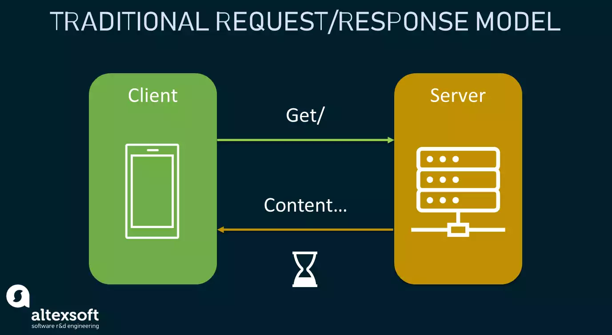
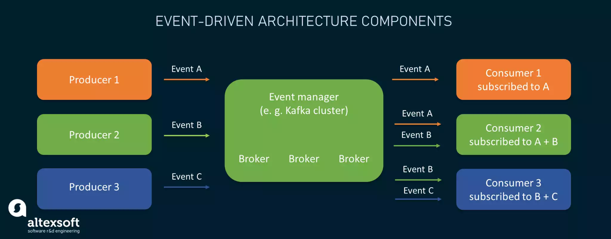
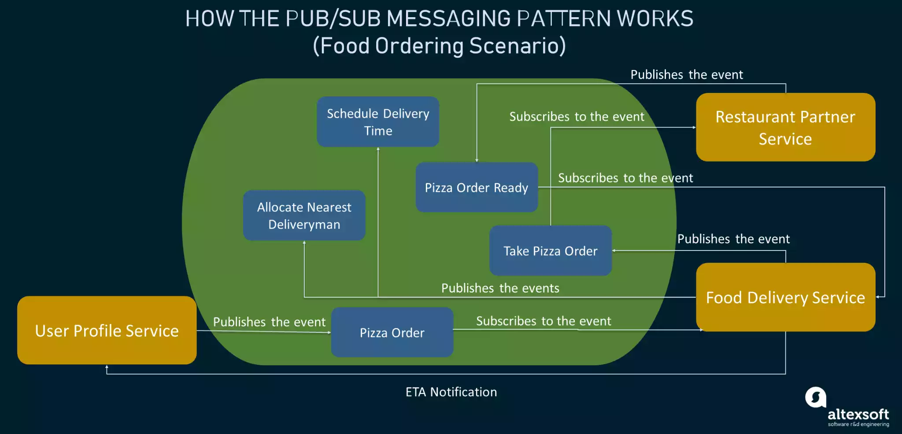

#! https://zhuanlan.zhihu.com/p/643881033
# Pub/Sub Pattern Explained

要掌握 event-driven architecture 和 pub/sub 背后的原理，首先需要定义所有关键术语。

**event**

event 是指系统内触发其他系统动作的状态变化或更新。它可以是交易和传感器输入，也可以是鼠标点击和照片上传等。事件的复杂程度和规模各不相同，既有来自内部的，也有来自外部的。但不应将事件与 notifications 混淆。

**notification**

notification 是由一个组件创建的消息，用于通知事件的发生并向其他组件进行描述。通知包含有关事件及其发生背景(如位置或时间)的信息。

**Event-driven architecture**

事件驱动架构是一种连接分布式软件系统并实现高效通信的设计模型。Event-driven architecture 使实时或接近实时的信息交换成为可能。它在设计依赖于 microservices (每个服务都运行自己的进程)的 apps 时非常常见。

事件驱动架构的概念主要通过 publish/subscribe communication model 来实现。

Event-based architectures 通常包括三个核心组件：

- event producers：生成或检测 events 并将其传送给事件管理器；
- event managers：作为中间件，负责异步过滤、处理和路由接收到的事件；
- event consumers：接收事件并对其采取行动。

**Publish/subscribe**

Publish/subscribe 是一种灵活的消息传递模式，允许不同的系统组件异步交互。

这里的关键点在于，pub/sub使计算机能够进行通信，并在数据更新时对其做出反应。这与传统的请求/响应消息传递模式形成鲜明对比，在这种模式下，数据更新是作为对用户发起的请求的响应，每隔一段时间进行一次。始终有两个参与者 -- a client and a server。client 通过 HTTP协议 进行调用，并等待 server 响应所请求的内容。

连接分布式软件系统的 request/response approach 总是需要一定的等待时间才能得到响应。虽然它仍然经常被用于各种情况，但 pub/sub 消息传递也正在成为一种相关的解决方案。

Publish/subscribe systems 遵循典型的事件驱动结构，但组件名称略有不同。从发布/订阅的角度来看，event producers 是 publishers，consumers 是相应的 subscribers，因此得名。但系统间交互的理念保持不变。

中间件可能包含多个消息代理，用于传输事件并将其推送给所有感兴趣的消费者或订阅者（如下图所示）。

subscribing services 通过 表示相关性的 filter 创建 subscription，从而通知 broker 对特定事件通知的兴趣。但是，事件是否与给定的 filter 相匹配由 broker 决定。在 pub/sub 系统中，有几种订阅模式，但最常用的是 topic-based 模式，即 event notifications 在他们已经发布的 topic 下有相关的 topic。

至于 event publishers 和 subscribers 的角色，它们并不是一成不变或不灵活的，组件可以改变它们，也可以同时扮演它们。例如，一个被消耗的事件可能会唤起一个订阅组件内部的事件，因此后者会将其状态变化作为一个新事件发布，供其他组件采取行动。

在这种架构中，产生事件的服务既不知道也不关心消耗事件的服务，反之亦然。后者只是执行所产生的事件所要求的任务。因此， Event-driven architecture 和 pub/sub 是构建动态环境的完美选择，因为通过灵活地添加新组件而无需修改现有组件，就可以轻松地扩展整个生态系统。

## Key principles of the pub/sub paradigm of event-driven architecture

事件驱动的pub/sub架构有几个基本原则，这些原则也可被视为优势，并将它们与其他系统通信模式区分开来。

**Scalability**

Event-driven architectures 具有很强的横向可扩展性，因为一个事件可能会触发多个系统的响应，这些系统具有不同的需求并提供不同的结果。

**Loose coupling**

生产者和消费者互不相识。中间人负责接收事件、处理事件并将事件发送给对特定事件感兴趣的系统。这允许服务松散耦合，便于服务的修改、测试和部署。与点对点系统集成不同，组件可以很容易地添加到系统中或从系统中移除。

**Asynchronous eventing**

事件通知是异步广播的，这意味着事件会在发生时发布。如果发布的事件不可用，服务可在稍后消费或处理该事件。这不会影响或阻塞正在生成的服务。

**Fault tolerance**

由于系统是松散耦合的，一个系统的故障不会对其他系统的工作造成任何影响。

所有这些都使不同规模和利益范围的企业能够满足客户对实时、个性化产品和服务的需求。

## How the pub/sub pattern of event-driven architecture works

因此，为了证明 publish/subscribe 是一种优雅、简单但功能强大的系统通信范例，能够支持事件驱动的应用程序和架构，我们将绘制一幅其工作原理图。让我们以一个简单的披萨订购场景为例，如下图所示。虽然在这个过程中可能会涉及到更多的微服务，但我们将介绍其中的三个关键微服务。

- a User Profile Service where a customer can place a pizza order;
- a Food Delivery Service that schedules delivery time and assigns deliverymen to orders, and
- a Restaurant Partner Service that takes a pizza order and notifies when it's ready.

以下是活动流程的大致情况：

- 用户通过用户资料服务（移动应用程序用户界面）订购披萨。该服务捕获用户的姓名、当前位置、联系方式等数据，并发布披萨订单事件。
- 送餐服务(如Uber Eats)订阅披萨订单事件，因此它通过发布 "接受披萨订单" 事件对其做出反应。
- 餐厅合作伙伴服务订阅 "接受披萨订单" 事件，完成订单并发布 "披萨订单准备就绪" 事件。
- 送餐服务分别发送分配最近的送餐员和安排送餐时间事件。现在，它可以监控订单的位置，并为用户提供ETA(Estimated Time of Arrival, 预计到达时间)通知。

## Key tools to enable the pub/sub and event-driven architecture

事件生产者和消费者之间的数据交换逻辑可借助不同的事件处理平台来执行。在创建事件驱动的解决方案时，您的IT团队需要考虑哪些软件符合要求。下面我们将介绍可帮助您实现事件驱动架构和pub/sub概念的关键参与者。

- **Apache Kafka**: Apache Kafka是分布式数据流领域的重量级产品。该开源平台允许实时发布、存储、处理和订阅事件流。Kafka以高度可扩展、容错和安全的方式提供pub/sub功能，每天可处理数万亿个事件。此外，它还可以部署在企业内部和云中。
- **Pulsar**: Pulsar是另一个Apache系列的分布式发布/订阅消息系统。Pulsar最初设计为消息队列系统，在最近的版本中增加了事件流功能。该系统具有高度可扩展性，可隔离生产和消费操作，并允许灵活的消息传递模型。
- **ActiveMQ**: ActiveMQ是Apache软件基金会推出的一个灵活的开源消息代理。它通过多个生产者和消费者之间的主题提供了pub/sub消息传递的功能。ActiveMQ相对容易部署在复杂的结构中；该系统显示出高吞吐量和高可靠性。
- **Redis**: Redis是一种开源的内存数据结构存储，可用作消息代理和数据库。Redis也是pub/sub应用的热门选择，能够处理数百万个请求。

当然，还有许多其他工具：以上四种只是冰山一角。此外，创建功能完善的事件驱动架构还需要配套服务，例如 cloud data storages。

## Common use cases of event-driven architecture and pub/sub

由于事件驱动型应用允许通过使用最新信息做出实时业务决策，因此它们在各种用例中都很常见。下面我们将介绍几种。

- Internet of Things: 物联网解决方案为从交通运输到医疗保健等不同行业提供动力。事件可用于捕捉物联网设备的输出，如传感器数据流、温度读数、位置点和其他状态变化。EDA可在基于物联网的环境和设备产生海量数据的瞬间对其进行处理。因此，可通过手动或自动决策来解决问题并规划前瞻性措施。
- Online shopping: 由于电子商务流程中涉及大量服务，EDA是将它们整合在一起的绝佳方式。从下单到发货的每一个阶段都会广播事件，从而实现实时可视，并对客户互动和订单做出即时反应。
- Healthcare: 随着IoMT设备、可穿戴设备和其他医疗设备实时产生大量数据，有必要及时处理新信息，并更快地意识到关键时刻。处理这些数据的事件驱动方法为远程患者监护、医疗诊断设备的预防性维护以及更积极主动的医疗保健提供了机会。
- Online banking: 通过事件驱动架构，可以实时监控交易，在欺诈活动发生时及时发现，并立即通过电话通知持卡人可疑的银行卡欺诈行为。

## Event-driven architecture isn't a magic bullet

当系统的敏捷性、互操作性和互连性成为重中之重时，事件驱动架构是理想之选。这就是为什么它们常见于使用微服务或依赖于脱节组件的现代应用程序中。

从这个角度来看，EDA和pub/sub在以下情况下是一个很好的选择：

- 您需要依赖多个系统来应对相同的事件；
- 您需要持续监控资源状态，并以最小的时滞接收有关任何变化和更新的通知；
- 您希望改进现有系统，使其更具可扩展性和响应性；
- 处理大量高速数据，例如物联网数据；
- 您的系统必须在不紧密耦合的情况下共享信息。

与此同时，EDA并不是适用于所有情况的通用解决方案。如果您的系统很简单，而且不太可能扩展，那么就没有必要把事情搞得过于复杂。请求/响应模型尚未失去其相关性，仍可用于各种情况。
