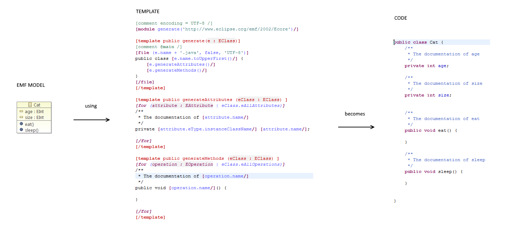
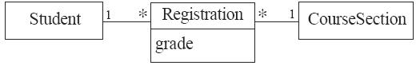
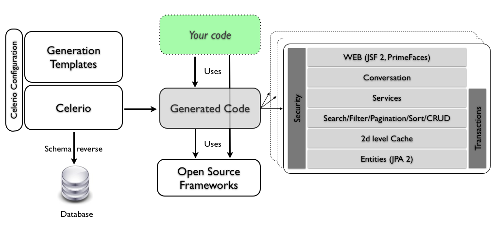

#! https://zhuanlan.zhihu.com/p/657058857
# A Guide to Code Generation

## Why to Use Code Generation

- productivity：使用代码生成功能，只需编写一次生成器，就可以根据需要多次重复使用。向生成器提供特定输入并调用它比手动编写代码要快得多，因此代码生成可以节省时间。
- Simplification：通过代码生成，你可以从一些抽象的描述中生成代码。这意味着你的truth来源变成了描述，而不是代码。与整个生成的代码相比，该描述通常更容易分析和检查。
- Portability：一旦你有了为某种语言或框架生成代码的程序，你就可以简单地更改生成器，并以不同的语言或框架为目标。您还可以同时针对多个平台。
    - 例如，使用解析器生成器，您可以获得 C#、Java 和 C++ 的解析器。
    - 另一个例子：您可能会编写一个 UML 图表，然后使用代码生成器用 C# 创建一个骨架类，并用 SQL 代码为 MySQL 创建一个数据库。因此，相同的抽象描述可用于生成不同类型的工件。
- Consistency：有了代码生成，你总能得到你所期望的代码。生成的代码是根据相同的原则设计的，命名规则等也是一致的。当然，除了生成器中的错误之外，代码总是能按照你所期望的方式运行。代码质量始终如一。如果用手工编写代码，不同的开发人员可能会使用不同的风格，即使是最重复的代码也会偶尔出现错误。

## Why Not to Use Code Generation

- Maintenance：当您使用代码生成工具时，您的代码就会依赖于它。代码生成工具必须得到维护。如果你创建了它，你就必须不断更新它；如果你只是使用现有的工具，你就必须希望有人继续维护它，或者你必须自己接手。因此，代码生成的优势并不是免费的。如果你没有或找不到合适的能力来维护代码生成器，风险就会更大。
- Complexity：自动生成的代码往往比手工编写的代码更复杂。有时，这与将不同部分连接在一起所需的胶水代码有关，或者与生成器支持的用例多于您所需的用例有关。在第二种情况下，生成的代码可以做比你想要的更多的事情，但这并不一定是一种优势。生成代码的优化程度肯定也不如手工编写的代码。有时这种差异很小，并不明显，但如果您的应用程序需要尽可能地提高性能，那么生成的代码对您来说可能并不是最佳选择。

## How Can We Use Code Generation?

根据具体情况，代码生成既可以提高工作效率，也可以成为开发过程中的重要组成部分。许多现代集成开发环境就是一个有用的例子：只需点击一个按钮，就能创建一个骨架类来实现接口或类似功能。你完全可以自己编写这样的代码，只不过会浪费一些时间来完成琐碎的任务。

设计代码生成流水线的方法有很多种。基本上，我们需要定义两个要素：

- Input：用于生成代码的信息来自何处。
- Output：如何获得生成的代码。

您也可以在输入和输出之间设置转换步骤。这些步骤可以简化输出层，并使输入和输出更加独立。

**Possible inputs**

- A DSL：例如，我们可以使用 ANTLR 来描述一种语言的语法。由此，我们可以生成一个解析器。
- code in other formats：数据库模式。根据数据库模式，我们可以生成 DAO。
- wizards：它们允许向用户询问信息。
- reverse engineering：可通过处理复杂的代码工件获得信息。
- data sources：比如一个DB，一个csv文件或者一个电子表格。

**Possible outputs**

- template engine：大多数网络程序员都知道模板引擎，它用于在 HTML UI 中填充数据。
- code building APIs：例如，Javaparser 可用于以编程方式创建 Java 文件。

现在让我们来检查一些 pipelines：

- parser generation：本网站的读者一定很熟悉 ANTLR 和其他此类从形式语法自动生成解析器的工具。在这种情况下，输入是一个 DSL，输出则是使用模板引擎生成的。
- model driven design：集成开发环境或独立集成开发环境的插件，可以描述应用程序的模型，有时还提供图形界面，并据此生成整个应用程序或仅生成其骨架。
- database-related code：这种用法可视为模型驱动设计和模板引擎的产物。通常，程序员会定义一个数据库模式，并据此生成整个 CRUD 应用程序或处理数据库的代码。也有一些工具可以执行相反的过程：根据现有数据库创建数据库模式或处理数据库的代码。
- metaprogramming languages：这些语言组包括可对程序代码进行近乎完全操作的语言，源代码只是另一种可操作的数据结构。
- ad hoc applications：这一类包括所有内容：从为处理一件事情而设计的工具到企业环境中使用的临时系统，这些系统可以根据正式的自定义描述生成整个应用程序。这些应用程序通常是特定工作流程的一部分。例如，客户使用图形界面描述一个应用程序，一个临时系统会生成支持该应用程序的数据库模式，另一个系统会生成 CRUD 界面等。
- IDE generated code：许多静态类型语言需要编写大量的模板代码，而集成开发环境通常可以生成其中的一部分：为要实现的方法提供存根的类、标准的等值、hashCode 和 toString 方法、所有现有属性的获取器和设置器。

### Code Generation Tools

模板引擎组可能是最著名和最常用的。模板引擎基本上就是一个能理解简单模板语言的迷你编译器。模板文件包含可由模板引擎解释的特殊符号。它能做的最简单的事情就是用运行时给出的适当数据替换这些特殊符号。大多数模板引擎还支持简单的流程控制命令（如 for 循环、if-else 语句），允许用户描述简单的结构。

有很多例子，让我们来看两个代表大多数模板引擎行为方式的例子。

#### Jinja2

Jinja2 是一个广泛使用的 Python 模板引擎。它能做所有模板引擎都能做的事情：根据提供的数据创建独一无二的文档。 它支持模块化模板、控制流、变量等。不过，它也有强大的安全措施：HTML 转义系统和沙箱环境，可以控制对危险属性的访问。

```
<title></title>
<ul>

  <li><a href="{{ user.url }}">{{ user.username }}</a></li>

</ul>
```

Jinja2 特别支持生成 HTML 页面，这也是最常用的功能。不过，它也可用于创建其他类型的文件。

#### Pug

Pug 是一个深受 Haml 影响的高性能模板引擎，使用 JavaScript 实现，适用于 Node.js 和浏览器。在许多方面，Pug 与许多其他模板引擎一样：它支持模块化模板、控制流等。不同的是，Pug 看起来像 DSL，而且只适用于 HTML。因此，Pug 模板看起来非常简洁。

```
doctype html
html(lang="en")
  head
    title= pageTitle
    script(type='text/javascript').
      if (foo) bar(1 + 5)
  body
    h1 Pug - node template engine
    #container.col
      if youAreUsingPug
        p You are amazing
      else
        p Get on it!
      p.
        Pug is a terse and simple templating language with a
        strong focus on performance and powerful features.
```

### Parser Generation

Parser Generation 是一种自动快速创建语言解析器的工具。它们非常成功且富有成效，因为人们已经对语言解析问题进行了广泛的研究。因此，有一些解决方案可以保证解析人们需要解析的大多数语言。

#### ANTLR

ANTLR 可能是使用最多的解析器生成器。这意味着有很多示例。然而，庞大社区的真正附加价值在于大量可用的语法。

ANTLR 的输入是语法：对语言的正式描述。解析器的输出是一棵解析树：一种包含源代码的结构，其转换方式便于程序的其他部分使用。ANTLR 还提供了两种走解析树的方法：访问者和监听者。第一种适用于需要对解析树中的元素进行操作或交互的情况，而第二种则适用于只需要在规则匹配时做一些事情的情况。

```
grammar simple;

basic   : NAME ':' NAME ;

NAME    : [a-zA-Z]* ;

COMMENT : '/*' .*? '*/' -> skip ;
```

### Model Driven Design

这些通常是集成开发环境的插件或独立的集成开发环境，可以通过图形界面描述应用程序的模型，并由此生成应用程序的骨架。之所以会出现这种情况，是因为模型驱动设计的基础是抽象模型，可以用 UML 图表或 DSL 来定义。一旦程序的主要特征可以根据模型进行描述，那么就有可能自动生成该程序的表示法。这种代码中的模型表示法会自动生成结构，但行为通常必须由开发人员自己直接实现。

#### Acceleo

Acceleo 3 是一款实现 OMG 模型到文本规范的代码生成器。它为开发人员提供了高质量代码生成集成开发环境所应具备的大部分功能：简单的语法、高效的代码生成、先进的工具以及与 JDT 不相上下的功能。Acceleo 可帮助开发人员处理代码生成器的生命周期。得益于基于原型的方法，您可以从现有原型的源代码中快速、轻松地创建第一个生成器，然后利用 Acceleo 工具的所有功能（如重构工具），您可以轻松地改进生成器，实现完整的代码生成器。

Acceleo 的工作：实施模型驱动设计原则。但缺少的是对 Acceleo 工作体验的描述。Acceleo 基本上是一个 Eclipse 插件，它为您提供了一个工具，可以根据您指定的模板，从 EMF 模型开始创建 Java 代码。EMF 模型可以通过不同方式定义：UML 图表或自定义 DSL。



#### Umple

Umple 是一种建模工具和编程语言系列，可实现作者所说的面向模型的编程。它在面向对象编程语言（如 Java、C++、PHP 和 Ruby）中添加了关联、属性和状态机等抽象概念，这些抽象概念源自 UML。Umple 还可用于以文本方式创建 UML 类图和状态图。

Umple 是一种将 UML 模式与传统编程语言结构化结合的工具。它的诞生是为了简化模型驱动开发的过程，而传统的模型驱动开发需要特定而复杂的工具。它本质上是一种编程语言，支持 UML（类和状态）图定义模型的功能。然后，Umple 代码会被其编译器转换为 Java 或 PHP 等传统语言。

Umple 可以有多种用法：

- 可用于以文本方式描述 UML 图表
- 可与传统语言结合使用，作为该目标语言的预处理器或扩展程序。Umple 编译器在目标语言中转换 Umple 代码，并保持现有目标语言不变。
- 由于其对 UML 状态机的大量支持，它可以作为状态机生成器使用。根据 Umple 对状态机的描述，可以生成许多目标语言的实现。

```
class Student {}

class CourseSection {}

class Registration 
{
  String grade;
  * -- 1 Student;
  * -- 1 CourseSection;
}
```



下面的 Umple 代码描述的是一个状态机。

```
class GarageDoor  
{  
   status {  
      Open { buttonOrObstacle -> Closing;  }  
      Closing {  
          buttonOrObstacle -> Opening;  
          reachBottom -> Closed;  
      }  
      Closed { buttonOrObstacle -> Opening; }  
      Opening {  
          buttonOrObstacle -> HalfOpen;  
          reachTop -> Open;  
      }  
      HalfOpen { buttonOrObstacle -> Opening; }  
  }  
}
```

#### Telosys

Telosys 设计用于生成所有管道和重复代码。它不需要使用 UML，但允许用户从起始数据库或使用 DSL 生成模型。它是一个有趣且易于使用的解决方案，还以 Eclipse 插件的形式提供 IDE 支持。

- url：https://tomassetti.me/telosys-code-generation-tool/

### Database-related Code

这一切都围绕着一个数据库模式展开，而代码就是从这个模式中生成的，或者是从一个数据库中生成一个模式。之所以可以使用这些生成器，有两个原因：

- 关系数据库支持与之交互的标准语言（SQL）
- 编程语言中存在与数据库交互的广泛模式和库

这两个原因保证了在编程语言和包含程序所需数据的数据库之间创建标准胶合代码成为可能。在实践中，数据库模式可以作为一个简单的模型，用来生成代码。

许多框架或集成开发环境都包含从类生成数据库模式的基本工具，反之亦然，生成与数据库表交互的类。在本节中，我们将看到一个可以做更多事情的工具示例。

#### Celerio

Celerio 是面向数据应用程序的代码生成工具。

Celerio 是一款 Java 工具，其中包括一个数据库提取器，用于从现有数据库中获取数据库模式。然后，它将生成的模式与配置文件结合起来，然后启动模板引擎，以创建整个应用程序。提取的数据库模式为 XML 格式。



### Domain Specific Language

DSL 是以正规化方式捕捉业务逻辑的好方法。之后，需要以某种方式执行这些逻辑。虽然有时会使用解释器和编译器来执行 DSL，但代码生成器却经常被使用。通过这种方式，DSL 可以被翻译成已经存在编译器的语言，如 Java 或 C#。

现在，可以使用语言工作台来构建 DSL，语言工作台是专门为设计和实现 DSL 而设计的集成开发环境。语言工作台之所以有用，是因为它们还能以较低的成本为 DSL 定义编辑器和其他支持工具。这一点非常重要，因为非开发人员也可以使用 DSL，他们需要定制的编辑器来利用语言的功能，或者根本无法使用普通的文本编辑器。除其他功能外，语言工作台通常还集成了代码生成功能。让我们来看几个例子。

#### JetBrains MPS

JetBrains MPS 是基于项目编辑器的语言工作台。您可以用它创建一个或多个 DSL。它还可用于扩展现有语言。例如，mbeddr 就是基于 JetBrains MPS 的 C 语言扩展，用于改进嵌入式编程。

所谓投影式编辑器，是指 MPS 会保留数据的基本结构，并以易于编辑的形式显示出来。这个概念可能有点难以理解。想想传统的编程：你写出源代码，然后编译器将源代码转换为逻辑表示，即解析树。编译器使用这种表示法来执行一些操作，如优化或将其转换为机器代码来执行。使用项目编辑器，您可以直接处理逻辑表示：解析树。不过，您只能按照编辑器（MPS）允许的方式对其进行修改。

这样做的主要后果是，当使用 JetBrains MPS 创建 DSL 时，您需要整个集成开发环境及其所有功能和功能。您可以获得语法高亮、代码自动补全、项目管理等功能。

不过，这种方法的优势在于，您可以创建一个使用任何形式的输入来修改代码的 DSL，因此您可以创建一个图形编辑器、一个表格输入，甚至是普通文本。这一优势使得创建非程序员也能使用的 DSL 特别有用。

#### Xtext

Xtext 是一种语言工作台，构建于 Eclipse 和 Eclipse Modeling Framework 之上。它可用于设计文本 DSL 并为其获取编辑器。 从功能上讲，Xtext 是不同工具（如用于解析的 ANTLR、用于用户界面的 Eclipse 等）的组合，用于生成 DSL。

#### Julia

让我们看看 Julia 中宏的示例，Julia 是一种受 Lisp 启发的语言，它的语法更易于理解。

```
julia> macro twostep(arg)
           println("I execute at parse time. The argument is: ", arg)
           return :(println("I execute at runtime. The argument is: ", $arg))
       end
@twostep (macro with 1 method)

julia> ex = macroexpand( :(@twostep :(1, 2, 3)) );

julia> ex # the macro itself
:((println)("I execute at runtime. The argument is: ", $(Expr(:copyast, :($(QuoteNode(:((1, 2, 3)))))))))

julia> eval(ex) # execution of the macro
I execute at runtime. The argument is: (1, 2, 3)
```

可以看出，执行宏和执行宏返回的表达式是两码事。

这个非常强大的功能可以用于代码生成：你不需要外部工具来创建模板代码，你可以从内部创建。在下面摘自 Julia 文档的示例中，你可以看到它是如何定义一系列新的三元运算符的。

```
for op = (:+, :*, :&, :|, :$)
    eval(:(($op)(a,b,c) = ($op)(($op)(a,b),c)))
end
```

代码利用已定义的二元运算符定义了这些新的三元运算符：

- 在前两个元素之间进行基本的二进制运算
- 然后在第一个运算结果和第三个元素之间再次进行运算

请注意，Julia 的标准语法与传统语言类似：没有奇怪的括号，表达式正常等。然而，当您使用元编程功能时，您将使用类似 Lisp 的内部语法。

这只是冰山一角，你可以查阅 Julia 手册，进一步了解元编程的强大功能。

#### Racket

如果你想在元编程方面做得更多，可以使用 Racket，这是一种受 Lisp 和 Scheme（另一种受 Lisp 影响的语言）启发的语言。

Racket 同时是一种语言和一个平台，它被设计成一种可以定义其他语言的语言。因此，它甚至可以使用比宏更强大的元编程功能。Racket 可以定义全新的语言，改变基本语言的语法。它之所以能做到这一点，基本上是因为它允许你改变解析本身。

Racket 的传统语法类似 Lisp。

```
(define (four p)
  (define two-p (hc-append p p))
  (vc-append two-p two-p))
```

你可以改变它，例如，你可以创建一种语言来定义文档：Scribble

```
#lang scribble/base
 
@title{On the Cookie-Eating Habits of Mice}
 
If you give a mouse a cookie, he's going to ask for a
glass of milk.
```

该语言允许您创建 HTML、PDF 等文件。您可以在语言中定义结构，然后生成所需的任何输出。

这是一个与元编程和 DSL 相匹配的全新层次：您可以使用类似 DSL 的易用界面轻松创建自定义生成器。当目标受众是其他开发人员时，可以采用这种方法。这是因为您虽然获得了一种功能强大的语言，但它仅仅是一种语言而已。如果使用语言工作台，您就可以拥有一整套强大的编辑工具，帮助普通用户使用语言。

### Ad-Hoc Applications

这一类包括所有内容：从为处理一件事情而设计的工具到在企业环境中使用的临时系统，这些系统可以根据正式的自定义描述生成整个应用程序。这些应用程序通常是特定工作流程的一部分。例如，客户使用图形界面描述一个应用程序，一个临时系统会生成支持该应用程序的数据库模式，另一个系统会生成 CRUD 界面等。

这不是一个正确定义的类别，而是一个总括类别，包括不属于特定组别的所有内容。这意味着这组程序没有标准结构。这也证明了代码生成的多功能性：如果你能创建一个问题模型或描述，那么你就能用代码生成来解决问题。当然，你还必须了解解决一般问题和创建代码生成工具是否有意义，还是直接解决问题更好。

在本节中，我们将讨论两种工具：CMake 是一款开发工具，而 Yeoman 则是一款脚手架工具。前者主要是生成配置文件：为其他软件提供支持的软件。第二种工具简化了开发人员的工作，提供了一种创建即用项目的方法，可针对特定软件平台、库或需求进行优化。

#### CMake

CMake 是一个开源、跨平台的工具系列，用于构建、测试和打包软件。

CMake 包括三个开发工具，用于帮助开发 C 和 C++。主要工具旨在为不同平台和工具链生成构建文件（即 makefile 和项目文件）。例如，它可以生成 Linux 的 makefile 和 Visual Studio 项目文件。

CMake 不是编译器。用户以 CMake 格式定义项目结构，然后该工具会生成传统构建过程中使用的普通构建文件。

CMake 文件看起来像一系列命令/宏，用于为编译器设置选项/标志、链接库、执行自定义命令等。

```
cmake_minimum_required(VERSION 2.8)

project("Antlr-cpp-tutorial")


[..]

if (NOT WIN32)
  set(CMAKE_CXX_FLAGS "-Wdeprecated -Wno-attributes" )
endif()

[..]

if(APPLE)
add_custom_command(TARGET antlr4-tutorial POST_BUILD
  COMMAND ${CMAKE_COMMAND} -E copy_if_different
  "${PROJECT_SOURCE_DIR}/libs/antlr4-runtime.dylib"
  $<TARGET_FILE_DIR:antlr4-tutorial>)
endif()
```

#### Yeoman

Yeoman 是一个通用的脚手架系统，可以创建任何类型的应用程序。

如今，要成为一名优秀的程序员，意味着不仅仅要知道如何编码。你需要了解你所使用的每种工具的最佳实践，并记住每次都要执行它们。编写代码本身就已经很困难了，如果还需要正确编写配置文件和使用正确的项目结构，那就更难了。这就是像 Yeoman 这样的工具的用武之地：它是一款脚手架工具，只需一条命令就能生成一个新项目，并立即实施所有最佳实践。

Yeoman 的核心是一个生成器生态系统，开发人员可以在此基础上构建自己的模板。该工具非常受欢迎，已有数千个模板可供使用。

Yeoman 是一款 JavaScript 应用程序，因此编写生成器只需编写 JavaScript 代码并使用提供的 API 即可。工作流程也非常简单：向用户询问项目信息（如名称），收集配置信息，然后生成项目。

以下代码展示了生成器的部分示例，用于创建 Yeoman 模板。

```
function makeGeneratorName(name) {
  name = _.kebabCase(name);
  name = name.indexOf('generator-') === 0 ? name : 'generator-' + name;
  return name;
}

module.exports = class extends Generator {
  initializing() {
    this.props = {};
  }

  prompting() {
    return askName(
      {
        name: 'name',
        message: 'Your generator name',
        default: makeGeneratorName(path.basename(process.cwd())),
        filter: makeGeneratorName,
        validate: str => {
          return str.length > 'generator-'.length;
        }
      },
      this
    ).then(props => {
      this.props.name = props.name;
    });
  }

  [..]

  writing() {
    const pkg = this.fs.readJSON(this.destinationPath('package.json'), {});
    const generatorGeneratorPkg = require('../package.json');

    [..]

    this.fs.writeJSON(this.destinationPath('package.json'), pkg);
  }

  conflicts() {
    this.fs.append(this.destinationPath('.eslintignore'), '**/templatesn');
  }

  install() {
    this.installDependencies({ bower: false });
  }
};
```

## Resources 

- https://tomassetti.me/code-generation/