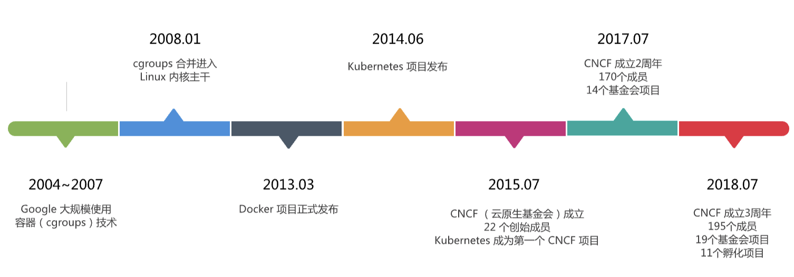
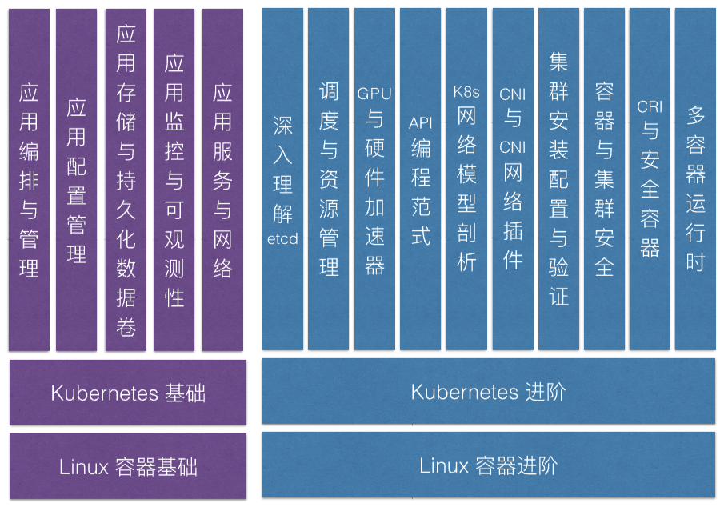

#! https://zhuanlan.zhihu.com/p/650586054
# lec01-云原生技术概览

## Resources

- 课程官网：https://edu.aliyun.com/course/314164/?spm=a2cwt.28120018.314164.1.64de1ee9GBAhjO
- blibili官网：https://www.bilibili.com/video/BV1Et411j7R2/?spm_id_from=333.999.0.0

## 云原生技术发展简史

- 2004 年— 2007 年，Google 已在内部大规模地使用像 Cgroups 这样的容器技术；
- 2008 年，Google 将 Cgroups 合并进入了 Linux 内核主干；
- 2013 年，Docker 项目正式发布。
- 2014 年，Kubernetes 项目也正式发布。这样的原因也非常容易理解，因为有了容器和 Docker 之后，就需要有一种方式去帮助大家方便、快速、优雅地管理这些容器，这就是 Kubernetes 项目的初衷。在 Google 和 Redhat 发布了 Kubernetes 之后，这个项目的发展速度非常之快。
- 2015 年，由Google、Redhat 以及微软等大型云计算厂商以及一些开源公司共同牵头成立了 CNCF 云原生基金会。CNCF 成立之初，就有 22 个创始会员，而且 Kubernetes 也成为了 CNCF 托管的第一个开源项目。在这之后，CNCF 的发展速度非常迅猛；
- 2017 年，CNCF 达到 170 个成员和 14 个基金项目；
- 2018 年，CNCF 成立三周年有了 195 个成员，19 个基金会项目和 11 个孵化项目，如此之快的发展速度在整个云计算领域都是非常罕见的。

## 云原生技术生态现状

因此，如今我们所讨论的云原生技术生态是一个庞大的技术集合。CNCF 有一张云原生全景图（https://github.com/cncf/landscape），在这个全景图里已经有 200 多个项目和产品了，这些项目和产品也都是和 CNCF 的观点所契合的。所以如果以这张全景图作为背景，加以思考就会发现，我们今天所讨论的云原生其实主要谈论了以下几点：

1. 云原生基金会 —— CNCF；
2. 云原生技术社区，比如像 CNCF 目前正式托管的 20 多个项目共同构成了现代云计算生态的基石，其中像 Kubernetes 这样的项目已经成为了世界第四活跃的开源项目；
3. 除了前面两点之外，现在全球各大公有云厂商都已经支持了 Kubernetes。此外，还有 100 多家技术创业公司也在持续地进行投入。现在阿里巴巴也在谈全面上云，而且上云就要上云原生，这也是各大技术公司拥抱云原生的一个例子。

## 我们正处于时代的关键节点

2019 年正是云原生时代的关键节点，为什么这么说？我们这里就为大家简单梳理一下。

从 2013 年 Docker 项目发布开始说起，Docker 项目的发布使得全操作系统语义的沙盒技术唾手可得，使得用户能够更好地、更完整地打包自己的应用，使得开发者可以轻而易举的获得了一个应用的最小可运行单位，而不需要依赖任何 PaaS（Platform as a Service）能力。这对经典 PaaS 产业其实是一个"降维打击"。

2014 年的时候，Kubernetes 项目发布，其意义在于 Google 将内部的 Borg/Omega 系统思想借助开源社区实现了"重生"，并且提出了"容器设计模式"的思想。而 Google 之所以选择间接开源 Kubernetes 而不是直接开源 Borg 项目，其实背后的原因也比较容易理解：Borg/Omega 这样的系统太复杂了，是没办法提供给 Google 之外的人使用，但是 Borg/Omega 这样的设计思想却可以借助 Kubernetes 让大家接触到，这也是开源 Kubernetes 的重要背景。

这样到了 2015 年到 2016 年，就到了容器编排"三国争霸"的时代，当时 Docker、Swarm、Mesos、Kubernetes 都在容器编排领域展开角逐，他们竞争的原因其实也比较容易理解， 那就是 Docker 或者容器本身的价值虽然大，但是如果想要让其产生商业价值或者说对云的价值，那么就一定需要在编排上面占据一个有利的位置。

Swarm 和 Mesos 的特点，那就是各自只在生态和技术方面比较强，其中，Swarm 更偏向于生态，而 Mesos 技术更强一些。相比之下， Kubernetes 则兼具了两者优势，最终在 2017 年"三国争霸"的局面中得以胜出，成为了当时直到现在的容器编排标准。这一过程的代表性事件就是 Docker 公司宣布在核心产品中内置了 Kubernetes 服务，并且 Swarm 项目逐渐停止维护。

到了 2018 年的时候，云原生技术理念开始逐渐萌芽，这是因为此时 Kubernetes 以及容器都成为了云厂商的既定标准，以"云"为核心的软件研发思想逐步形成。

而到了 2019 年，情况似乎又将发生一些变化。我们认为 2019 年是云原生技术的普及元年。

首先大家可以看到，在 2019 年，阿里巴巴宣布要全面上云，而且"上云就要上云原生"。我们还可以看到，以"云"为核心的软件研发思想，正逐步成为所有开发者的默认选项。像 Kubernetes 等云原生技术正在成为技术人员的必修课，大量的工作岗位正在涌现出来。

这种背景下，"会 Kubernetes"已经远远不够了，"懂 Kubernetes"、"会云原生架构"的重要性正日益凸显出来。 从 2019 年开始，云原生技术将会大规模普及，这也是为什么大家都要在这个时间点上学习和投资云原生技术的重要原因。

# 云原生技术公开课教学大纲

第一期云原生公开课的教学大纲，主要以应用容器和 Kubernetes 为核心，在后面几期将会陆续上线 Service Mesh、Serverless 等相关课程。

在第一期公开课中，我们首先将课程分为两部分——基础知识部分和进阶知识部分，总共有 **17 个知识点**。

- 首先，我们希望通过第一部分的课程讲解帮助大家夯实基础。然后，对于更高阶的内容展开更深入的代码级别的剖析。希望通过这样循序渐进的方式帮助大家学习云原生技术；
- 其次，在每个课程后面我们的讲师都会设置对应的课后自测考试题，这些考试题实际上是对本节课程最有效的归纳，我们希望能够通过课后评测的方式来帮助大家总结知识点，打造出属于自己的云原生知识体系；
- 最后，我们的讲师在每个知识点的背后都设计了云端实践，所谓"实践出真知"，学习计算机相关的知识还是需要上手来实际地进行操作才可以。 因此在云端实践部分，讲师会提供详细的实践步骤供大家课后自我联系。并且在这个环节，阿里云还会赠送了定量的阿里云代金券帮助大家更好地在云上进行实践。

以上三个部分就构成了阿里云和 CNCF 联合推出的云原生技术公开课的教学内容。

## 预备知识

- Linux 操作系统知识：主要是一些通识性的基础，最好具有一定的在 Linux 下开发的经验；
- 计算机和程序设计的基础：这一点到入门工程师或者高年级本科生水平就足够了；
- 容器的使用基础：希望大家具有容器的简单使用经验，比如 docker run 以及 docker build 等，最好有一定 Docker 化应用开发的经验。当然，我们在课程中也会讲解相关的基础知识。
    - https://docs.docker.com/get-started/02_our_app/

# 云原生该怎么落地

## 云原生的定义

云原生是一条最佳路径或者最佳实践。更详细的说，云原生为用户指定了一条低心智负担的、敏捷的、能够以可扩展、可复制的方式最大化地利用云的能力、发挥云的价值的最佳路径。

因此，云原生其实是一套指导进行软件架构设计的思想。按照这样的思想而设计出来的软件：
- 首先，天然就"生在云上，长在云上"；
- 其次，能够最大化地发挥云的能力，使得我们开发的软件和"云"能够天然地集成在一起，发挥出"云"的最大价值。

所以，云原生的最大价值和愿景，就是认为未来的软件，会从诞生起就生长在云上，并且遵循一种新的软件开发、发布和运维模式，从而使得软件能够最大化地发挥云的能力。说到了这里，大家可以思考一下为什么容器技术具有革命性？

其实，容器技术和集装箱技术的革命性非常类似，即：容器技术使得应用具有了一种"自包含"的定义方式。所以，这样的应用才能以敏捷的、以可扩展可复制的方式发布在云上，发挥出云的能力。这也就是容器技术对云发挥出的革命性影响所在，所以说，容器技术正是云原生技术的核心底盘。

## 云原生的技术范畴

- 第一部分是云应用定义与开发流程。这包括应用定义与镜像制作、配置 CI/CD、消息和 Streaming 以及数据库等。
- 第二部分是云应用的编排与管理流程。这也是 Kubernetes 比较关注的一部分，包括了应用编排与调度、服务发现治理、远程调用、API 网关以及 Service Mesh。
- 第三部分是监控与可观测性。这部分所强调的是云上应用如何进行监控、日志收集、Tracing 以及在云上如何实现破坏性测试，也就是混沌工程的概念。
- 第四部分就是云原生的底层技术，比如容器运行时、云原生存储技术、云原生网络技术等。
- 第五部分是云原生工具集，在前面的这些核心技术点之上，还有很多配套的生态或者周边的工具需要使用，比如流程自动化与配置管理、容器镜像仓库、云原生安全技术以及云端密码管理等。
- 最后则是 Serverless。Serverless 是一种 PaaS 的特殊形态，它定义了一种更为"极端抽象"的应用编写方式，包含了 FaaS 和 BaaS 这样的概念。而无论是 FaaS 还是 BaaS（Backend as a Service ），其最为典型的特点就是按实际使用计费（Pay as you go），因此 Serverless 计费也是重要的知识和概念。
 
## 云原生思想的两个理论

- 第一个理论基础是：不可变基础设施。这一点目前是通过容器镜像来实现的，其含义就是应用的基础设施应该是不可变的，是一个自包含、自描述可以完全在不同环境中迁移的东西；
- 第二个理论基础就是：云应用编排理论。当前的实现方式就是 Google 所提出来的"容器设计模式"，这也是本系列课程中的 Kubernetes 部分所需主要讲解的内容。

### 基础设施向云演进的过程

首先为大家介绍一下"不可变基础设施"的概念。其实，应用所依赖的基础设施也在经历一个向云演进的过程，举例而言，对于传统的应用基础设施而言，其实往往是可变的。

大家可能经常会干这样一件事情，比如需要发布或者更新一个软件，那么流程大致是这样的，先通过 SSH 连到服务器，然后手动升级或者降级软件包，逐个调整服务器上的配置文件，并且将新代码直接都部署到现有服务器上。因此，这套基础设施会不断地被调整和修改。

但是在云上，对"云"友好的应用基础设施是不可变的。

这种场景下的上述更新过程会这么做：一旦应用部署完成之后，那么这套应用基础设施就不会再修改了。如果需要更新，那么需要现更改公共镜像来构建新服务直接替换旧服务。而我们之所以能够实现直接替换，就是因为容器提供了自包含的环境（包含应用运行所需的所有依赖）。所以对于应用而言，完全不需要关心容器发生了什么变化，只需要把容器镜像本身修改掉就可以了。因此，对于云友好的基础设施是随时可以替换和更换的，这就是因为容器具有敏捷和一致性的能力，也就是云时代的应用基础设施。

所以，总结而言，云时代的基础设施就像是可以替代的"牲口"，可以随时替换；而传统的基础设施则是独一无二的"宠物"，需要细心呵护，这就体现出了云时代不可变基础设施的优点。

### 云原生关键技术点

当我们回过头来看云原生关键技术点或者说它所依赖的技术理论的时候，可以看到主要有这样的四个方向：

- 如何构建自包含、可定制的应用镜像；
- 能不能实现应用快速部署与隔离能力；
- 应用基础设施创建和销毁的自动化管理；
- 可复制的管控系统和支撑组件。
 
这四个云原生关键技术点是落地实现云原生技术的四个主要途径，而这四个技术点也是本门课程的 17 个技术点所主要讲述的核心知识。

