#! https://zhuanlan.zhihu.com/p/658865379
# lec05-应用编排与管理-核心概念

- K8s 资源的重要元信息；
- 使用阿里云服务演示一下如何去修改或查看 K8s 重要元数据；
- 详细分析控制器模式；
- 总结控制器模式特点。

## Resources

- 课程官网：https://edu.aliyun.com/course/314164/?spm=a2cwt.28120018.314164.1.64de1ee9GBAhjO
- blibili官网：https://www.bilibili.com/video/BV1Et411j7R2/?spm_id_from=333.999.0.0

## 资源元信息

### Kubernetes 资源对象

首先，我们来回顾一下 Kubernetes 的资源对象组成：主要包括了 Spec、Status 两部分。其中 Spec 部分用来描述期望的状态，Status 部分用来描述观测到的状态。

今天我们将为大家介绍 K8s 的另外一个部分，即元数据部分。该部分主要包括了用来识别资源的标签：Labels， 用来描述资源的注解；Annotations， 用来描述多个资源之间相互关系的 OwnerReference。这些元数据在 K8s 运行中有非常重要的作用。后续课程中将会反复讲到。

### labels

第一个元数据，也是最重要的一个元数据是：资源标签。资源标签是一种具有标识型的 Key：Value 元数据，这里展示了几个常见的标签。

前三个标签都打在了 Pod 对象上，分别标识了对应的应用环境、发布的成熟度和应用的版本。从应用标签的例子可以看到，标签的名字包括了一个域名的前缀，用来描述打标签的系统和工具，最后一个标签打在 Node 对象上，还在域名前增加了版本的标识 beta 字符串。

标签主要用来筛选资源和组合资源，可以使用类似于 SQL 查询 select，来根据 Label 查询相关的资源。


### Selector

最常见的 Selector 就是相等型 Selector。现在举一个简单的例子：

假设系统中有四个 Pod，每个 Pod 都有标识系统层级和环境的标签，我们通过 Tie：front 这个标签，可以匹配左边栏的 Pod，相等型 Selector 还可以包括多个相等条件，多个相等条件之间是逻辑**与**的关系。

在刚才的例子中，通过 Tie=front,Env=dev 的Selector，我们可以筛选出所有 Tie=front，而且 Env=dev 的 Pod，也就是下图中左上角的 Pod。另外一种 Selector 是集合型 Selector，在例子中，Selector 筛选所有环境是 test 或者 gray 的 Pod。

除了 in 的集合操作外，还有 notin 集合操作，比如 tie notin（front,back），将会筛选所有 tie 不是 front 且不是 back 的 Pod。另外，也可以根据是否存在某 lable 的筛选，如：Selector release，筛选所有带 release 标签的 Pod。集合型和相等型的 Selector，也可以用 **,** 来连接，同样的标识逻辑 **与** 的关系。

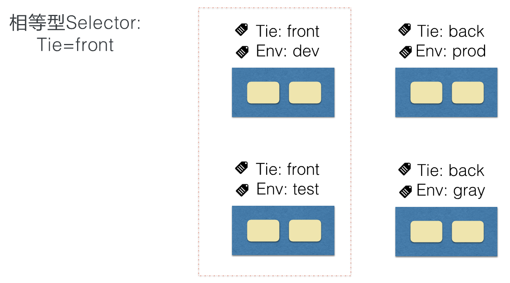

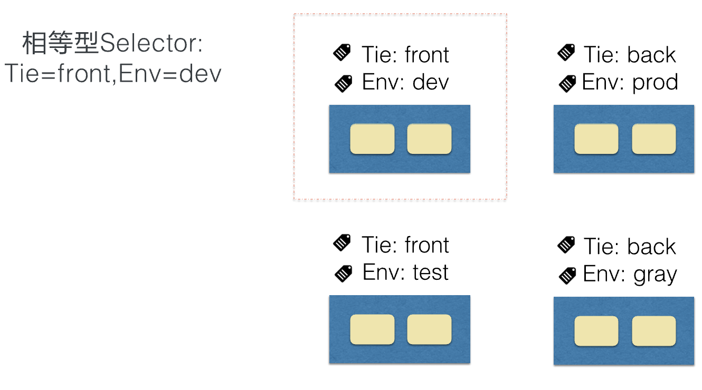

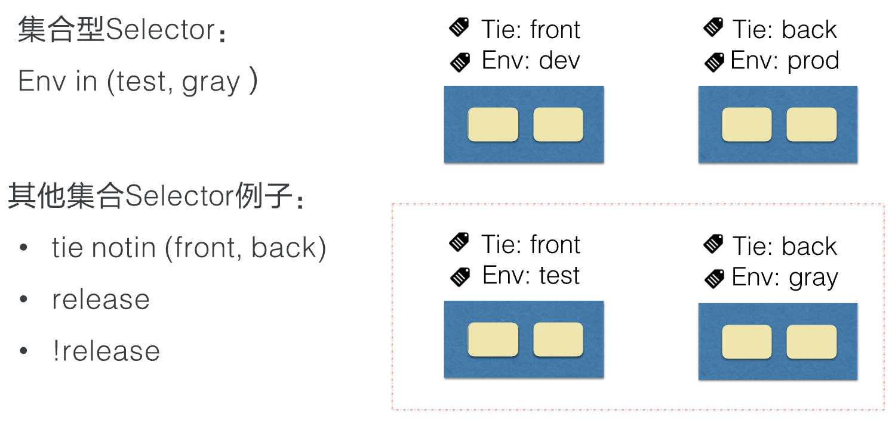

label Selector 是通过 -l 这个选项来进行指定的

```bash
kubectl get pods —show-labels -l env=test
```

### Annotations

另外一种重要的元数据是：annotations。一般是系统或者工具用来存储资源的非标示性信息，可以用来扩展资源的 spec/status 的描述，这里给了几个 annotations 的例子：

第一个例子，存储了阿里云负载器的证书 ID，我们可以看到 annotations 一样可以拥有域名的前缀，标注中也可以包含版本信息。第二个 annotation存储了 nginx 接入层的配置信息，我们可以看到 annotations 中包括 **,** 这样无法出现在 label 中的特殊字符。第三个 annotations 一般可以在 kubectl apply 命令行操作后的资源中看到， annotation 值是一个结构化的数据，实际上是一个 json 串，标记了上一次 kubectl 操作的资源的 json 的描述。

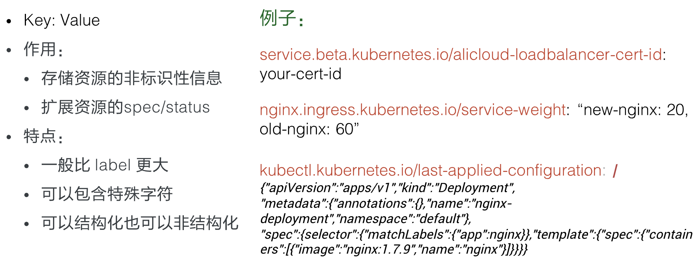

### OwnerReference

我们当时讲到最后一个元数据叫做 OwnerReference，所谓所有者，一般就是指集合类的资源，比如说 Pod 集合，就有 replicaset、statefulset，这个将在后序的课程中讲到。

集合类资源的控制器会创建对应的归属资源。比如：replicaset 控制器在操作中会创建 Pod，被创建 Pod 的 OwnerReference 就指向了创建 Pod 的 replicaset，OwnerReference 使得用户可以方便地查找一个创建资源的对象，另外，还可以用来实现级联删除的效果。

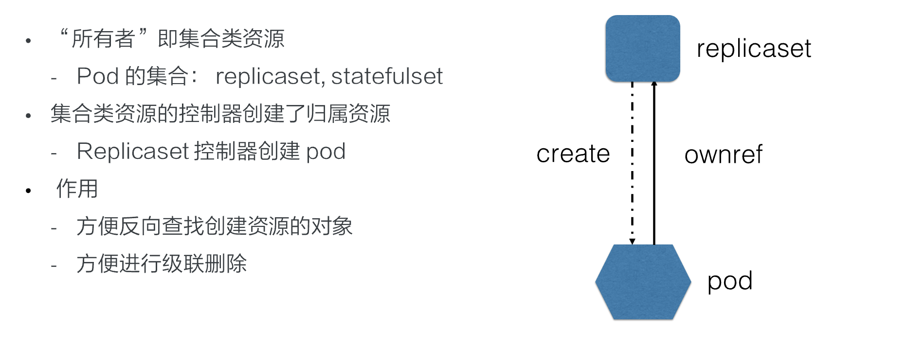


## 控制器模式

### 控制循环

控制型模式最核心的就是控制循环的概念。在控制循环中包括了控制器，被控制的系统，以及能够观测系统的传感器，三个逻辑组件。

当然这些组件都是逻辑的，外界通过修改资源 spec 来控制资源，控制器比较资源 spec 和 status，从而计算一个 diff，diff 最后会用来决定执行对系统进行什么样的控制操作，控制操作会使得系统产生新的输出，并被传感器以资源 status 形式上报，控制器的各个组件将都会是独立自主地运行，不断使系统向 spec 表示终态趋近。

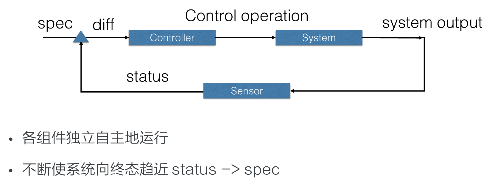

### Sensor

控制循环中逻辑的传感器主要由 Reflector、Informer、Indexer 三个组件构成。

Reflector 通过 List 和 Watch K8s server 来获取资源的数据。List 用来在 Controller 重启以及 Watch 中断的情况下，进行系统资源的全量更新；而 Watch 则在多次 List 之间进行增量的资源更新；Reflector 在获取新的资源数据后，会在 Delta 队列中塞入一个包括资源对象信息本身以及资源对象事件类型的 Delta 记录，Delta 队列中可以保证同一个对象在队列中仅有一条记录，从而避免 Reflector 重新 List 和 Watch 的时候产生重复的记录。

Informer 组件不断地从 Delta 队列中弹出 delta 记录，然后把资源对象交给 indexer，让 indexer 把资源记录在一个缓存中，缓存在默认设置下是用资源的命名空间来做索引的，并且可以被 Controller Manager 或多个 Controller 所共享。之后，再把这个事件交给事件的回调函数

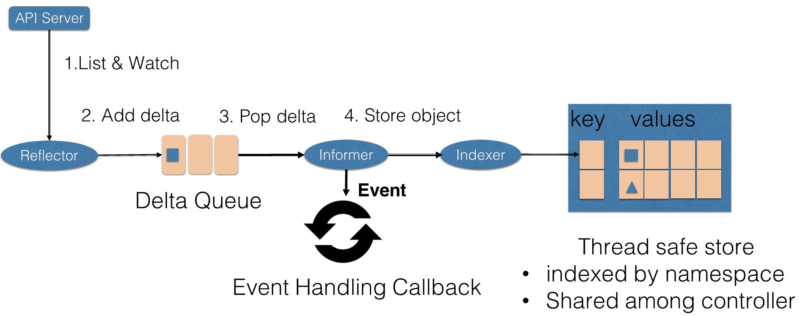

控制循环中的控制器组件主要由事件处理函数以及 worker 组成，事件处理函数之间会相互关注资源的新增、更新、删除的事件，并根据控制器的逻辑去决定是否需要处理。对需要处理的事件，会把事件关联资源的命名空间以及名字塞入一个工作队列中，并且由后续的 worker 池中的一个 Worker 来处理，工作队列会对存储的对象进行去重，从而避免多个 Woker 处理同一个资源的情况。

Worker 在处理资源对象时，一般需要用资源的名字来重新获得最新的资源数据，用来创建或者更新资源对象，或者调用其他的外部服务，Worker 如果处理失败的时候，一般情况下会把资源的名字重新加入到工作队列中，从而方便之后进行重试。

### 控制循环例子-扩容

这里举一个简单的例子来说明一下控制循环的工作原理。

ReplicaSet 是一个用来描述无状态应用的扩缩容行为的资源， ReplicaSet controler 通过监听 ReplicaSet 资源来维持应用希望的状态数量，ReplicaSet 中通过 selector 来匹配所关联的 Pod，在这里考虑 ReplicaSet rsA 的，replicas 从 2 被改到 3 的场景。

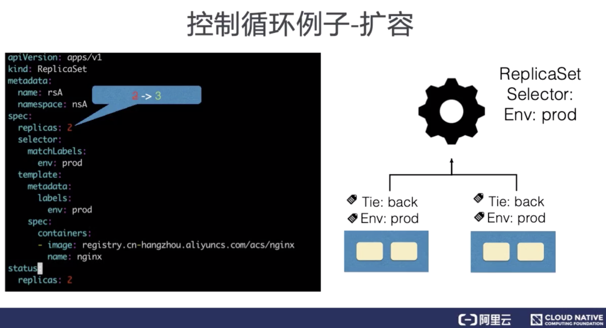

首先，Reflector 会 watch 到 ReplicaSet 和 Pod 两种资源的变化，为什么我们还会 watch pod 资源的变化稍后会讲到。发现 ReplicaSet 发生变化后，在 delta 队列中塞入了对象是 rsA，而且类型是更新的记录。

Informer 一方面把新的 ReplicaSet 更新到缓存中，并与 Namespace nsA 作为索引。另外一方面，调用 Update 的回调函数，ReplicaSet 控制器发现 ReplicaSet 发生变化后会把字符串的 nsA/rsA 字符串塞入到工作队列中，工作队列后的一个 Worker 从工作队列中取到了 nsA/rsA 这个字符串的 key，并且从缓存中取到了最新的 ReplicaSet 数据。

Worker 通过比较 ReplicaSet 中 spec 和 status 里的数值，发现需要对这个 ReplicaSet 进行扩容，因此 ReplicaSet 的 Worker 创建了一个 Pod，这个 pod 中的 OwnerReference 取向了 ReplicaSet rsA。

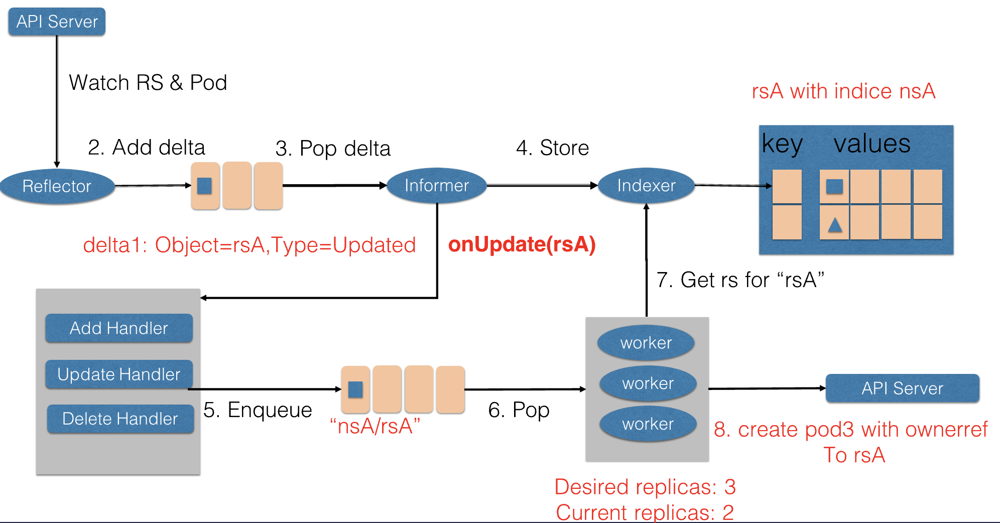

然后 Reflector Watch 到的 Pod 新增事件，在 delta 队列中额外加入了 Add 类型的 deta 记录，一方面把新的 Pod 记录通过 Indexer 存储到了缓存中，另一方面调用了 ReplicaSet 控制器的 Add 回调函数，Add 回调函数通过检查 pod ownerReferences 找到了对应的 ReplicaSet，并把包括 ReplicaSet 命名空间和字符串塞入到了工作队列中。

ReplicaSet 的 Woker 在得到新的工作项之后，从缓存中取到了新的 ReplicaSet 记录，并得到了其所有创建的 Pod，因为 ReplicaSet 的状态不是最新的，也就是所有创建 Pod 的数量不是最新的。因此在此时 ReplicaSet 更新 status 使得 spec 和 status 达成一致。

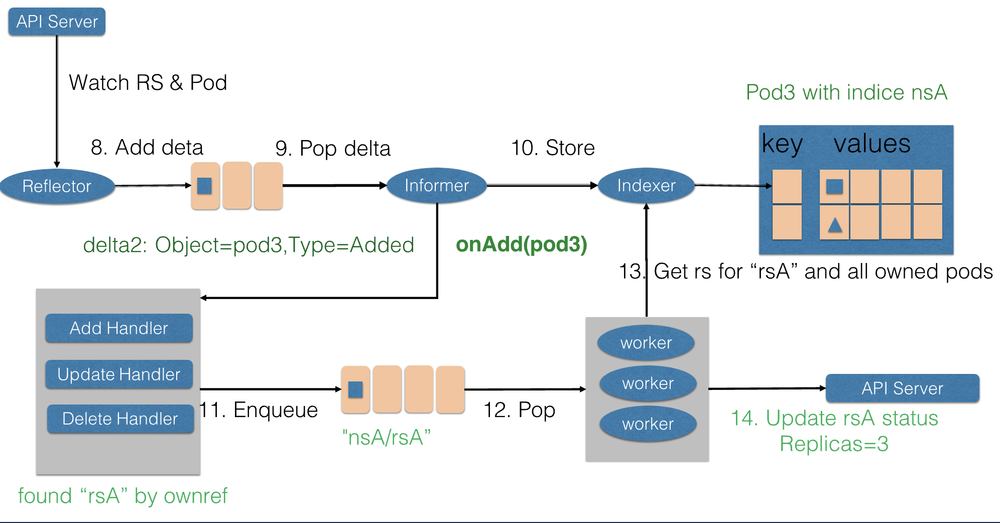

## 控制器模式总结

### 两种 API 设计方法

Kubernetes 控制器模式依赖声明式的 API。另外一种常见的 API 类型是命令式 API。为什么 Kubernetes 采用声明式 API，而不是命令式 API 来设计整个控制器呢？

首先，比较两种 API 在交互行为上的差别。在生活中，常见的命令式的交互方式是家长和孩子交流方式，因为孩子欠缺目标意识，无法理解家长期望，家长往往通过一些命令，教孩子一些明确的动作，比如说：吃饭、睡觉类似的命令。我们在容器编排体系中，命令式 API 就是通过向系统发出明确的操作来执行的。

而常见的声明式交互方式，就是老板对自己员工的交流方式。老板一般不会给自己的员工下很明确的决定，实际上可能老板对于要操作的事情本身，还不如员工清楚。因此，老板通过给员工设置可量化的业务目标的方式，来发挥员工自身的主观能动性。比如说，老板会要求某个产品的市场占有率达到 80%，而不会指出要达到这个市场占有率，要做的具体操作细节。

类似的，在容器编排体系中，我们可以执行一个应用实例副本数保持在 3 个，而不用明确的去扩容 Pod 或是删除已有的 Pod，来保证副本数在三个。

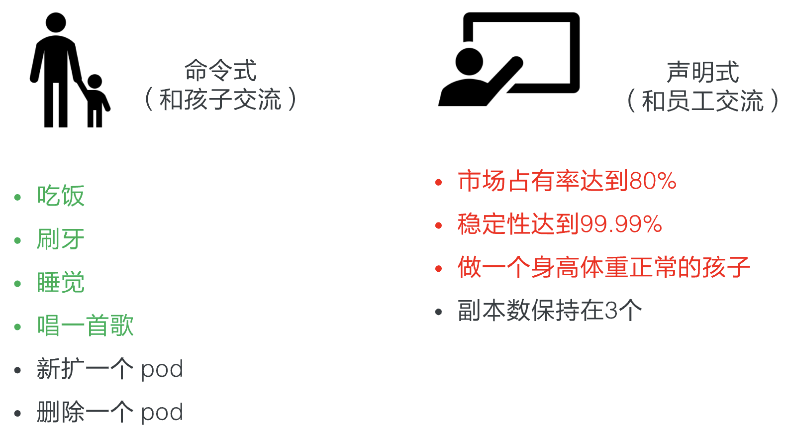

### 命令式 API 的问题

在理解两个交互 API 的差别后，可以分析一下命令式 API 的问题。

命令 API 最大的一个问题在于错误处理；

在大规模的分布式系统中，错误是无处不在的。一旦发出的命令没有响应，调用方只能通过反复重试的方式来试图恢复错误，然而盲目的重试可能会带来更大的问题。

假设原来的命令，后台实际上已经执行完成了，重试后又多执行了一个重试的命令操作。为了避免重试的问题，系统往往还需要在执行命令前，先记录一下需要执行的命令，并且在重启等场景下，重做待执行的命令，而且在执行的过程中，还需要考虑多个命令的先后顺序、覆盖关系等等一些复杂的逻辑情况。

实际上许多命令式的交互系统后台往往还会做一个巡检的系统，用来修正命令处理超时、重试等一些场景造成数据不一致的问题；
 
然而，因为巡检逻辑和日常操作逻辑是不一样的，往往在测试上覆盖不够，在错误处理上不够严谨，具有很大的操作风险，因此往往很多巡检系统都是人工来触发的。

最后，命令式 API 在处理多并发访问时，也很容易出现问题；
 
假如有多方并发的对一个资源请求进行操作，并且一旦其中有操作出现了错误，就需要重试。那么最后哪一个操作生效了，就很难确认，也无法保证。很多命令式系统往往在操作前会对系统进行加锁，从而保证整个系统最后生效行为的可预见性，但是加锁行为会降低整个系统的操作执行效率。

相对的，声明式 API 系统里天然地记录了系统现在和最终的状态。
 

不需要额外的操作数据。另外因为状态的幂等性，可以在任意时刻反复操作。在声明式系统运行的方式里，正常的操作实际上就是对资源状态的巡检，不需要额外开发巡检系统，系统的运行逻辑也能够在日常的运行中得到测试和锤炼，因此整个操作的稳定性能够得到保证。

最后，因为资源的最终状态是明确的，我们可以合并多次对状态的修改。可以不需要加锁，就支持多方的并发访问。

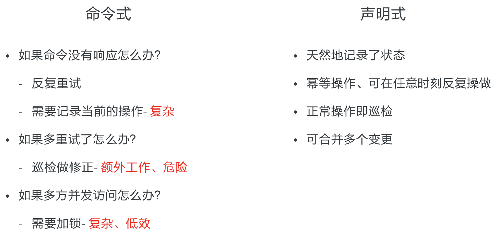

### 控制器模式总结

- Kubernetes 所采用的控制器模式，是由声明式 API 驱动的。确切来说，是基于对 Kubernetes 资源对象的修改来驱动的；
- Kubernetes 资源之后，是关注该资源的控制器。这些控制器将异步的控制系统向设置的终态驱近；
- 这些控制器是自主运行的，使得系统的自动化和无人值守成为可能；
- 因为 Kubernetes 的控制器和资源都是可以自定义的，因此可以方便的扩展控制器模式。特别是对于有状态应用，我们往往通过自定义资源和控制器的方式，来自动化运维操作。这个也就是后续会介绍的 operator 的场景。

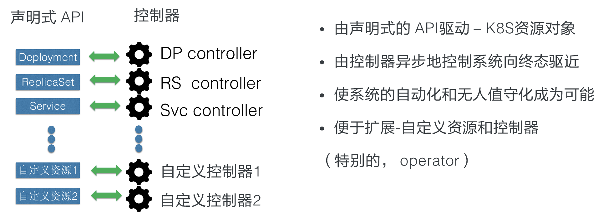

