#! https://zhuanlan.zhihu.com/p/658957986
# lec06-应用编排与管理-Deployment

## Resources

- 课程官网：https://edu.aliyun.com/course/314164/?spm=a2cwt.28120018.314164.1.64de1ee9GBAhjO
- blibili官网：https://www.bilibili.com/video/BV1Et411j7R2/?spm_id_from=333.999.0.0

## 需求来源

### 背景问题
 
首先，我们来看一下背景问题。如下图所示：如果我们直接管理集群中所有的 Pod，应用 A、B、C 的 Pod，其实是散乱地分布在集群中。

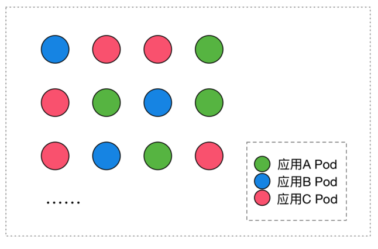

现在有以下的问题：

- 首先，如何保证集群内可用 Pod 的数量？也就是说我们应用 A 四个 Pod 如果出现了一些宿主机故障，或者一些网络问题，如何能保证它可用的数量？
- 如何为所有 Pod 更新镜像版本？我们是否要某一个 Pod 去重建新版本的 Pod？
- 然后在更新过程中，如何保证服务的可用性？
- 以及更新过程中，如果发现了问题，如何快速回滚到上一个版本？

### Deployment：管理部署发布的控制器

这里就引入了我们今天课程的主题：Deployment 管理部署发布的控制器。

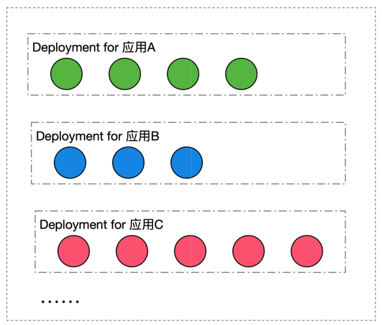

可以看到我们通过 Deployment 将应用 A、B、C 分别规划到不同的 Deployment 中，每个 Deployment 其实是管理的一组相同的应用 Pod，这组 Pod 我们认为它是相同的一个副本，那么 Deployment 能帮我们做什么事情呢？

1. 首先，Deployment 定义了一种 Pod 期望数量，比如说应用 A，我们期望 Pod 数量是四个，那么这样的话，controller 就会持续维持 Pod 数量为期望的数量。当我们与 Pod 出现了网络问题或者宿主机问题的话，controller 能帮我们恢复，也就是新扩出来对应的 Pod，来保证可用的 Pod 数量与期望数量一致；
 
2. 配置 Pod 发布方式，也就是说 controller 会按照用户给定的策略来更新 Pod，而且更新过程中，也可以设定不可用 Pod 数量在多少范围内；
 
3. 如果更新过程中发生问题的话，即所谓"一键"回滚，也就是说你通过一条命令或者一行修改能够将 Deployment 下面所有 Pod 更新为某一个旧版本 。

## 用例解读

### Deployment 语法

下面我们用一个简单的用例来解读一下如何操作 Deployment。

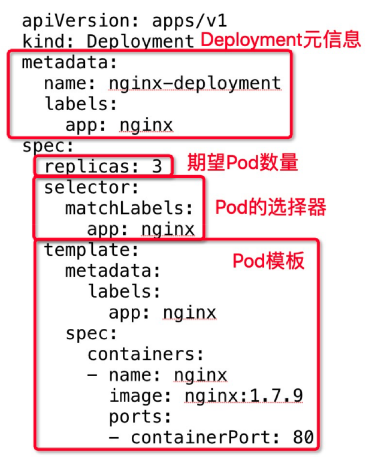

上图可以看到一个最简单的 Deployment 的 yaml 文件。

"apiVersion：apps/v1"，也就是说 Deployment 当前所属的组是 apps，版本是 v1。"metadata"是我们看到的 Deployment 元信息，也就是往期回顾中的 Labels、Selector、Pod.image，这些都是在往期中提到的知识点。

Deployment 作为一个 K8s 资源，它有自己的 metadata 元信息，这里我们定义的 Deployment.name 是 nginx.Deployment。Deployment.spec 中首先要有一个核心的字段，即 **replicas**，这里定义期望的 Pod 数量为三个；selector 其实是 Pod 选择器，那么所有扩容出来的 Pod，它的 Labels 必须匹配 selector 层上的 image.labels，也就是 app.nginx。

就如上面的 Pod 模板 **template** 中所述，这个 template 它其实包含了两部分内容：

- 一部分是我们期望 Pod 的 metadata，其中包含了 labels，即跟 selector.matchLabels 相匹配的一个 Labels；
- 第二部分是 template 包含的一个 Pod.spec。这里 Pod.spec 其实是 Deployment 最终创建出来 Pod 的时候，它所用的 Pod.spec，这里定义了一个 container.nginx，它的镜像版本是 nginx:1.7.9。

下面是遇到的新知识点：

- 第一个是 replicas，就是 Deployment 中期望的或者终态数量；
- 第二个是 template，也就是 Pod 相关的一个模板。

### 查看 Deployment 状态

当我们创建出一个 Deployment 的时候，可以通过 kubectl get deployment，看到 Deployment 总体的一个状态。如下图所示：

nginx-deployment.yaml

```yaml
apiVersion: apps/v1
kind: Deployment
metadata:
  name: nginx-deployment
  labels:
    app: nginx
spec:
  replicas: 3
  selector:
    matchLabels:
      app: nginx
  template:
    metadata:
      labels:
        app: nginx
    spec:
      containers:
      - name: nginx
        image: nginx:1.7.9
        ports:
        - containerPort: 80
```


```bash
wds@worker01:~/I2EC$ kubectl create -f nginx-deployment.yaml
deployment.apps/nginx-deployment created
wds@worker01:~/I2EC$ kubectl get deployment
NAME               READY   UP-TO-DATE   AVAILABLE   AGE
nginx-deployment   0/3     3            0           19s
```

上面中可以看到：

- DESIRED：期望的 Pod 数量是 3 个；
- CURRENT：当前实际 Pod 数量是 3 个；
- UP-TO-DATE：其实是到达最新的期望版本的 Pod 数量；
- AVAILABLE：这个其实是运行过程中可用的 Pod 数量。后面会提到，这里 AVAILABLE 并不简单是可用的，也就是 Ready 状态的，它其实包含了一些可用超过一定时间长度的 Pod；
- AGE：deployment 创建的时长，如上图 Deployment 就是已经创建了 80 分钟。

### 查看 Pod 

最后我们可以查看一下 Pod。如下图所示：

```bash
wds@worker01:~/I2EC$ kubectl get pod
NAME                              READY   STATUS    RESTARTS   AGE
nginx-deployment-f7599d4c-2hwnl   0/1     Pending   0          2m20s
nginx-deployment-f7599d4c-55cjf   0/1     Pending   0          2m20s
nginx-deployment-f7599d4c-bsjqr   0/1     Pending   0          2m20s
```

上图中有三个 Pod，Pod 名字格式我们不难看到。

**\${deployment-name}-\${template-hash}-\${random-suffix}**
 
- 最前面一段：nginx-deployment，其实是 Pod 所属 Deployment.name；
- 中间一段：template-hash，这里三个 Pod 是一样的，因为这三个 Pod 其实都是同一个 template 中创建出来的。
- 最后一段，是一个 random 的字符串，我们通过 get.pod 可以看到，Pod 的 ownerReferences 即 Pod 所属的 controller 资源，并不是 Deployment，而是一个 ReplicaSet。这个 ReplicaSet 的 name，其实是 nginx-deployment 加上 pod.template-hash，后面会提到。所有的 Pod 都是 ReplicaSet 创建出来的，而 ReplicaSet 它对应的某一个具体的 Deployment.template 版本。

```bash
wds@worker01:~/I2EC$ kubectl get pod/nginx-deployment-f7599d4c-55cjf -o yaml
apiVersion: v1
kind: Pod
metadata:
  creationTimestamp: "2023-09-28T08:39:23Z"
  generateName: nginx-deployment-f7599d4c-
  labels:
    app: nginx
    pod-template-hash: f7599d4c
  name: nginx-deployment-f7599d4c-55cjf
  namespace: default
  ownerReferences:
  - apiVersion: apps/v1
    blockOwnerDeletion: true
    controller: true
    kind: ReplicaSet
    name: nginx-deployment-f7599d4c
    uid: 557efcfd-4653-4bdb-859d-8665025b52be
  resourceVersion: "174441"
  uid: ff8ca6e0-636f-44ba-9ac4-d25539a6d7ee
spec:
  containers:
  - image: nginx:1.7.9
    imagePullPolicy: IfNotPresent
    name: nginx
    ports:
    - containerPort: 80
      protocol: TCP
    resources: {}
    terminationMessagePath: /dev/termination-log
    terminationMessagePolicy: File
    volumeMounts:
    - mountPath: /var/run/secrets/kubernetes.io/serviceaccount
      name: kube-api-access-4fzq2
      readOnly: true
  dnsPolicy: ClusterFirst
  enableServiceLinks: true
  preemptionPolicy: PreemptLowerPriority
  priority: 0
  restartPolicy: Always
  schedulerName: default-scheduler
  securityContext: {}
  serviceAccount: default
  serviceAccountName: default
  terminationGracePeriodSeconds: 30
  tolerations:
  - effect: NoExecute
    key: node.kubernetes.io/not-ready
    operator: Exists
    tolerationSeconds: 300
  - effect: NoExecute
    key: node.kubernetes.io/unreachable
    operator: Exists
    tolerationSeconds: 300
  volumes:
  - name: kube-api-access-4fzq2
    projected:
      defaultMode: 420
      sources:
      - serviceAccountToken:
          expirationSeconds: 3607
          path: token
      - configMap:
          items:
          - key: ca.crt
            path: ca.crt
          name: kube-root-ca.crt
      - downwardAPI:
          items:
          - fieldRef:
              apiVersion: v1
              fieldPath: metadata.namespace
            path: namespace
status:
  conditions:
  - lastProbeTime: null
    lastTransitionTime: "2023-09-28T08:39:23Z"
    message: '0/1 nodes are available: 1 node(s) were unschedulable. preemption: 0/1
      nodes are available: 1 Preemption is not helpful for scheduling..'
    reason: Unschedulable
    status: "False"
    type: PodScheduled
  phase: Pending
  qosClass: BestEffort
```

### 更新镜像

接下来我们可以看一下，如何对一个给定的 Deployment 更新它所有Pod的镜像版本呢？这里我们可以执行一个 kubectl 命令：

```bash
wds@worker01:~/I2EC$ kubectl set image deployment.v1.apps/nginx-deployment nginx=nginx:1.9.1
deployment.apps/nginx-deployment image updated
```

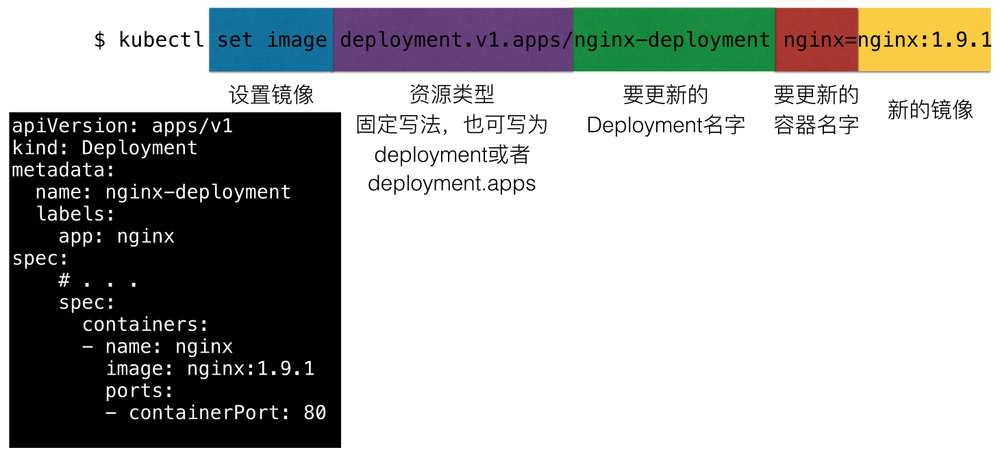

首先 kubectl 后面有一个 set image 固定写法，这里指的是设定镜像；其次是一个 deployment.v1.apps，这里也是一个固定写法，写的是我们要操作的资源类型，deployment 是资源名、v1 是资源版本、apps 是资源组，这里也可以简写为 deployment 或者 deployment.apps，比如说写为 deployment 的时候，默认将使用 apps 组 v1 版本。

第三部分是要更新的 deployment 的 name，也就是我们的 nginx-deployment；再往后的 nginx 其实指的是 template，也就是 Pod 中的 container.name；这里我们可以注意到：一个 Pod 中，其实可能存在多个 container，而我们指定想要更新的镜像的 container.name，就是 nginx。

最后，指定我们这个容器期望更新的镜像版本，这里指的是 nginx: 1.9.1。如下图所示：当执行完这条命令之后，可以看到 deployment 中的 template.spec 已经更新为 nginx: 1.9.1。

### 快速回滚

如果我们在发布过程中遇到了问题，也支持快速回滚。通过 kubectl 执行的话，其实是 **kubectl rollout undo** 这个命令，可以回滚到 Deployment 上一版本；通过 **rollout undo** 加上 **to-revision** 来指定可以回滚到某一个具体的版本。

```bash
wds@worker01:~/I2EC$ kubectl rollout undo deployment/nginx-deployment
deployment.apps/nginx-deployment rolled back
wds@worker01:~/I2EC$ kubectl rollout undo deployment.v1.apps/nginx-deployment --to-revision=2
deployment.apps/nginx-deployment rolled back
wds@worker01:~/I2EC$ kubectl rollout history deployment.v1.apps/nginx-deployment
deployment.apps/nginx-deployment
REVISION  CHANGE-CAUSE
3         <none>
4         <none>
```

### DeploymeStatus

最后我们来看一下 DeploymeStatus。前面的课程我们学习到，每一个资源都有它的 spec.Status。这里可以看一下，deploymentStatus 中描述的三个其实是它的 conversion 状态，也就是 Processing、Complete 以及 Failed。

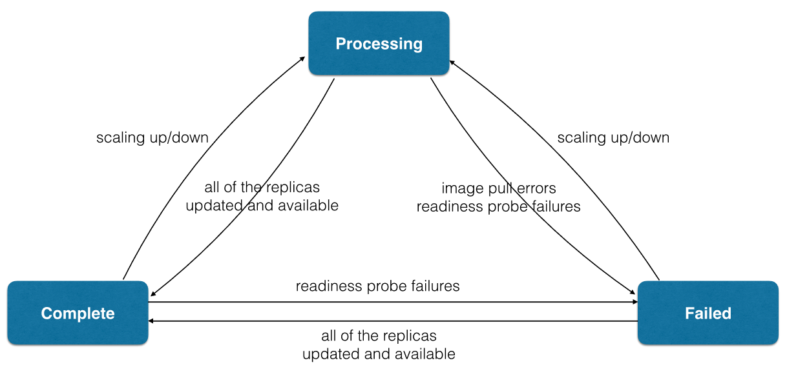

以 Processing 为例：Processing 指的是 Deployment 正在处于扩容和发布中。比如说 Processing 状态的 deployment，它所有的 replicas 及 Pod 副本全部达到最新版本，而且是 available，这样的话，就可以进入 complete 状态。而 complete 状态如果发生了一些扩缩容的话，也会进入 processing 这个处理工作状态。

如果在处理过程中遇到一些问题：比如说拉镜像失败了，或者说 readiness probe 检查失败了，就会进入 failed 状态；如果在运行过程中即 complete 状态，中间运行时发生了一些 pod readiness probe 检查失败，这个时候 deployment 也会进入 failed 状态。进入 failed 状态之后，除非所有点 replicas 均变成 available，而且是 updated 最新版本，deployment 才会重新进入 complete 状态。

## 架构设计

### 管理模式

我们来看一下架构设计。首先简单看一下管理模式：Deployment 只负责管理不同版本的 ReplicaSet，由 ReplicaSet 来管理具体的 Pod 副本数，每个 ReplicaSet 对应 Deployment template 的一个版本。在上文的例子中可以看到，每一次修改 template，都会生成一个新的 ReplicaSet，这个 ReplicaSet 底下的 Pod 其实都是相同的版本。

如上图所示：Deployment 创建 ReplicaSet，而 ReplicaSet 创建 Pod。他们的 OwnerRef 其实都对应了其控制器的资源。

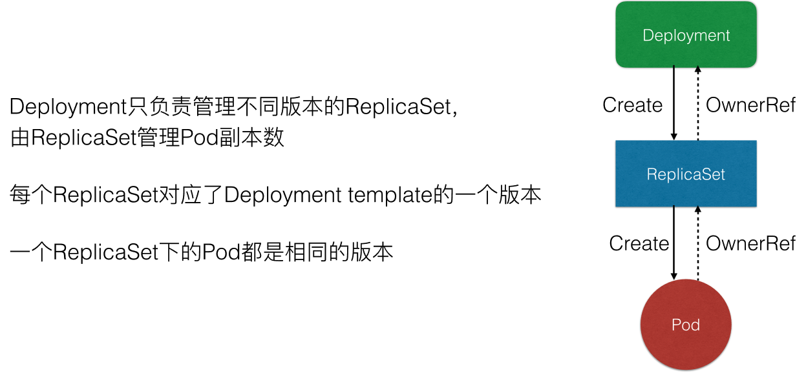

### Deployment 控制器

我们先简单看一下控制器实现原理。

首先，我们所有的控制器都是通过 Informer 中的 Event 做一些 Handler 和 Watch。这个地方 Deployment 控制器，其实是关注 Deployment 和 ReplicaSet 中的 event，收到事件后会加入到队列中。而 Deployment controller 从队列中取出来之后，它的逻辑会判断 Check Paused，这个 Paused 其实是 Deployment 是否需要新的发布，如果 Paused 设置为 true 的话，就表示这个 Deployment 只会做一个数量上的维持，不会做新的发布。

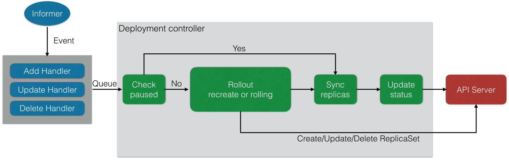

如上图，可以看到如果 Check paused 为 Yes 也就是 true 的话，那么只会做 Sync replicas。也就是说把 replicas sync 同步到对应的 ReplicaSet 中，最后再 Update Deployment status，那么 controller 这一次的 ReplicaSet 就结束了。

那么如果 paused 为 false 的话，它就会做 Rollout，也就是通过 Create 或者是 Rolling 的方式来做更新，更新的方式其实也是通过 Create/Update/Delete 这种 ReplicaSet 来做实现的。

### ReplicaSet 控制器

当 Deployment 分配 ReplicaSet 之后，ReplicaSet 控制器本身也是从 Informer 中 watch 一些事件，这些事件包含了 ReplicaSet 和 Pod 的事件。从队列中取出之后，ReplicaSet controller 的逻辑很简单，就只管理副本数。也就是说如果 controller 发现 replicas 比 Pod 数量大的话，就会扩容，而如果发现实际数量超过期望数量的话，就会删除 Pod。

上面 Deployment 控制器的图中可以看到，Deployment 控制器其实做了更复杂的事情，包含了版本管理，而它把每一个版本下的数量维持工作交给 ReplicaSet 来做。

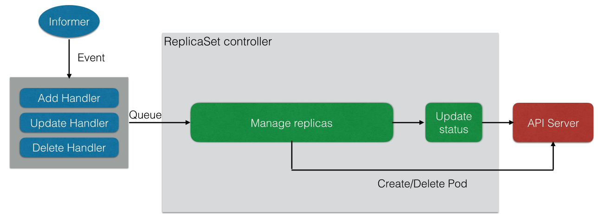

#### 扩/缩容模拟

下面来看一些操作模拟，比如说扩容模拟。这里有一个 Deployment，它的副本数是 2，对应的 ReplicaSet 有 Pod1 和 Pod2。这时如果我们修改 Deployment replicas， controller 就会把 replicas 同步到当前版本的 ReplicaSet 中，这个 ReplicaSet 发现当前有 2 个 Pod，不满足当前期望 3 个，就会创建一个新的 Pod3。

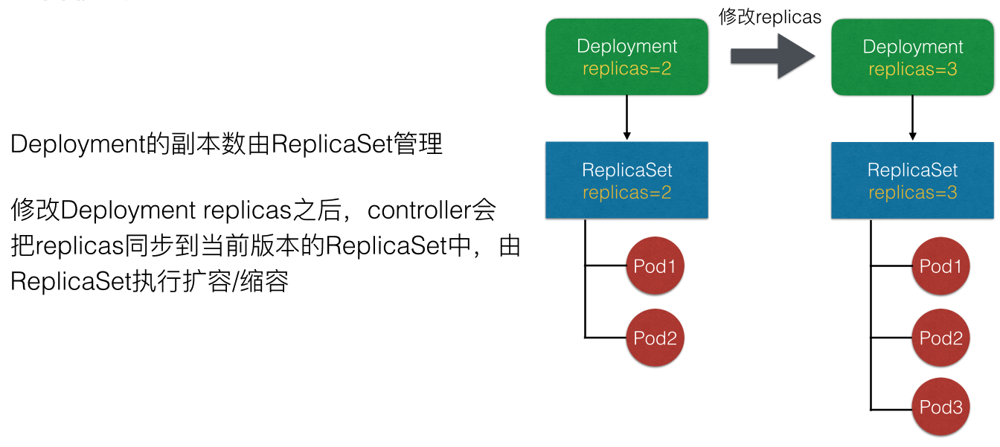

#### 发布模拟

我们再模拟一下发布，发布的情况会稍微复杂一点。这里可以看到 Deployment 当前初始的 template，比如说 template1 这个版本。template1 这个 ReplicaSet 对应的版本下有三个 Pod：Pod1，Pod2，Pod3。

这时修改 template 中一个容器的 image， Deployment controller 就会新建一个对应 template2 的 ReplicaSet。创建出来之后 ReplicaSet 会逐渐修改两个 ReplicaSet 的数量，比如它会逐渐增加 ReplicaSet2 中 replicas 的期望数量，而逐渐减少 ReplicaSet1 中的 Pod 数量。

那么最终达到的效果是：新版本的 Pod 为 Pod4、Pod5和Pod6，旧版本的 Pod 已经被删除了，这里就完成了一次发布。

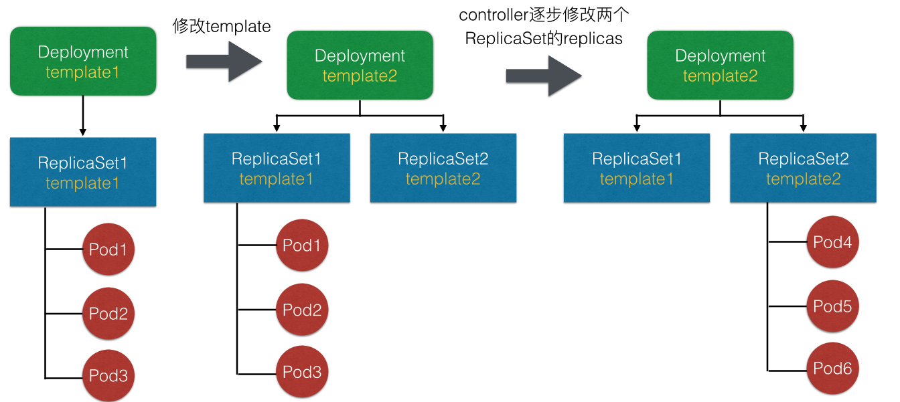

#### 回滚模拟

来看一下回滚模拟，根据上面的发布模拟可以知道 Pod4、Pod5、Pod6 已经发布完成。这时发现当前的业务版本是有问题的，如果做回滚的话，不管是通过 rollout 命令还是通过回滚修改 template，它其实都是把 template 回滚为旧版本的 template1。

这个时候 Deployment 会重新修改 ReplicaSet1 中 Pod 的期望数量，把期望数量修改为 3 个，且会逐渐减少新版本也就是 ReplicaSet2 中的 replica 数量，最终的效果就是把 Pod 从旧版本重新创建出来。

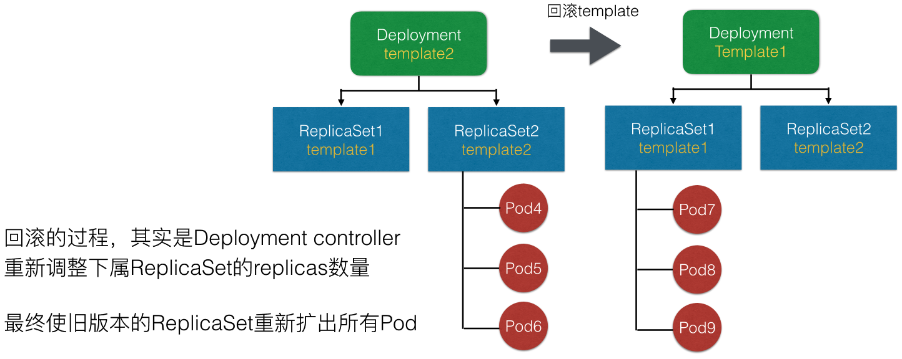

发布模拟的图中可以看到，其实初始版本中 Pod1、Pod2、Pod3 是旧版本，而回滚之后其实是 Pod7、Pod8、Pod9。就是说它的回滚并不是把之前的 Pod 重新找出来，而是说重新创建出符合旧版本 template 的 Pod。

#### spec 字段解析

最后再来简单看一些 Deployment 中的字段解析。首先看一下 Deployment 中其他的 spec 字段：

- MinReadySeconds：Deployment 会根据 Pod ready 来看 Pod 是否可用，但是如果我们设置了 MinReadySeconds 之后，比如设置为 30 秒，那 Deployment 就一定会等到 Pod ready 超过 30 秒之后才认为 Pod 是 available 的。Pod available 的前提条件是 Pod ready，但是 ready 的 Pod 不一定是 available 的，它一定要超过 MinReadySeconds 之后，才会判断为 available；
- revisionHistoryLimit：保留历史 revision，即保留历史 ReplicaSet 的数量，默认值为 10 个。这里可以设置为一个或两个，如果回滚可能性比较大的话，可以设置数量超过 10；
- paused：paused 是标识，Deployment 只做数量维持，不做新的发布，这里在 Debug 场景可能会用到；
- progressDeadlineSeconds：前面提到当 Deployment 处于扩容或者发布状态时，它的 condition 会处于一个 processing 的状态，processing 可以设置一个超时时间。如果超过超时时间还处于 processing，那么 controller 将认为这个 Pod 会进入 failed 的状态。

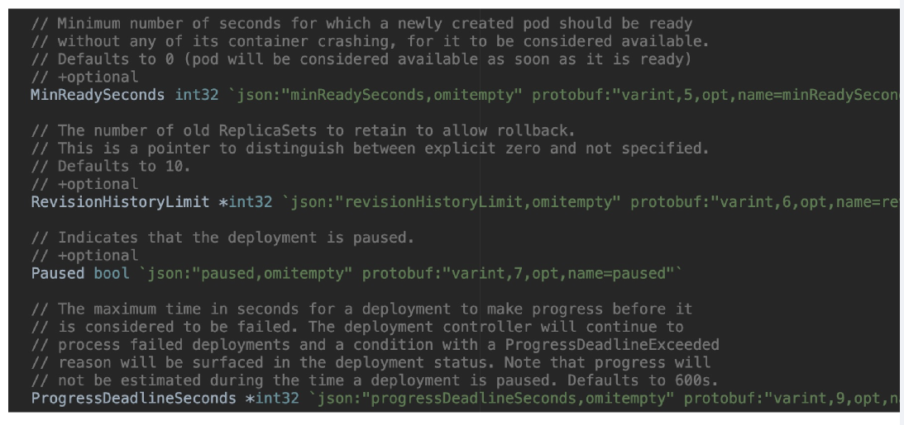

#### 升级策略字段解析

最后来看一下升级策略字段解析。

Deployment 在 RollingUpdate 中主要提供了两个策略，一个是 MaxUnavailable，另一个是 MaxSurge。这两个字段解析的意思，可以看下图中详细的 comment，或者简单解释一下：

MaxUnavailable：滚动过程中最多有多少个 Pod 不可用；
MaxSurge：滚动过程中最多存在多少个 Pod 超过预期 replicas 数量。
 
上文提到，ReplicaSet 为 3 的 Deployment 在发布的时候可能存在一种情况：新版本的 ReplicaSet 和旧版本的 ReplicaSet 都可能有两个 replicas，加在一起就是 4 个，超过了我们期望的数量三个。这是因为我们默认的 MaxUnavailable 和 MaxSurge 都是 25%，默认 Deployment 在发布的过程中，可能有 25% 的 replica 是不可用的，也可能超过 replica 数量 25% 是可用的，最高可以达到 125% 的 replica 数量。

这里其实可以根据用户实际场景来做设置。比如当用户的资源足够，且更注重发布过程中的可用性，可设置 MaxUnavailable 较小、MaxSurge 较大。但如果用户的资源比较紧张，可以设置 MaxSurge 较小，甚至设置为 0，这里要注意的是 MaxSurge 和 MaxUnavailable 不能同时为 0。

理由不难理解，当 MaxSurge 为 0 的时候，必须要删除 Pod，才能扩容 Pod；如果不删除 Pod 是不能新扩 Pod 的，因为新扩出来的话，总共的 Pod 数量就会超过期望数量。而两者同时为 0 的话，MaxSurge 保证不能新扩 Pod，而 MaxUnavailable 不能保证 ReplicaSet 中有 Pod 是 available 的，这样就会产生问题。所以说这两个值不能同时为 0。用户可以根据自己的实际场景来设置对应的、合适的值。

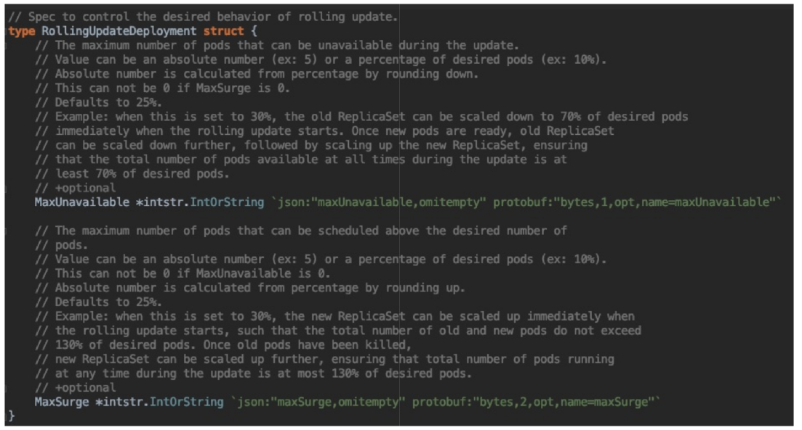
