#! https://zhuanlan.zhihu.com/p/657063126
# 从 Lambda 表达式出发理解 Java List 中的常用方法 Stream()

Java中，ArrayList应该是比较常用的一个对象了；那么它的stream()方法大家了解过吗？

如果可以熟练使用stream()方法，就可以方便地获取list中元素的某个特定字段、对list中的元素进行筛选、或者把list转成map。

在学习 Stream() 前，需要对 Lambda 表达式有一定的了解。

## 1. 对Lambda的理解 —【JAVA8】

### 1.1 简易理解

java 中最简单的语法，莫过于将一个值赋给某个变量，例如

```java
int a = 1;
```

而 java8 中的 lambda ，就是将一段代码赋给某个变量，例如

```java
ablock = public void dosomethings(String s){
            System.out.println(s);
       }
```


但是这样的写法略显笨拙，我们可以一步一步精简代码。

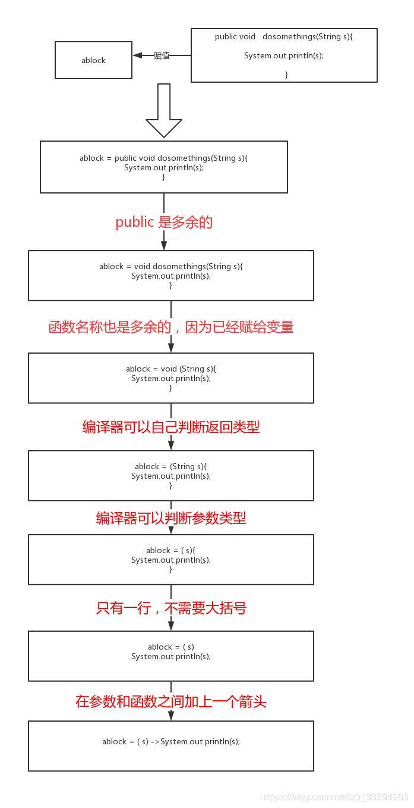

这样的代码就是一个lambda表达式，可以使得代码变得很简洁。

lambda表达式，即 `(可省略类型, 也可省略参数的参数列表) -> {代码块}`

### 1.2 更多案例

#### 1.2.1 lambda能替换匿名内部类【强强强】

```java
Runnable r = new Runnable() {
    @Override
    public void run() {
        System.out.println("thread run");
    }
}

Runnable r = () -> {
    System.out.println("thread run");
};
```

从这里可以看出，

- lambda 是有类型的，它的类型为等号左边接口的类型。
- 当 lambda 表达式内部的语句只有一行时，可以省略 `{}` ，但不建议这样做。

编译器之所以能大胆推断出这条语句 `System.out.println("thread run")` 实际上是 `run` 方法的内部语句，是因为 `Runnable` 接口只有 `run` 这一个抽象方法。我们注意到， `Runnable` 接口被 `@FunctionalInterface` 注解修饰，该注解限制该接口只能有一个抽象方法，该接口就会被赋予新的名词，函数接口。**在工作中，我们也可以给某一个接口添加 `@FunctionalInterface` 注解，代表该接口为函数接口，是为 `lambda` 所服务的**。如果再添加一个抽象方法，就会和此注解冲突，从而编译失败。

##### 1.2.1.1 @FunctionalInterface

函数式接口（Functional Interface），首先是一个接口，然后就是在这个接口里面只能有一个抽象方法。这种类型的接口也称为SAM接口，即Single Abstract Method interfaces。

它们主要用在 lambda表达式 和 方法引用（实际上也可认为是Lambda表达式）上。

如定义了一个函数式接口如下：

```java
@FunctionalInterface
public interface Person {
    void sayHello(String msg);
}
```

那么就可以使用Lambda表达式来表示该接口的一个实现(注：JAVA 8 之前一般是用匿名类实现的)：

```java
Person  personSay = message -> System.out.println("Hello " + message);
```

@FunctionalInterface标记在接口上，`函数式接口` 是指仅仅只包含一个 抽象方法*的接口。 在编译期间检查。

| 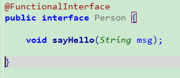 | 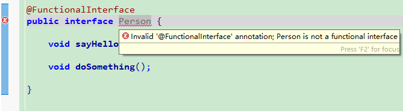 |
| ------------------------------------------------------------ | ------------------------------------------------------------ |

@FunctionalInterface 仅对抽象方法检查。

1. 该注解只能标记在 `有且仅有一个抽象方法` 的接口上。
2. JDK8接口中的静态方法和默认方法，都不算是抽象方法。
3. 接口默认继承 `java.lang.Object` ，所以如果接口显示声明覆盖了Object中方法，那么 也不算抽象方法。

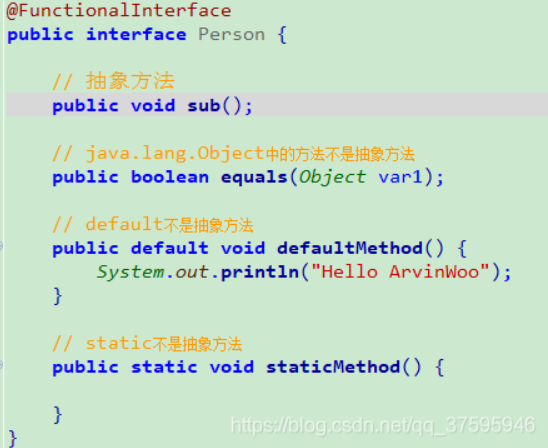

**注：该注解不是必须的，如果一个接口符合"函数式接口"定义，那么加不加该注解都没有影响。加上该注解能够更好地让编译器进行检查。如果编写的不是函数式接口，但是加上了@FunctionInterface，那么编译器会报错**。

为什么不能用默认方法来重载equals，hashCode和toString？

- 接口不能提供对Object类的任何方法的默认实现。从接口里不能提供对 `equals` ， `hashCode` 或 `toString` 的默认实现。因为若可以会很难确定什么时候该调用接口默认的方法。
- 如果一个类实现了一个方法，那总是优先于默认的实现的。一旦所有接口的实例都是 `Object` 的子类，所有接口实例都已经有对 `equals` / `hashCode` / `toString` 等方法非默认 实现。因此，一个在接口上的这些默认方法都是没用的，它也不会被编译。（简单地讲，每一个java类都是Object的子类，也都继承了它类中的 `equals` / `hashCode` / `toString` 方法，那么在类的接口上包含这些默认方法是没有意义的，它们也从来不会被编译。）

##### 1.2.1.2 java中的default关键字详解

default关键字和Java中的 `public`、`private` 等关键字一样，都属于修饰符关键字，可以用来修饰属性、方法以及类，但是 `default` 一般用来修饰接口中的方法。

出现该关键字的 **原因** 是，由于接口在Java中定义之初，有一个缺点，那就是，如果定义了一个接口，接口中又定义了N个方法，那么某个具体的类在实现该接口时，需要实现接口中的所有方法，不管是否需要用到接口中的方法。如果接口中的某个方法被 `default` 关键字修饰了，那么具体的实现类中可以不用实现方法。

例子：

```java
interface Person {
    default void show() {
        System.out.println("this is show");
    }
}
```

`Student` 类可以不用实现 `Person` 接口中的 `show()` 方法。

```java
class Student implements Person {
    //可以不用实现show()方法
}
```

如果实现类实现了个多个接口，假如不同的接口中有同名的被default修饰的方法，那么此时，实现类就必须重写这个方法，否则会编译出错。

```java
public interface Person1 {
    default void prinN(){
        System.out.println(Person1.class.getName());
    }
}
```

```java
public interface Person2 {
    default void prinN(){
        System.out.println(Person2.class.getName());
    }
}
```

```java
class Student implements Person1, Person2 {
    @Override
    public void prinN(){
        System.out.println(Student.class.getName());
    }
}
```

#### 1.2.2 哪里有list，哪里就有lambda

```java
//遍历输出集合
List<Integer> list=Arrays.asList(1,2,3,4,5);
list.forEach(x->System.out.print(x));
//当然也可使用方法引用
list.forEach(System.out::print);

//取出所有大于1的元素，并形成新的集合
List<Integer> collect = list.stream().filter(x -> x > 1).collect(Collectors.toList());

//获取学生的所有年龄集合
List<Integer> ageList=Arrays.asList(new Student("tom",20), new Student("jack",22))
    .stream().map(Student::getAge).collect(Collectors.toList());
```

- `forEach()`：对集合的迭代。但在大多数情况下，遍历效率：迭代器与for-each循环 $>$ 带有索引的for循环 $>$ lambda中的forEach 。但是lambda可以在多个CPU核上同时处理集合，在大数据量并行计算下，lambda的效率就体现出来了。
- `stream()`：将集合转化为流，这里的流不是io流。只有转化为流后，才可以进行接下来的map、filter、collect操作等，但流只能被消费一次。
- `map()`：将一种形式的流转化为另一种形式的流，这里常常配合方法引用，例如将 `List<Student>` 形式的流转化为 `List<Integer>` 形式的流。
- `collect()`：按照某种方法将流形成具体的集合。

------------------------------------------------
lambda对集合的操作还有很多，需要大家自己去探索。

## 2. 快速理解Consumer、Supplier、Predicate与Function

这几个接口都处在java.util.function包下，Consumer（消费型），Supplier（供给型）、Predicate（判断型）与Function（转换型），暂时不理解他们的类型没关系。

### 2.1 Consumer

Consumer是一个消费型的接口，它接收一个🍉，然后对这个西瓜进行消费，连西瓜籽都不带留下的。

先看Consumer接口的源码，有一个未实现的抽象方法，和一个默认方法（jdk1.8之后，接口里面可以有默认方法和静态方法）。

```java
@FunctionalInterface
public interface Consumer<T> {
 
    void accept(T t);
 
    default Consumer<T> andThen(Consumer<? super T> after) {
        Objects.requireNonNull(after);
        return (T t) -> { accept(t); after.accept(t); };
    }
 
}
```

我们只在意这个accept方法，接收一个泛型参数，不返回任何值。ok，我们来简单实现它

```java
Consumer<Integer> consumer = new Consumer<Integer>() {
    @Override
    public void accept(Integer integer) {
        System.out.println(integer);
    }
};

consumer.accept(1);
}
```

好了，用脚指头想着，肯定是输出1了。

接下来我们使用 lambda 表达式来对此匿名内部类进行改写。此时该 lambda 的类型就是 `Consumer` 类型。

```java
consumer = i-> System.out.println(i);
```

当然我们也可以使用方法引用

```java
consumer = System.out::println;
```

在 Stream 类中，我们发现常用的 forEach 接口接收一个 Consumer 类型的参数，源码如下

```java
void forEach(Consumer<? super T> action);
```

二话不说，我们将consumer传入forEach中，来实现遍历集合的操作。

```java
List<Integer> list = Arrays.asList(1,2,3,4,5);
Consumer<Integer> consumer = System.out::println;
list.stream().forEach(consumer);
```

将中间 consumer 对象去掉呢，代码会变得更加简洁。咦，到这里，是不是有一种似曾相识的感觉，原来是这样演变来的。

```java
List<Integer> list = Arrays.asList(1, 2, 3, 4, 5);
list.stream().forEach(System.out::println);
```

Consumer总结：

- Consumer接口是一个消费型的接口，只要实现它的accept方法，就能作为消费者来输出信息。
- lambda、方法引用都可以是一个 Consumer 类型，因此他们可以作为forEach的参数，用来协助 Stream 输出信息。
- Consumer还有很多变种，例如 IntConsumer 、 DoubleConsumer 与 LongConsumer 等，归根结底，这些变种其实只是指定了 Consumer 中的泛型而已，方法上并无变化。

### 2.2 Supplier

`Supplier` 是一个供给型的接口，我们可以无条件的从它这里获取东西。

```java
@FunctionalInterface
public interface Supplier<T> {
    
    T get();
}
```

我们不需要为 `get` 方法传入任何参数，就能获得一个结果，这不是白嫖吗？那我想要一个随机数

```java
Supplier<Double> supplier = ()->new Random().nextDouble();
//当然也可以使用方法引用
Supplier<Double> supplier1 = Math::random;
System.out.println(supplier.get());
```

下一步，`Supplier` 可以哪些地方呢，毕竟是可以白嫖的，谁不喜欢呢？我们看看 `Supplier` 在 `Optional` 中的应用。

```java
public T orElseGet(Supplier<? extends T> other) {
    return value != null ? value : other.get();
}
```

该方法接收 `Supplier` 类型的参数，当 `Optional` 内部的 `value` 不为空时，才会返回 `Supplier` 中的值。例如

```java
Optional<Double> optional = Optional.empty();
Supplier<Double> supplier = ()->new Random().nextDouble();
optional.orElseGet(supplier);
```

这必定返回 `Supplier` 中的随机值，因为 `Optional.empty()` 包含的值就是 `null` 。

Supplier总结：

- Supplier 是一个供给型的接口，其中的 get 方法用于返回一个值。
- Supplier 也有很多的变种，例如 IntSupplier 、LongSupplier 与 BooleanSupplier 等

### 2.3 Predicate

Predicate 是一个判断型接口，看看它的源码。

```java
@FunctionalInterface
public interface Predicate<T> {
 
    boolean test(T t);
 
    default Predicate<T> and(Predicate<? super T> other) {
        Objects.requireNonNull(other);
        return (t) -> test(t) && other.test(t);
    }
 
    default Predicate<T> negate() {
        return (t) -> !test(t);
    }
 
    default Predicate<T> or(Predicate<? super T> other) {
        Objects.requireNonNull(other);
        return (t) -> test(t) || other.test(t);
    }
 
    static <T> Predicate<T> isEqual(Object targetRef) {
        return (null == targetRef)
                ? Objects::isNull
                : object -> targetRef.equals(object);
    }
}
```

该接口将 jdk1.8 中接口的变化体现的淋漓尽致，接口不再 `纯粹` 了，可以有默认方法与静态方法了，下次面试再问道，就得分情况喽，哭出声。

要理解一个接口，我们就去实现它的方法。

```java
Predicate<Integer> predicate = i -> i>5;
System.out.println(predicate.test(1));
```

很明显，输出是false。等等，既然可以进行判断，那和 `Stream.filter()` 有没有关系呢？

```java
Stream<T> filter(Predicate<? super T> predicate);
```

果然是有关系的，啧啧啧，我这敏锐的嗅觉。那我们把 `Predicate` 对象传入 `filter` 试试？

```java
List<Integer> list= Arrays.asList(1,2,3,4,5,6,7,8);
list.stream().filter(i -> i>5).forEach(System.out::print);
```

很简单，输出是678。

Predicate总结：

- Predicate是一个判断型的接口，用一个test方法去测试传入的参数。
- 当然，Predicate也有对应的变种。

### 2.4 Function

Function是一个功能型的接口，用于将一种类型的数据转化为另外一种类型的数据。

```java
@FunctionalInterface
public interface Function<T, R> {
 
    R apply(T t);
 
    default <V> Function<V, R> compose(Function<? super V, ? extends T> before) {
        Objects.requireNonNull(before);
        return (V v) -> apply(before.apply(v));
    }
 
    default <V> Function<T, V> andThen(Function<? super R, ? extends V> after) {
        Objects.requireNonNull(after);
        return (T t) -> after.apply(apply(t));
    }
 
    static <T> Function<T, T> identity() {
        return t -> t;
    }
}
```

重点关注它的 apply 方法，现在就去实现它，并将之传入进 Stream.map() 方法中试试。

```java
public class TestFunction {
    static class Student{
        String name;
        Integer id;
 
        public Student(String name, Integer id) {
            this.name = name;
            this.id = id;
        }
 
        public String getName() {
            return name;
        }
 
        public Integer getId() {
            return id;
        }
    }
    public static void main(String[] args) {
        List<Student> list = Arrays.asList(new Student("jack",1),new Student("tom",2));
        Function<Student, Integer> function = Student::getId;
        list.stream().map(function).forEach(System.out::print);
    }
    
}
```

输出 `12`，可以看得出，Function 中的 apply 方法将 Student 类型的数据转化为对应 id 的 Integer 类型的数据。

Function总结：

- Function是一个转换型的接口，其中的apply可以将一种类型的数据转化成另外一种类型的数据。
- Function的变种就更多了。

### 2.5 总结

- 首先只要记住这四个接口的类型，Consumer(消费型)、Supplier(供给型)、Predicate(判断型)与Function(转换型)，
- 再记住他们对应的抽象方法Consumer(accpet)、Supplier(get)、Predicate(test)与Function(apply)

## 3. Lambda执行原理 【JAVA】

先看以下的一个示例：

```java
//使用注解@FunctionalInterface来声明这是一个函数式接口
@FunctionalInterface
interface Print {
    void output(String str);
}
 
public class Main {
 
    private static void handle(String str, Print p) {
        p.output(str);
    }
 
    public static void main(String[] args) {
        handle("abc", str -> System.out.println(str));
    }
}
```

运行后，显然输出 `abc` 。

那么，这段代码被编译成什么样子了呢，我们使用 `javap -p Main.class` 查看编译后的类成员信息（`-p`显示所有的类和成员）

```java
public class com.yang.testLambda.Main {
    public com.yang.testLambda.Main();
    private static void handle(java.lang.String, com.yang.testLambda.Print);
    public static void main(java.lang.String[]);
    private static void lambda$main$0(java.lang.String);
}
```

可以看到，多出来一个私有静态方法 `lambda$main$0`

那这个静态方法，里面的内容又是什么呢？

继续使用 `javap -c -p Main.class`（ `-c` 对代码进行反汇编）看看

```shell
public class com.yang.testLambda.Main {
  public com.yang.testLambda.Main();
    Code:
       0: aload_0
       1: invokespecial #1                  // Method java/lang/Object."<init>":()V
       4: return
 
  private static void handle(java.lang.String, com.yang.testLambda.Print);
    Code:
       0: aload_1
       1: aload_0
       2: invokeinterface #2,  2            // InterfaceMethod com/yang/testLambda/Print.output:(Ljava/lang/String;)V
       7: return
 
  public static void main(java.lang.String[]);
    Code:
       0: ldc           #3                  // String abc
       2: invokedynamic #4,  0              // InvokeDynamic #0:output:()Lcom/yang/testLambda/Print;
       7: invokestatic  #5                  // Method handle:(Ljava/lang/String;Lcom/yang/testLambda/Print;)V
      10: return
 
  private static void lambda$main$0(java.lang.String);
    Code:
       0: getstatic     #6                  // Field java/lang/System.out:Ljava/io/PrintStream;
       3: aload_0
       4: invokevirtual #7                  // Method java/io/PrintStream.println:(Ljava/lang/String;)V
       7: return
}
```

只看 `lambda$main$0` 方法，发现里面是

```java
new PrintStream("abc").println();
```

也就是

```java
System.out.println("abc")
```

说明，生成的私有静态方法里面的内容就是 lambda 表达式里面的主要内容。

那么，这个私有静态方法，是何时何地被谁调用的呢？

现在需要使用 `javac Main.java` 编译成 `Main.class` 文件，之后使用 `java -Djdk.internal.lambda.dumpProxyClasses Main` 来运行，并会将运行过程中产生的内部类输出出来。

运行第一个命令后，会产生 `Main.class` 和 `Print.class` 文件

运行第二个命令后，会额外产生 `Main$$Lambda$1.class` 文件

使用 `javap -c -p Main$$Lambda$1.class` 反编译 `Main$$Lambda$1.class` 文件，会得到

```shell
final class Main$$Lambda$1 implements Print {
  private Main$$Lambda$1();
    Code:
       0: aload_0
       1: invokespecial #10                 // Method java/lang/Object."<init>":()V
       4: return
 
  public void output(java.lang.String);
    Code:
       0: aload_1
       1: invokestatic  #18                 // Method Main.lambda$main$0:(Ljava/lang/String;)V
       4: return
}
```

发现 `Main$$Lambda$1` 实现了 `Print` 接口，并且 `output` 方法中，调用了 `Main` 类中的私有静态方法 `lambda$main$0`

那么，该内部类又是何时何地被谁调用的呢？

而在一开始我们使用 `javap -c-p Main.class` 时，其中主方法是：

```shell
  public static void main(java.lang.String[]);
    Code:
       0: ldc           #3                  // String abc
       2: invokedynamic #4,  0              // InvokeDynamic #0:output:()Lcom/yang/testLambda/Print;
       7: invokestatic  #5                  // Method handle:(Ljava/lang/String;Lcom/yang/testLambda/Print;)V
      10: return
```

可以看得出这边使用了 `invokedynamic` 调用了函数式接口，可以粗略的认为这里实例化了 `Print` 的实现类(其实具体的逻辑太挺复杂，这里直接简化了)，就是内部类 `Main$$Lambda$1` ，然后调用静态方法 `handle` ，这个方法接收一个字符串和 `Print` 实现类实例。

那么，一开始的 `lambda` 表达式，可以改写成这样的形式：

```java
interface Print {
    void output(String str);
}
 
public class Main {
 
    private static void handle(String str, Print p) {
        p.output(str);
    }
 
    //编译后生成的私有静态方法，方法内容就是lambda里的内容
    private static void lambda$main$0(String str) {
        System.out.println(str);
    }
 
    //运行时生成的内部类，实现函数式接口，实现方法中调用私有静态方法
    final class Main$$Lambda$1 implements Print {
 
        @Override
        public void output(String str) {
            lambda$main$0(str);
        }
    }
 
    public static void main(String[] args) {
        Print print = new Main().new Main$$Lambda$1();
        handle("abc", print);
    }
}
```

到这里，lambda表达式的执行原理，已经粗浅的解释完毕了。

## 4. stream 常用操作


### 4.0 先给出案例

下面有五个学生，放入到集合中

```java
@Data
@AllArgsConstructor
class Student {
    private String name;
    private Integer age;
}      


Student a = new Student("a", 20);
Student b = new Student("b", 18);
Student c = new Student("c", 22);
Student d = new Student("d", 19);
Student e = new Student("e", 18);
List<Student> list = new ArrayList<>();
list.add(a);
list.add(b);
list.add(c);
list.add(d);
list.add(e);
```

在日常开发中，可能有以下的需求：

### 4.1 遍历该集合

```java
list.forEach(System.out::println);
```

forEach接受一个 Consumer 表达式

### 4.2 取出学生姓名

```java
List<String> nameList = list.stream()
    .map(Student::getName)
    .collect(Collectors.toList());
```

stream 可以将一种形式的流转化为另外一种形式的流，上面的代码，是将包含整个学生对象的流，转化成了单独包含姓名的流，最后使用 collect 方法，将流收集起来。

### 4.3 取出年龄大于19岁的学生

```java
List<Student> studentList = list.stream()
    .filter(s -> s.getAge() > 19)
    .collect(Collectors.toList());
```

filter 接收一个 Predicate 表达式，将会在流中丢弃不符合表达式的学生对象。

### 4.4 取出不重复的学生年龄

```java
List<Integer> ageDistinctList = list.stream()
    .map(Student::getAge)
    .distinct()
    .collect(Collectors.toList());
```

和mysql的去重关键字一样，都是使用distinct

### 4.5 全匹配、任意匹配、都不匹配

需求1：是否所有学生的年龄都在18岁以上（全匹配）

```java
boolean flag = list.stream()
    .map(Student::getAge)
    .allMatch(i -> i > 18);
```

需求2：是否有学生的年龄大于21岁（任意匹配）

```java
boolean flag = list.stream()
    .map(Student::getAge)
    .anyMatch(i -> i > 21);
```

需求3：是否所有学生的年龄都不大于22岁（都不匹配）

```java
boolean flag = list.stream()
    .map(Student::getAge)
    .noneMatch(i -> i > 22);
```

### 4.6 排序

需求，按照学生的年龄进行排序

```java
list.stream()
    .sorted(Comparator.comparingInt(Student::getAge))
    .forEach(System.out::println);
```


默认是按照年龄进行升序输出，当然也可以降序输出，只要加上.reversed即可，如下图

```java
list.stream()
    .sorted(Comparator.comparingInt(Student::getAge).reversed())
    .forEach(System.out::println);
```

如果先按照年龄排序，再按照姓名进行排序，则可以写成：

```java
list.stream()
    .sorted(Comparator.comparingInt(Student::getAge).thenComparing(Student::getName))
    .forEach(System.out::println);
```

### 4.7 分页

需求：当前页是第2页，每页显示3条

```java
list.stream()
    .sorted(Comparator.comparingInt(Student::getAge))
    .skip((2 - 1) * 3) //(当前页-1)*每页显示条数
    .limit(3)          //每页显示条数
    .forEach(System.out::println);
```

首先按照年龄进行排序，然后跳过上一页的数据，取出之后的limit条数据。

### 4.8 分组

需求：照年龄进行分组

```java
Map<Integer, List<Student>> group = list.stream().
    collect(Collectors.groupingBy(Student::getAge));
group.forEach((k, v) -> System.out.println("k:" + k + ",v:" + v.toString()));
```

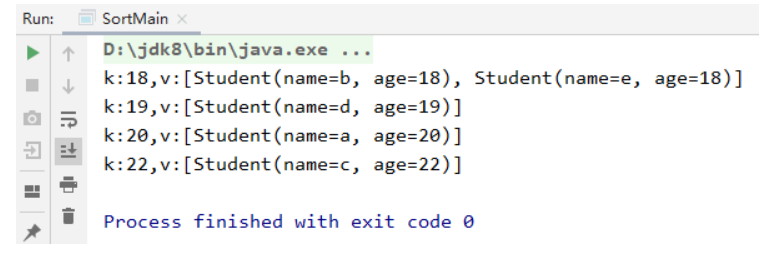

### 4.9 字符串拼接

需求：输出学生姓名用逗号隔开的字符串

```java
String str = list.stream()
    .map(Student::getName)
    .collect(Collectors.joining(","));
System.out.println(str);
```

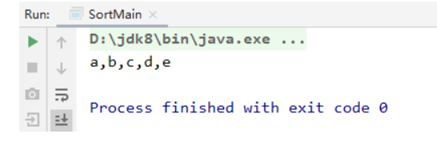

### 4.10 数学运算

需求1：求学生年龄的总和

```java
int sum = list.stream()
    .mapToInt(Student::getAge).sum();
System.out.println(sum);
```

需求2：求学生年龄的平均数

```java
double average = list.stream()
    .mapToInt(Student::getAge)
    .average()
    .orElse(0.0);
System.out.println(average);
```

注意，average()返回的是一个OptionalDouble，为了防止集合中没有元素时，我们必须使用orElse指定一个默认值。

同理，求最大值使用max，最小值使用min，都需要指定默认值。

### 4.11 其他

1. `list.stream().map().collect()` 方法，可以获取list中JavaBean的某个字段，转成一个新的list。
2. `list.stream().filter().map().collect()`方法，可以对list中的JavaBean进行筛选，保留符合条件的JavaBean，然后将JavaBean中的某个字段，转成一个新的list。
3. `list.stream().collect()` 方法，可以把list转为map，可以指定list的中的JavaBean的某个字段或JavaBean本身为map的key或value。（或者根据情况自定义map的key与value）
4. `list.stream().filter().collect()`方法，可以先筛选出list中符合条件的JavaBean，然后把list转为map，可以指定list的中的JavaBean的某个字段或JavaBean本身为map的key或value。（或者根据情况自定义map的key与value）

```java
import java.util.ArrayList;
import java.util.List;
import java.util.Map;
import java.util.Set;
import java.util.stream.Collectors;

public class Main {
    public static void main(String[] args) {
        Bean bean1 = new Bean(1,"a","za");
        Bean bean2 = new Bean(2,"b","zb");
        Bean bean3 = new Bean(3,"c","zc");

        ArrayList<Bean> list1 = new ArrayList();
        list1.add(bean1);
        list1.add(bean2);
        list1.add(bean3);

        

        //获取list1中的所有Bean对象的id，放入另一个list数组
        //注意，这个.map()方法返回的还是流对象，而不是返回map的意思

        //.stream().map().collect()

        List<Long> ids = list1.stream().map(bean -> bean.getId()).collect(Collectors.toList());
        System.out.println(ids);

        

        //使用filter方法，筛选list1中的所有Bean对象，留下id属于ids中的Bean对象，并把它们的name字段转成一个list
        //删除一个，便于看出差别来
        ids.remove(0);

        //.stream().filter().map().collect()

        List<String> names = list1.stream().filter(bean -> ids.contains(bean.getId())).map(Bean::getName).collect(Collectors.toList());
        System.out.println(names);

        

        //把list1中的所有Bean对象转成map，其中，id是map的key，Bean对象本身是map的value

        //.stream().collect()

        Map<Long, Bean> maps = list1.stream().collect(java.util.stream.Collectors.toMap(Bean::getId, e->e));
        System.out.println(maps);
        Set<Long> longs = maps.keySet();
        for(Long l : longs){
            System.out.print(l+" " + maps.get(l).getName() + " | ");
        }
        System.out.println();

        

        //按条件过滤后生成map，与上方的filter类似，只保留ids中有的id的bean对象

        //.stream().filter().collect()

        Map<Long, Bean> maps2 = list1.stream().filter(bean -> ids.contains(bean.getId())).collect(java.util.stream.Collectors.toMap(Bean::getId, e->e));
        System.out.println(maps2);
        Set<Long> longs2 = maps2.keySet();
        for(Long l : longs2){
            System.out.print(l+" " + maps2.get(l).getName() + " | ");
        }
        System.out.println();


    }

    static class Bean {
        private long id;
        private String name;
        private String address;

        public Bean(long id, String name, String address) {
            this.id = id;
            this.name = name;
            this.address = address;
        }

        public long getId() {
            return id;
        }

        public void setId(long id) {
            this.id = id;
        }

        public String getName() {
            return name;
        }

        public void setName(String name) {
            this.name = name;
        }

        public String getAddress() {
            return address;
        }

        public void setAddress(String address) {
            this.address = address;
        }
    }
}
```

## 5. 并行流parallelStream

Java8中提供了能够更方便处理集合数据的Stream类，其中parallelStream()方法能够充分利用多核CPU的优势，使用多线程加快对集合数据的处理速度。

`parallelStream()` 方法的源码如下：

```java
/**
 * @return a possibly parallel {@code Stream} over the elements in this
 * collection
 * @since 1.8
 */
default Stream<E> parallelStream() {
    return StreamSupport.stream(spliterator(), true);
}
```

从注释的 `@return a possibly parallel` 可以看得出来，`parallelStream()` 并不是一定返回一个并行流，有可能 `parallelStream()` 全是由主线程顺序执行的。

### 5.1 parallelStream内部使用了哪些线程

以一个简单的例子，来看看 `parallelStream` 内部到底使用了哪些线程

```java
Integer[] array = new Integer[]{1, 2, 3, 4, 5};
Arrays.asList(array).parallelStream().forEach(i -> {
    System.out.println(Thread.currentThread().getName() + " num:" + i);
});
```

输出结果如下：

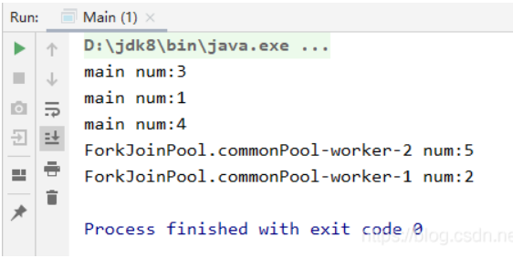

可以看得出来，结果是乱序输出的，且参与并行处理的线程有**主线程**以及**ForkJoinPool中的worker线程**

### 5.2 Fork/Join框架

parallelStream的底层是基于ForkJoinPool的，ForkJoinPool实现了ExecutorService接口，因此和线程池的关系微妙。

#### 5.2.1 线程池

线程池内部是多个线程的集合，在创建初期，线程池会创建出多个空闲的线程，当有一个任务需要执行时，线程池会选择出一个线程去执行它，执行结束后，该线程不会被销毁，而是可以继续复用。

使用线程池可以大大减少线程频繁创建与销毁的开销，降低了系统资源的消耗。当任务来临时，直接复用之前的线程，而不是先创建，提高了系统的响应速度。此外，线程池可以控制最大的并发数，避免资源的过度消耗。

##### 5.2.1.1 简单实例

先给出一个线程池的简单例子：

```java
package com.xue.testThreadPool;
 
import java.util.concurrent.ExecutorService;
import java.util.concurrent.Executors;
 
public class Main {
    public static void main(String[] args) {
        ExecutorService threadPool = Executors.newFixedThreadPool(2);
        for (int i = 0; i < 4; i++) {
            int finalI = i;
            threadPool.execute(new Runnable() {
                @Override
                public void run() {
                    System.out.println(Thread.currentThread().getName() + "正在执行任务" + finalI);
                }
            });
        }
        threadPool.shutdown();
    }
}
```

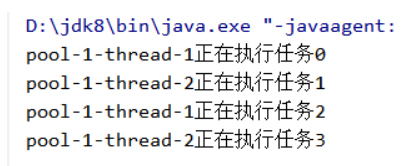

可见，2个线程总共执行了4个任务，线程得到了复用。

##### 5.2.1.2 线程池的核心参数

这些核心参数位于ThreadPoolExecutor的构造方法中：

```java
public ThreadPoolExecutor(int corePoolSize,
                          int maximumPoolSize,
                          long keepAliveTime,
                          TimeUnit unit,
                          BlockingQueue<Runnable> workQueue,
                          ThreadFactory threadFactory,
                          RejectedExecutionHandler handler)
```

| 参数名称        | 描述                                                         |
| --------------- | ------------------------------------------------------------ |
| corePoolSize    | 核心线程数，或者说常驻线程数，线程池中最少线程数             |
| maximumPoolSize | 最大线程数                                                   |
| keepAliveTime   | 空闲线程的存活时间，线程池中当前线程数大于corePoolSize时，那些空闲时间达到keepAliveTime的空闲线程，它们将会被销毁掉 |
| TimeUnit        | keepAliveTime的时间单位                                      |
| workQueue       | 任务队列，存放未被执行的任务                                 |
| threadFactory   | 创建线程的工厂                                               |
| handler         | 拒绝策略，当前线程数 $\geq$ 最大线程数且任务队列满的时候，对后续任务的拒绝方式 |

##### 5.2.1.3 线程池的种类

不同的线程池有不同的适用场景，本质上都是在Executors类中实例化一个ThreadPoolExecutor对象，只是传入的参数不一样罢了。

线程池的种类有以下几种：

###### 5.2.1.3.1 newFixedThreadPool

```java
public static ExecutorService newFixedThreadPool(int nThreads) {
    return new ThreadPoolExecutor(nThreads, nThreads,
                                  0L, TimeUnit.MILLISECONDS,
                                  new LinkedBlockingQueue<Runnable>());
}
```

创建一个固定大小的线程池，即核心线程数等于最大线程数，每个线程的存活时间和线程池的寿命一致，线程池满负荷运作时，多余的任务会加入到无界的阻塞队列中，newFixedThreadPool可以很好的控制线程的并发量。

###### 5.2.1.3.2 newCachedThreadPool

```java
public static ExecutorService newCachedThreadPool() {
    return new ThreadPoolExecutor(0, Integer.MAX_VALUE,
                                  60L, TimeUnit.SECONDS,
                                  new SynchronousQueue<Runnable>());
}
```

创建一个可以无限扩大的线程池，当任务来临时，有空闲线程就去执行，否则立即创建一个线程。当线程的空闲时间超过1分钟时，销毁该线程。适用于执行任务较少且需要快速执行的场景，即短期异步任务。

###### 5.2.1.3.3 newSingleThreadExecutor

```java
public static ExecutorService newSingleThreadExecutor() {
    return new FinalizableDelegatedExecutorService
        (new ThreadPoolExecutor(1, 1,
                                0L, TimeUnit.MILLISECONDS,
                                new LinkedBlockingQueue<Runnable>()));
}
```

创建一个大小为 1 的线程池，用于顺序执行任务。

###### 5.2.1.3.4 newScheduledThreadPool

```java
public static ScheduledExecutorService newScheduledThreadPool(int corePoolSize) {
    return new ScheduledThreadPoolExecutor(corePoolSize);
}

public ScheduledThreadPoolExecutor(int corePoolSize) {
    super(corePoolSize, Integer.MAX_VALUE, 0, NANOSECONDS,
          new DelayedWorkQueue());
}
```

创建一个初始大小为 corePoolSize 的线程池，线程池的存活时间没有限制， newScheduledThreadPool 中的 schedule 方法用于延时执行任务， scheduleAtFixedRate 用于周期性地执行任务。

##### 5.2.1.4 线程池执行任务的流程

- 当线程池中线程数小于corePoolSize时，新提交任务将创建一个新线程执行任务，即使此时线程池中存在空闲线程。
- 当线程池中线程数达到corePoolSize时，新提交任务将被放入workQueue中，等待线程池中任务调度执行 。
- 当workQueue已满，且maximumPoolSize > corePoolSize时，新提交任务会创建新线程执行任务。
- 当workQueue已满，且提交任务数超过maximumPoolSize，任务由RejectedExecutionHandler处理。
- 当线程池中线程数超过corePoolSize，且超过这部分的空闲时间达到keepAliveTime时，回收这些线程。
- 当设置allowCoreThreadTimeOut(true)时，线程池中corePoolSize范围内的线程空闲时间达到keepAliveTime也将回收。


使用更加直观的流程图来描述：

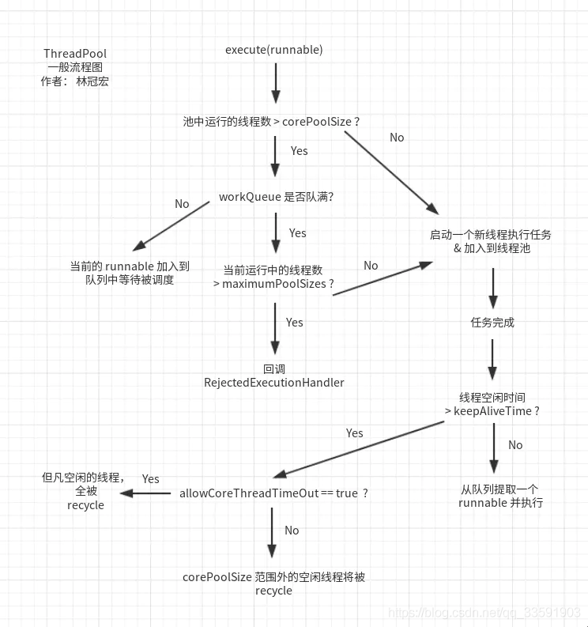

##### 5.2.1.5 工作队列

工作队列用来存储提交的任务，工作队列一般使用的都是阻塞队列。阻塞队列可以保证任务队列中没有任务时阻塞获取任务的线程，使得线程进入wait状态，释放cpu资源。当队列中有任务时才唤醒对应线程从队列中取出消息进行执行。

阻塞队列一般由以下几种：

###### 5.2.1.5.1 LinkedBlockingQueue 

由单链表实现的无界阻塞队列，遵循FIFO。注意这里的无界是因为其记录队列大小的数据类型是int，那么队列长度的最大值就是恐怖的Integer.MAX_VALUE，这个值已经很大了，因此可以将之称为无界队列。不过该队列也提供了有参构造函数，可以手动指定其队列大小，否则使用默认的int最大值。

LinkedBlockingQueue只能从head取元素，从tail添加元素。添加元素和获取元素都有独立的锁，也就是说它是**读写分离的**，读写操作可以并行执行。LinkedBlockingQueue采用可重入锁(**ReentrantLock)**来保证在并发情况下的线程安全。

当线程数目达到corePoolSize时，后续的任务会直接加入到LinkedBlockingQueue中，**在不指定其队列大小的情况下，该队列永远也不会满，可能内存满了，队列都不会满，此时maximumPoolSize和拒绝策略将不会有任何意义**。

###### 5.2.1.5.2 ArrayBlockingQueue

由数组实现的有界阻塞队列，同样遵循FIFO，必须制定队列大小。使用**全局独占锁的方式，使得在同一时间只有一个线程能执行入队或出队操作**，相比于LinkedBlockingQueue，ArrayBlockingQueue锁的力度很大。

###### 5.2.1.5.3 SynchronousQueue

是一个没有容量的队列，当然也可以称为单元素队列。会将任务直接传递给消费者，添加任务时，必须等待前一个被添加的任务被消费掉，即take动作等待put动作，put动作等待take动作，put与take是循环往复的。

如果线程拒绝执行该队列中的任务，或者说没有线程来执行。那么旧任务无法被执行，新任务也无法被添加，线程池将陷入一种尴尬的境地。因此，该队列一般需要maximumPoolSize为Integer.MAX_VALUE，有一个任务到来，就立马新起一个线程执行，newCachedThreadPool就是使用的这种组合。

关于这些阻塞队列的源码解析，可能需要另开篇幅。

##### 5.2.1.6 线程工厂

先看一下，ThreadPoolExecutor构造方法中默认使用的线程工厂

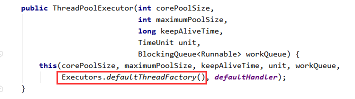

```java
    static class DefaultThreadFactory implements ThreadFactory {
        private static final AtomicInteger poolNumber = new AtomicInteger(1);
        private final ThreadGroup group;
        private final AtomicInteger threadNumber = new AtomicInteger(1);
        private final String namePrefix;
 
        DefaultThreadFactory() {
            SecurityManager s = System.getSecurityManager();
            group = (s != null) ? s.getThreadGroup() :
                                  Thread.currentThread().getThreadGroup();
            namePrefix = "pool-" +
                          poolNumber.getAndIncrement() +
                         "-thread-";
        }
 
        public Thread newThread(Runnable r) {
            Thread t = new Thread(group, r,
                                  namePrefix + threadNumber.getAndIncrement(),
                                  0);
            if (t.isDaemon())
                t.setDaemon(false);
            if (t.getPriority() != Thread.NORM_PRIORITY)
                t.setPriority(Thread.NORM_PRIORITY);
            return t;
        }
    }
```

defaultThreadFactory对于线程的命名方式为“pool-”+pool的自增序号+"-thread-"+线程的自增序号，这也印证了在简单实例的章节中，输出Thread.getCurrentThread.getName()是“pool-1-thread-1”的样式

默认线程工厂给线程的取名没有太多的意义，在实际开发中，我们一般会给线程取个比较有识别度的名称，方便出现问题时的排查。

##### 5.2.1.7 拒绝策略

如果当工作队列已满，且线程数目达到maximumPoolSize后，依然有任务到来，那么此时线程池就会采取拒绝策略。

ThreadPoolExecutor中提供了4种拒绝策略。

###### 5.2.1.7.1 AbortPolicy

```java
     private static final RejectedExecutionHandler defaultHandler = new AbortPolicy(); 
 
     public static class AbortPolicy implements RejectedExecutionHandler {
 
            public AbortPolicy() { }
 
            public void rejectedExecution(Runnable r, ThreadPoolExecutor e) {
            throw new RejectedExecutionException("Task " + r.toString() +
                                                 " rejected from " +
                                                 e.toString());
            }
    }
```

这是线程池的默认拒绝策略，直接会丢弃任务并抛出RejectedExecutionException异常。

###### 5.2.1.7.2 DiscardPolicy

```java
public static class DiscardPolicy implements RejectedExecutionHandler {
 
    public DiscardPolicy() { }
 
    public void rejectedExecution(Runnable r, ThreadPoolExecutor e) {
    }
}
```
丢弃后续提交的任务，但不抛出异常。建议在一些无关紧要的场景中使用此拒绝策略，否则无法及时发现系统的异常状态。

###### 5.2.1.7.3 DiscardOldestPolicy

```java
public static class DiscardOldestPolicy implements RejectedExecutionHandler {
 
    public DiscardOldestPolicy() { }
 
    public void rejectedExecution(Runnable r, ThreadPoolExecutor e) {
        if (!e.isShutdown()) {
            e.getQueue().poll();
            e.execute(r);
        }
    }
}
```
从源码中可以看到，此拒绝策略会丢弃队列头部的任务，然后将后续提交的任务加入队列中

###### 5.2.1.7.4 CallerRunsPolicy

```java
public static class CallerRunsPolicy implements RejectedExecutionHandler {
 
    public CallerRunsPolicy() { }
 
    public void rejectedExecution(Runnable r, ThreadPoolExecutor e) {
        if (!e.isShutdown()) {
            r.run();
        }
    }
}
```
由调用线程执行该任务，即提交任务的线程，一般是主线程。

##### 5.2.1.8 如何配置最大线程数

###### 5.2.1.8.1 CPU密集型任务

CPU密集指的是需要进行大量的运算，一般没有什么阻塞。

尽量使用较小的线程池，大小一般为**CPU核心数+1**。因为CPU密集型任务使得CPU使用率很高，若开过多的线程数，会造成CPU过度切换。

###### 5.2.1.8.2 IO密集型任务

IO密集指的是需要进行大量的IO，阻塞十分严重，可以挂起被阻塞的线程，开启新的线程干别的事情。

可以使用稍大的线程池，大小一般为CPU核心数*2。IO密集型任务CPU使用率并不高，因此可以让CPU在等待IO的时候有其他线程去处理别的任务，充分利用CPU时间。

当然，依据IO密集的程度，可以在两倍的基础上进行相应的扩大与缩小。

#### 5.2.2 Fork/Join框架

parallelStream的底层是基于ForkJoinPool的，ForkJoinPool实现了ExecutorService接口，因此和线程池的关系微妙。

ForkJoinPool和ExecutorService的继承关系如图所示：

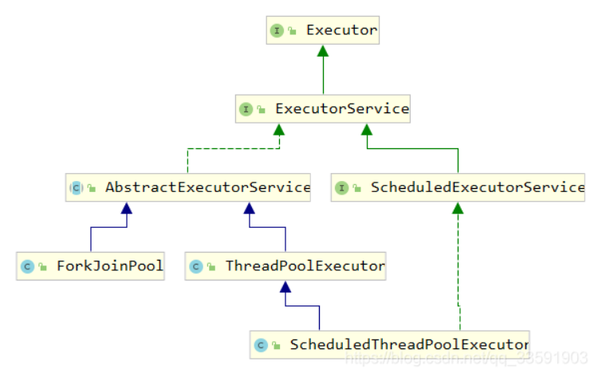

Fork/Join框架主要采用分而治之的理念来处理问题，对于一个比较大的任务，首先将它拆分(fork)为两个小任务task1与task2。

使用新的线程thread1去处理task1，thread2去处理task2。

如果thread1认为task1还是太大，则继续往下拆分成新的子任务task3与task4。

thread2认为task2任务量不大，则立即进行处理，形成结果result2。

之后将task3和task4的处理结果合并(join)成result1，最后将result1与result2合并成最后的结果。

用图来描述可能更加直观：

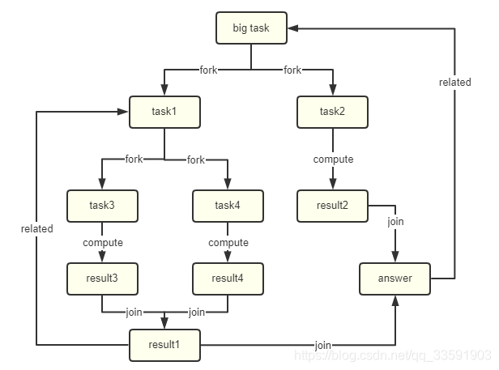

下面用一个示例代码，计算出1到10000的和(实际上应该取到一个很大的数字，这里为了演示方便就到10000就结束)来演示ForkJoinPool的简单使用。

```java
package com.qcy.testStream;
 
import java.util.concurrent.ExecutionException;
import java.util.concurrent.ForkJoinPool;
import java.util.concurrent.ForkJoinTask;
import java.util.concurrent.RecursiveTask;
import java.util.stream.IntStream;
 
/**
 * @author qcy
 * @create 2020/08/13 21:31:45
 */
public class Task extends RecursiveTask<Integer> {
 
    //起始数
    private Integer startNum;
 
    //结束数
    private Integer endNum;
 
    //最大间隔数
    private Integer maxInterval;
 
    public Task(Integer startNum, Integer endNum, Integer maxInterval) {
        this.startNum = startNum;
        this.endNum = endNum;
        this.maxInterval = maxInterval;
    }
 
    @Override
    protected Integer compute() {
 
        if (endNum - startNum < maxInterval) {
            //任务足够小，不需要拆分
            return IntStream.rangeClosed(startNum, endNum).sum();
        }
 
        //需要拆分任务
        int middleNum = (startNum + endNum) % 2 == 0 ? (startNum + endNum) / 2 : (startNum + endNum - 1) / 2;
 
        Task t1 = new Task(startNum, middleNum, maxInterval);
        Task t2 = new Task(middleNum + 1, endNum, maxInterval);
 
        //使用invokeAll,能让这两个任务被并行处理
        invokeAll(t1, t2);
        //使用t1.fork()、t2.fork()则让这两个任务串行处理
 
        return t1.join() + t2.join();
    }
 
    public static void main(String[] args) throws ExecutionException, InterruptedException {
        ForkJoinPool pool = new ForkJoinPool();
        Task task = new Task(1, 10000, 100);
        ForkJoinTask<Integer> future = pool.submit(task);
        System.out.println(future.get());
    }
}
```

当我们使用默认的不带参数的方法构造ForkJoinPool时，默认最大的线程并行数量是当前CPU的核数。在一定程度上，这样做能够减少线程上下文切换的次数。

```java
public ForkJoinPool() {
    this(Math.min(MAX_CAP, Runtime.getRuntime().availableProcessors()),
         defaultForkJoinWorkerThreadFactory, null, false);
}
```

当然，我们可以使用 `-Djava.util.concurrent.ForkJoinPool.common.parallelism=x`，其中x为ForkJoinPool中的线程数量，当设定为2时，则上述计算1到10000之和的任务，总共只有两个线程来处理任务。

**注意此参数是全局的，会影响其他parallelStream中的线程总数。**

但是对于第一个例子，一共会有3个线程来进行处理，多出来那个线程是主线程。如图所示：

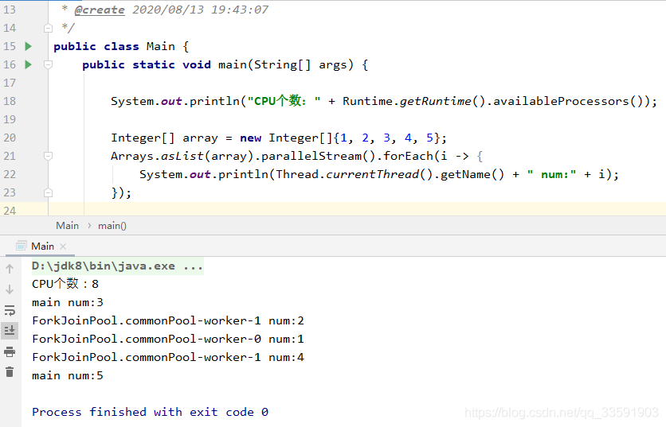

#### 5.2.3 使用parallelStream的一些注意点

##### 5.2.3.1 parallelStream并行流一定要使用线程安全的对象，比如有这样的一个场景

```java
List<Integer> list = new ArrayList<>();
IntStream.rangeClosed(1, 10000).parallel().forEach(i -> list.add(i));
```

执行就立即报错了：

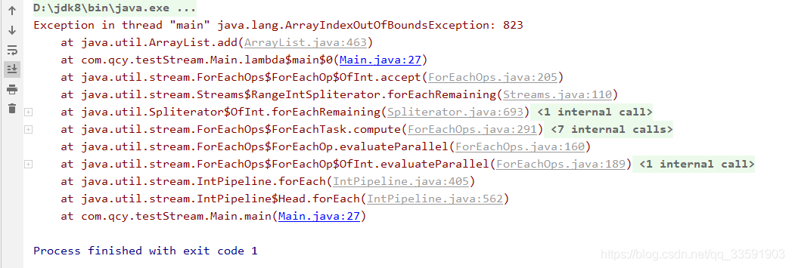

ArrayList本身就是一个线程不安全的容器，在多线程的操作下，扩容操作可能会导致产生数组越界的异常。

此时，要么使用线程安全的容器，比如Vector，要么使用collect完成串行收集。

```java
List<Integer> collect = IntStream.rangeClosed(1, 10000)
    .parallel()
    .boxed()
    .collect(Collectors.toList());
```

##### 5.2.3.2 线程关联的ThreadLocal将会失效

这一点从第二小节就可以看出，主线程参与到parallelStream中的任务处理的过程中。如果我们处理的任务方法中包含对ThreadLocal的处理，可能除主线程之外的所有线程都获取不到自己的线程局部变量，加之ForkJoinPool中的线程是反复使用的，线程关联的ThreadLocal会发生共用的情况。

所以我的建议是，parallelStream中就不要使用ThreadLocal了，要么在任务处理方法中，第一行先进行ThreadLocal.set()，之后再由ThreadLocal.get()获取到自己的线程局部变量。

##### 5.2.3.3 使用parallelStream也不一定会提升性能

在CPU资源紧张的时候，使用并行流可能会带来频繁的线程上下文切换，导致并行流执行的效率还没有串行执行的效率高。
