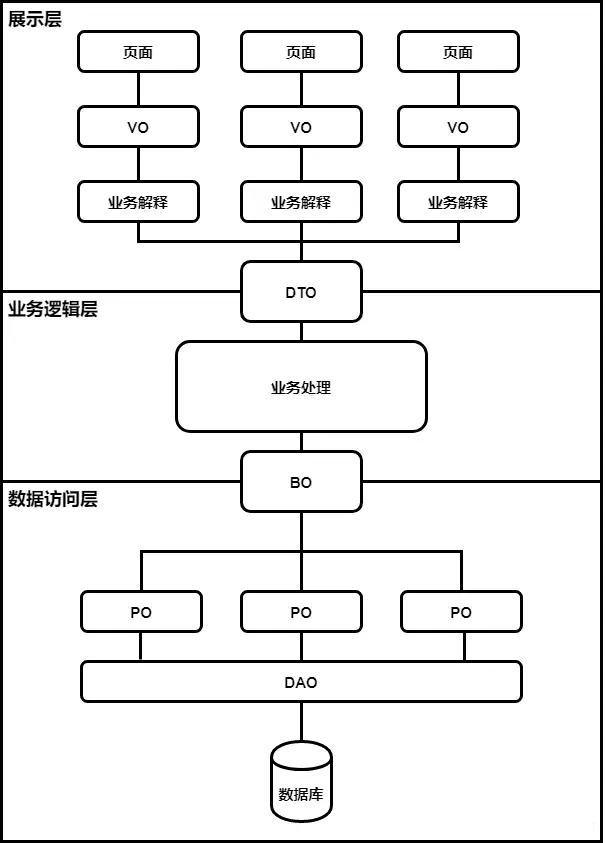

# VO、DTO、BO、PO、DO区别

- **VO：**（View Object）视图对象，一般位于Controller层，用于展示视图。
- **DTO：**（Data Transfer Object）数据传输对象， 即RPC 接口请求或传输出去的对象，用于展示层与服务层之间的数据传输对象。
- **BO：**（Business Object）业务层对象，一般位于Service层，它与 DO 会有一定的属性差别。
- **PO：**（Persistent Object）持久化对象，对象属性与数据库字段形成映射关系。
- **DO**：（Domain Object）领域对象，就是从现实世界中抽象出来的有形或无形的业务实体，可以当成BO；（Data Object）数据层对象，对象属性与数据库字段形成映射关系，可以当成PO




## VO与DTO

- **VO**：展示层需要展示的数据。 
- **DTO**：业务逻辑层需要接收的数据和返回的数据。

VO与DTO的属性值基本相同，但是VO是DTO的最终解释，可以对DTO的字段进行适当删减。 举个例子：

例子1

DTO中返回的字段为

```json
{
    "sex": "女",
}
```

对于大部分需求来说中返回的字段为中返回的字段就已经够用了，但是如果说业务的需求是展示具体的身份，那就需要在VO层进行进一步解释， VO中返回的字段为：

```json
{
    "sex": "女演员",
}
```

例子2

DTO

```json
{
    "sex": "男",
    "age": "17"
}
```

如果说展示层只需要展示是否成年， VO：

```json
{
    "age": "未成年"
}
```

## PO与DO

- **PO**：通常来说是只有get/set方法的POJO，也就是常说的实体类。
- **DO**：一般是PO的组合，也就是多表联查的映射。

例子1 

PO1：

```json
{
    "id": "999",
    "name": "ahzoo"
}
```

PO2：

```json
{
    "userId": "999",
    "role": "管理员"
}
```

DO：

```json
{
    "id": "999",
    "name": "ahzoo",
    "role": "管理员"
}
```

## BO和PO

**BO**：与PO的区别是，BO会删掉一些不宜在展示层展示的数据，只对外提供必要的字段属性。 比如用户需要查询用户的信息，通常来说这个返回给用户的用户信息是不应该包含密码之类的一些字段的，那么我们就可以在BO层做一下处理。

举例， 如果用PO层的话返回的字段为：

```json
{
    "id": "999",
    "name": "ahzoo",
    "password":"123456"
}
```

BO层的放回字段：

```json
{
    "id": "999",
    "name": "ahzoo"
}
```

