# Android 学习教程

Android 是一个开源的，基于 Linux 的移动设备操作系统，如 智能手机 和 平板电脑 。Android 是由谷歌及其他公司带领的开放手机联盟开发的。Android 提供了一个统一的应用程序开发方法，这意味着开发人员只需要为 Android 进行开发，这样他们的应用程序就能够运行在不同搭载 Android 的移动设备上。

- 谷歌在2007年发布了第一个测试版本的 Android 软件开发工具包（SDK），第一个商业版本的 Android 1.0，则发布于2008年9月。
- 2012年6月27日，在谷歌I/O大会上，谷歌宣布发布了 Android 版本4.1 Jelly Bean。 Jelly Bean 是一个在功能和性能方面的渐进的更新，主要目的是改进用户界面，
- Android 源代码是根据自由和开放源码软件许可证。谷歌发布的大部分代码遵循 Apache 许可证2.0版，Linux 内核的变化遵循 GNU 通用公共许可证版本2。

API 级别是一个用于唯一标识 API 框架版本的整数，由某个版本的 Android 平台提供。

| 平台版本                              | API 等级 | VERSION_CODE           |                           |
| :------------------------------------ | :------- | :--------------------- | :------------------------ |
| Android 5.1                           | 22       | LOLLIPOP_MR1           |                           |
| Android 5.0                           | 21       | LOLLIPOP               |                           |
| Android 4.4W                          | 20       | KITKAT_WATCH           | KitKat for Wearables Only |
| Android 4.4                           | 19       | KITKAT                 |                           |
| Android 4.3                           | 18       | JELLY_BEAN_MR2         |                           |
| Android 4.2, 4.2.2                    | 17       | JELLY_BEAN_MR1         |                           |
| Android 4.1, 4.1.1                    | 16       | JELLY_BEAN             |                           |
| Android 4.0.3, 4.0.4                  | 15       | ICE_CREAM_SANDWICH_MR1 |                           |
| Android 4.0, 4.0.1, 4.0.2             | 14       | ICE_CREAM_SANDWICH     |                           |
| Android 3.2                           | 13       | HONEYCOMB_MR2          |                           |
| Android 3.1.x                         | 12       | HONEYCOMB_MR1          |                           |
| Android 3.0.x                         | 11       | HONEYCOMB              |                           |
| Android 2.3.4Android 2.3.3            | 10       | GINGERBREAD_MR1        |                           |
| Android 2.3.2Android 2.3.1Android 2.3 | 9        | GINGERBREAD            |                           |
| Android 2.2.x                         | 8        | FROYO                  |                           |
| Android 2.1.x                         | 7        | ECLAIR_MR1             |                           |
| Android 2.0.1                         | 6        | ECLAIR_0_1             |                           |
| Android 2.0                           | 5        | ECLAIR                 |                           |
| Android 1.6                           | 4        | DONUT                  |                           |
| Android 1.5                           | 3        | CUPCAKE                |                           |
| Android 1.1                           | 2        | BASE_1_1               |                           |
| Android 1.0                           | 1        | BASE                   |                           |

## 1.  Android 架构

Android大致可以分为\五层，从上到下依次是：

- 应用层，
- 应用框架层，
- 系统运行层库，
- 硬件抽象层（Hardware Abstraction Layer），
- Linux内核层。

Android的系统架构如下图所示：


### 1.1 Linux内核层

众所周知，Android系统是基于Linux内核层的，这一层为android设备的各种硬件提供了底层的强大驱动，如显示驱动、音频驱动、照相机驱动、蓝牙驱动、Wi-Fi驱动、电源管理等。

在所有层的最底下是 Linux - 包括大约115个补丁的 Linux 3.6。它提供了基本的系统功能，比如进程管理，内存管理，设备管理（如摄像头，键盘，显示器）。同时，内核处理所有 Linux 所擅长的工作，如网络和大量的设备驱动，从而避免兼容大量外围硬件接口带来的不便。

### 1.2 硬件抽象层（HAL）

硬件抽象层 (HAL) 提供标准界面，向更高级别的 Java API 框架显示设备硬件功能。HAL 包含多个库模块，其中每个模块都为特定类型的硬件组件实现一个界面，例如：

- Audio音频模块，
- BlueTooth：蓝牙模块，
- Camera：相机模块，
- Sensors:传感器。

系统内置对传感器的支持达 13 种，他们分别是：

- 加速度传感器(accelerometer)
- 磁力传感器(magnetic field)
- 方向传感器(orientation)
- 陀螺仪(gyroscope)、环境光照传感器(light)
- 压力传感器(pressure)、温度传感器(temperature)
- 距离传感器(proximity)等。

当框架 API 要求访问设备硬件时，Android 系统将为该硬件组件加载库模块。厂商会在这层定义自己的HAL接口。

### 1.3 系统运行库层

这一层通过一些 C/C++ 库来为 Android 提供主要的特性支持。如：

- SQLite 库提供了数据库的支持，
- OpenGL | ES 库提供了 3D绘图 的支持，
- Webkit库 提供了浏览器内核的支持等。

同样在这一层还要 Android 运行时库，它主要提供了一些核心库，能够允许开发者使用 Java 语言来编写 Android 程序。不仅如此，它还包括了 Dalvik 虚拟机（android5.0后改为ART运行环境），它使得每一个 android 程序可以运行在独立的进程中，并且拥有自己的 Dalvik 虚拟机实例。相较于 Java 虚拟机，Dalvik 是专门为移动设备定制的，它针对手机内存、CPU 性能有限等情况做了优化处理。

### 1.4 Android运行时

这是架构中的第三部分，自下而上的第二层。这个部分提供名为 Dalvik 虚拟机的关键组件，类似于 Java 虚拟机，但专门为 Android 设计和优化。

Dalvik 虚拟机使得可以在 Java 中使用 Linux 核心功能，如内存管理和多线程。Dalvik 虚拟机使得每一个 Android 应用程序运行在自己独立的虚拟机进程。

Android 运行时同时提供一系列核心的库来为 Android 应用程序开发者使用标准的 Java 语言来编写 Android 应用程序。

### 1.5 Android 程序库

这个类别包括了专门为 Android 开发的基于 Java 的程序库。这个类别程序库的示例包括应用程序框架库，如用户界面构建，图形绘制和数据库访问。一些 Android 开发者可用的 Android 核心程序库总结如下：

- android.app ： 提供应用程序模型的访问，是所有 Android 应用程序的基石。
- android.content ： 方便应用程序之间，应用程序组件之间的内容访问，发布，消息传递。
- android.database ： 用于访问内容提供者发布的数据，包含 SQLite 数据库管理类。
- android.opengl ： OpenGL ES 3D 图片渲染 API 的 Java 接口。
- android.os ： 提供应用程序访问标注操作系统服务的能力，包括消息，系统服务和进程间通信。
- android.text ： 在设备显示上渲染和操作文本。
- android.view ： 应用程序用户界面的基础构建块。
- android.widget ： 丰富的预置用户界面组件集合，包括按钮，标签，列表，布局管理，单选按钮等。
- android.webkit ： 一系列类的集合，允许为应用程序提供内建的 Web 浏览能力。

看过了 Android 运行层内的基于 Java 的核心程序库，是时候关注一下 Android 软件栈中的基于 C/C++ 的程序库。

### 1.6 应用层

所有安装到手机上的应用程序都是属于这一层的，比如系统自带的联系人，短信等程序，或者是你从应用商店下载的所有App，当然也包括你自己开发的程序。

应用框架层以 Java 类的形式为应用程序提供许多高级的服务。应用程序开发者被允许在应用中使用这些服务。

- 活动管理者 - 控制应用程序生命周期和活动栈的所有方面。
- 内容提供者 - 允许应用程序之间发布和分享数据。
- 资源管理器 - 提供对非代码嵌入资源的访问，如字符串，颜色设置和用户界面布局。
- 通知管理器 - 允许应用程序显示对话框或者通知给用户。
- 视图系统 - 一个可扩展的视图集合，用于创建应用程序用户界面。

### 1.7 应用程序

顶层中有所有的 Android 应用程序。你写的应用程序也将被安装在这层。这些应用程序包括通讯录，浏览器，游戏等。

## 2. Android 应用程序组件

应用程序组件是一个Android应用程序的基本构建块。这些组件由应用清单文件松耦合的组织。AndroidManifest.xml描述了应用程序的每个组件，以及他们如何交互。

以下是可以在Android应用程序中使用的四个主要组件。

| 组件                | 描述                                      |
| :------------------ | :---------------------------------------- |
| Activities          | 描述UI，并且处理用户与机器屏幕的交互。    |
| Services            | 处理与应用程序关联的后台操作。            |
| Broadcast Receivers | 处理Android操作系统和应用程序之间的通信。 |
| Content Providers   | 处理数据和数据库管理方面的问题。          |

### 2.1 Activities

一个活动标识一个具有用户界面的单一屏幕。举个例子，一个邮件应用程序可以包含一个活动用于显示新邮件列表，另一个活动用来编写邮件，再一个活动来阅读邮件。当应用程序拥有多于一个活动，其中的一个会被标记为当应用程序启动的时候显示。

一个活动是**Activity**类的一个子类，如下所示：

```java
public class MainActivity extends Activity {

}
```

### 2.2 Services

服务是运行在后台，执行长时间操作的组件。举个例子，服务可以是用户在使用不同的程序时在后台播放音乐，或者在活动中通过网络获取数据但不阻塞用户交互。

一个服务是**Service**类的子类，如下所示：

```java
public class MyService extends Service {

}
```

### 2.3 Broadcast Receivers

广播接收器简单地响应从其他应用程序或者系统发来的广播消息。举个例子，应用程序可以发起广播来让其他应用程序知道一些数据已经被下载到设备，并且可以供他们使用。因此广播接收器会拦截这些通信并采取适当的行动。

广播接收器是**BroadcastReceiver**类的一个子类，每个消息以**Intent**对象的形式来广播。

```java
public class MyReceiver  extends  BroadcastReceiver {

}
```

### 2.4 Content Providers

内容提供者组件通过请求从一个应用程序到另一个应用程序提供数据。这些请求由**ContentResolver**类的方法来处理。这些数据可以是存储在文件系统、数据库或者其他其他地方。

内容提供者是**ContentProvider**类的子类，并实现一套标准的API，以便其他应用程序来执行事务。

```java
public class MyContentProvider extends  ContentProvider {

}
```

我们将在独立的章节中通过这些标签的细节来涵盖应用程序组件。

### 2.5 附件组件

有一些附件的组件用于以上提到的实体、他们之间逻辑、及他们之间连线的构造。这些组件如下：

| 组件      | 描述                                             |
| :-------- | :----------------------------------------------- |
| Fragments | 代表活动中的一个行为或者一部分用户界面。         |
| Views     | 绘制在屏幕上的UI元素，包括按钮，列表等。         |
| Layouts   | 控制屏幕格式，展示视图外观的View的继承。         |
| Intents   | 组件间的消息连线。                               |
| Resources | 外部元素，例如字符串资源、常量资源及图片资源等。 |
| Manifest  | 应用程序的配置文件。                             |

## 3. Android Hello World 实例

Android项目中的一些文件目录和文件，对其进行应用程序剖析。

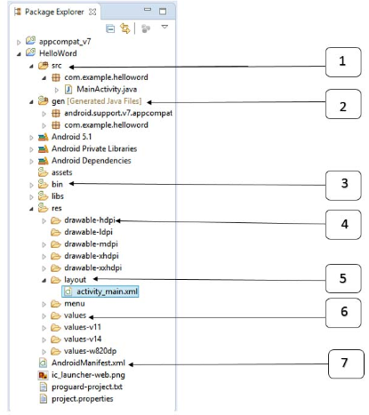

| 序号 | 文件夹、文件和说明                                           |
| :--- | :----------------------------------------------------------- |
| 1    | src:包含项目中所有的.java源文件，默认情况下，它包括一个 MainActivity.java源文件对应的活动类，当应用程序通过应用图标启动时，将运行它。 |
| 2    | gen:这包含由编译器生成的.R文件，引用了所有项目中的资源。该文件不能被修改。 |
| 3    | bin:这个文件夹包含Android由APT构建的.apk包文件，以及运行Android应用程序所需要的其他所有东西。 |
| 4    | res/drawable-hdpi:这个目录下包括所有的为高密度屏幕设计所需的drawable对象。 |
| 5    | res/layout:这个目录存放用于定义用户界面的文件。              |
| 6    | res/values:这个目录存放各种各样的包含一系列资源的XML文件，比如字符串和颜色的定义。 |
| 7    | AndroidManifest.xml:这个是应用程序的清单文件，描述了应用程序的基础特性，定义它的各种组件。 |

### 3.1 主要活动文件

主要活动代码在 `MainActivity.java` 的 `Java` 文件中。这是实际的应用程序文件，将被转化为 `Dalvik` 可执行文件并运行。下面是由应用向导为 `Hello World` 应用生成的默认代码 

```java
package com.example.helloworld;

import android.os.Bundle;
import android.app.Activity;
import android.view.Menu;
import android.view.MenuItem;
import android.support.v4.app.NavUtils;

public class MainActivity extends Activity {

   @Override
   public void onCreate(Bundle savedInstanceState) {
      super.onCreate(savedInstanceState);
      setContentView(R.layout.activity_main);
   }

   @Override
   public boolean onCreateOptionsMenu(Menu menu) {
      getMenuInflater().inflate(R.menu.activity_main, menu);
      return true;
   }
}
```

这里，`R.layout.activity_main` 引用自 `res/layout` 目录下的 `activity_main.xml` 文件。`onCreate()` 是活动被加载之后众多被调用的方法之一。

### 3.2 Manifest 文件

无论你开发什么组件用作应用程序中的一部分，都需要在应用程序项目根目录下的 `manifest.xml` 文件中声明所有的组件。这个文件是 `Android` 操作系统与你的应用程序之间的接口，因此，如果没有在这个文件中声明你的组件，将无法被操作系统所识别。举个例子，一个默认的清单文件看起来如下：

```xml
<manifest xmlns:android="http://schemas.android.com/apk/res/android"
   package="com.example.helloworld"
   android:versionCode="1"
   android:versionName="1.0" >

   <uses-sdk
      android:minSdkVersion="8"
      android:targetSdkVersion="22" />

   <application
       android:icon="@drawable/ic_launcher"
       android:label="@string/app_name"
       android:theme="@style/AppTheme" >

       <activity
          android:name=".MainActivity"
          android:label="@string/title_activity_main" >

          <intent-filter>
             <action android:name="android.intent.action.MAIN" />
             <category android:name="android.intent.category.LAUNCHER"/>
          </intent-filter>

       </activity>

   </application>
</manifest>
```

这里，...标签之间是应用程序相关的组件。`andnroid:icon` 属性指出位于 `res/drawable-hdpi` 下面的应用程序图标。这个应用使用 `drawable` 文件夹下名为 `ic_launcher.png` 的图片。

标签用于指定一个活动，`android:name` 属性指定一个 `Activity` 类子类的全名。`android:label` 属性指定用于活动名称的字符串。可以使用标签来指定多个活动。

意图过滤器的 `action` 被命名为 `android.intent.action.MAIN` ，表明这个活动被用做应用程序的入口。意图过滤器的 `category` 被命名为 `android.intent.category.LAUNCHER` ，表明应用程序可以通过设备启动器的图标来启动。

`@string` 指的是 `strings.xml` （ 将在后面介绍 ）。因此，`@string/app_name` 指的是定义在`strings.xml` 中的 `app_name` ，实际为 `"Hello World"` 。类似的，应用中的其他字符串也很流行。

下面是你的清单文件中将用到的标签，用于指定不同的Android应用程序组件：

- 活动元素
- 服务元素
- 广播接收器元素
- 内容提供者元素

### 3.3 Strings 文件

`strings.xml` 文件在 `res/value` 文件夹下，它包含应用程序使用到的所有文本。例如，按钮、标签的名称，默认文本，以及其他相似的 `strings`。这个文件为他们的文本内容负责。一个默认的 `strings` 文件看起来如下：

```xml
<resources>
   <string name="app_name">HelloWorld</string>
   <string name="hello_world">Hello world!</string>
   <string name="menu_settings">Settings</string>
   <string name="title_activity_main">MainActivity</string>
</resources>
```

### 3.4 R 文件

gen/com.example.helloworld/R.java文件是活动的Java文件，如MainActivity.java的和资源如strings.xml之间的胶水。这是一个自动生成的文件，不要修改R.java文件的内容。下面是一个R.java文件的示例：

```java
/* AUTO-GENERATED FILE.  DO NOT MODIFY.
 *
 * This class was automatically generated by the
 * aapt tool from the resource data it found.  It
 * should not be modified by hand.
 */

package com.example.helloworld;

public final class R {
   public static final class attr {
   }

   public static final class dimen {
      public static final int padding_large=0x7f040002;
      public static final int padding_medium=0x7f040001;
      public static final int padding_small=0x7f040000;
   }

   public static final class drawable {
      public static final int ic_action_search=0x7f020000;
      public static final int ic_launcher=0x7f020001;
   }

   public static final class id {
      public static final int menu_settings=0x7f080000;
   }

   public static final class layout {
      public static final int activity_main=0x7f030000;
   }

   public static final class menu {
      public static final int activity_main=0x7f070000;
   }

   public static final class string {
      public static final int app_name=0x7f050000;
      public static final int hello_world=0x7f050001;
      public static final int menu_settings=0x7f050002;
      public static final int title_activity_main=0x7f050003;
   }

   public static final class style {
      public static final int AppTheme=0x7f060000;
   }
}
```

### 3.5 Layout 文件

`activity_main.xml` 是一个在 `res/layout` 目录下的 `layout` 文件。当应用程序构建它的界面时被引用。你将非常频繁的修改这个文件来改变应用程序的布局。在 `"Hello World"` 应用程序中，这个文件具有默认的布局，内容如下：

```xml
<RelativeLayout xmlns:android="http://schemas.android.com/apk/res/android"
   xmlns:tools="http://schemas.android.com/tools"
   android:layout_width="match_parent"
   android:layout_height="match_parent" >

   <TextView
      android:layout_width="wrap_content"
      android:layout_height="wrap_content"
      android:layout_centerHorizontal="true"
      android:layout_centerVertical="true"
      android:padding="@dimen/padding_medium"
      android:text="@string/hello_world"
      tools:context=".MainActivity" />

</RelativeLayout>
```

这是一个简单的 `RelativeLayout` 的示例，更多内容会在独立的章节中讲解。`TextView` 是一个`Android` 的控件用于构建用户图形界面。它包含有许多不同的属性，诸如 `android:layout_width` , `android:layout_height` 等用来设置它的宽度和高度等。`@string` 指的是 `res/values` 文件夹下的  `strings.xml` 文件。因此，`@string/hello_world` 指的是定义在 `strings.xml` 中的名为 `hello` 的字符串：`"Hello World!"`。

## 4. Android 资源(Resources)访问

有许多东西用来构建一个优秀的 Android 应用程序。除了应用程序的编码，你需要关注各种各样的资源，诸如你用到的各种静态内容，如位图，颜色，布局定义，用户界面字符串，动画等等。这些资源一般放置在项目的 res/ 下独立子目录中。

这节教程将学习如何来组织应用程序资源，指定替代资源，并在应用程序中访问它们。

### 4.1 在eclipse中组织资源

你需要将每种资源放置在项目中 res/ 目录的特定子目录下。例如，这是一个简单项目的文件层级：

```
MyProject/
    src/  
        MyActivity.java  
    res/
        drawable/  
            icon.png  
        layout/  
            activity_main.xml
            info.xml
        values/  
            strings.xml 
```

res/ 目录在各种子目录中包含了所有的资源。这里有一个图片资源，两个布局资源和一个字符串资源文件。下表详细的给出了在项目中 res/ 目录里面支持的资源。

| 目录      | 资源类型                                                     |
| :-------- | :----------------------------------------------------------- |
| anim/     | 定义动画属性的XML文件。它们被保存在res/anim/文件夹下，通过R.anim类访问 |
| color/    | 定义颜色状态列表的XML文件。它们被保存在res/color/文件夹下，通过R.color类访问 |
| drawable/ | 图片文件，如.png,.jpg,.gif或者XML文件，被编译为位图、状态列表、形状、动画图片。它们被保存在res/drawable/文件夹下，通过R.drawable类访问 |
| layout/   | 定义用户界面布局的XML文件。它们被保存在res/layout/文件夹下，通过R.layout类访问 |
| menu/     | 定义应用程序菜单的XML文件，如选项菜单，上下文菜单，子菜单等。它们被保存在res/menu/文件夹下，通过R.menu类访问 |
| raw/      | 任意的文件以它们的原始形式保存。需要根据名为R.raw.filename的资源ID，通过调用Resource.openRawResource()来打开raw文件 |
| values/   | 包含简单值(如字符串，整数，颜色等)的XML文件。这里有一些文件夹下的资源命名规范。arrays.xml代表数组资源，通过R.array类访问；integers.xml代表整数资源，通过R.integer类访问；bools.xml代表布尔值资源，通过R.bool类访问；colors.xml代表颜色资源，通过R.color类访问；dimens.xml代表维度值，通过R.dimen类访问；strings.xml代表字符串资源，通过R.string类访问；styles.xml代表样式资源，通过R.style类访问 |
| xml/      | 可以通过调用Resources.getXML()来在运行时读取任意的XML文件。可以在这里保存运行时使用的各种配置文件 |

### 4.2 替代资源

你的应用程序需要为特定的设备配置提供替代的资源支持。比如说，你需要为不同的屏幕分辨率提供替代的图片资源，为不同的语言提供替代的字符串资源。在运行时，Android 检测当前设备配置，并为应用程序加载合适的资源。

要为特定的配置的确定一系列替代资源，遵循如下的步骤：

- 在res/ 下创建一个新的目录，以 <resource_name>_<config_qualifier> 的方式命名。这里的 resources_name 是上表中提到的任意资源，如布局、图片等。 qualifier 将确定个性的配置使用哪些资源。你可以查看官方文档来了解不同类型资源的一个完整 qualifier 列表。
- 在这个目录中保存响应的替代资源。这些资源文件必须与下面例子中展示的默认资源文件名一致，然而这些文件将确定的内容进行替代。例如：虽然图片的文件名一样，但是高分辨率的屏幕，图片的分辨率也会高。

下面是一个例子，指定默认屏幕的图片和高分辨率的替代图片。

```
MyProject/
   src/
    main/
    java/
       MyActivity.java  
       res/
          drawable/  
            icon.png
            background.png
        drawable-hdpi/  
            icon.png
            background.png  
        layout/  
            activity_main.xml
            info.xml
        values/  
            strings.xml
```

下面是另外一个例子，指定默认语言的布局和阿拉伯语言的替代布局。

```
MyProject/
   src/
    main/
    java/
       MyActivity.java  
      res/
         drawable/  
            icon.png
            background.png
        drawable-hdpi/  
            icon.png
            background.png  
        layout/  
            activity_main.xml
            info.xml
        layout-ar/
            main.xml
        values/  
            strings.xml
```

### 4.3 访问资源

在应用程序开发中，需要访问定义好的资源，不论是通过代码还是通过 XML 文件。下面的章节介绍如何分别在这两种场景中访问资源。

#### 4.3.1 在代码访问资源

当 Android 应用程序被编译，生成一个 R 类，其中包含了所有 res/ 目录下资源的 ID。你可以使用 R 类，通过子类+资源名或者直接使用资源 ID 来访问资源。

#### 4.3.2 实例

访问 res/drawable/myimage.png，并将其设置到 ImageView 上，你将使用以下代码：

```java
ImageView imageView = (ImageView) findViewById(R.id.myimageview);
imageView.setImageResource(R.drawable.myimage);
```

这里第一行代码用 R.id.myimageview 来在布局文件中获取定义为 myimageview 的 ImageView。第二行用 R.drawable.myimage 来获取在 res/ 的 drawable 子目录下名为 myimage 的图片。

#### 4.3.3 实例

考虑下一个例子，其中 res/values/strings.xml 有如下定义：

```xml
<?xml version="1.0" encoding="utf-8"?>
<resources>
    <string  name="hello">Hello, World!</string>
</resources>
```

现在你可以在 ID 为 msg 的 TextView 对象上使用资源 ID 来设置文本，具体如下：

```java
TextView msgTextView = (TextView) findViewById(R.id.msg);
msgTextView.setText(R.string.hello);
```

#### 4.3.4 实例

考虑如下定义的布局 res/layout/activity_main.xml

```xml
<?xml version="1.0" encoding="utf-8"?>
<LinearLayout xmlns:android="http://schemas.android.com/apk/res/android"
   android:layout_width="fill_parent" 
   android:layout_height="fill_parent" 
   android:orientation="vertical" >

   <TextView android:id="@+id/text"
      android:layout_width="wrap_content"
      android:layout_height="wrap_content"
      android:text="Hello, I am a TextView" />

   <Button android:id="@+id/button"
      android:layout_width="wrap_content"
      android:layout_height="wrap_content"
      android:text="Hello, I am a Button" />

</LinearLayout>
```

这个应用程序代码将为 activity 加载这个布局，onCreate() 方法中如下：

```java
public void onCreate(Bundle savedInstanceState) {
   super.onCreate(savedInstanceState);
   setContentView(R.layout.main_activity);
}
```

#### 4.3.5 在XML中访问

考虑下面的 XML 资源文件 res/values/strings.xml，其中包含一个颜色资源和一个字符串资源 -

```xml
<?xml version="1.0" encoding="utf-8"?>
<resources>
   <color name="opaque_red">#f00</color>
   <string name="hello">Hello!</string>
</resources>
```

现在，你可以在下面的布局文件中使用这些资源来设置文本颜色和文本内容：

```xml
<?xml version="1.0" encoding="utf-8"?>
<EditText xmlns:android="http://schemas.android.com/apk/res/android"
    android:layout_width="fill_parent"
    android:layout_height="fill_parent"
    android:textColor="@color/opaque_red"
    android:text="@string/hello" />
```

## 5. Android 活动(Activity)

### 5.1 基本活动种类

活动代表了一个具有用户界面的单一屏幕，如 Java 的窗口或者帧。Android 的活动是 ContextThemeWrapper 类的子类。

如果你曾经用 C,C++ 或者 Java 语言编程，你应该知道这些程序从 main() 函数开始。很类似的，Android 系统初始化它的程序是通过活动中的 onCreate() 回调的调用开始的。存在有一序列的回调方法来启动一个活动，同时有一序列的方法来关闭活动，如下面的活动声明周期图所示：

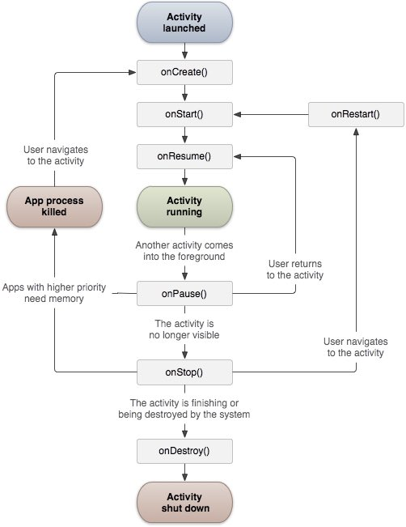

Activity 类定义了下面的回调。你可以不用实现所有的回调方法。但了解其中的每一个非常的重要，实现这些可以保证你的应用行为如用户所期望的那样。

| 回调        | 描述                                                         |
| :---------- | :----------------------------------------------------------- |
| onCreate()  | 这是第一个回调，在活动第一次创建时调用                       |
| onStart()   | 这个回调在活动为用户可见时被调用                             |
| onResume()  | 这个回调在应用程序与用户开始可交互的时候调用                 |
| onPause()   | 被暂停的活动无法接受用户输入，不能执行任何代码。当前活动将要被暂停，上一个活动将要被恢复时调用 |
| onStop()    | 当活动不在可见时调用                                         |
| onDestroy() | 当活动被系统销毁之前调用                                     |
| onRestart() | 当活动被停止以后重新打开时调用                               |

### 5.2 实例

这个实例通过简单地步骤展示 Android 应用程序活动的生命周期。按照下面的步骤来修改我们在 Hello World 实例章节中创建的 Android 应用程序。

| 步骤 | 描述                                                         |
| :--- | :----------------------------------------------------------- |
| 1    | 使用eclipse IDE来创建一个Android应用程序，并命名为HelloWorld放在com.example.helloworld包下。如之前Hello World Example章节中介绍。 |
| 2    | 按照下面修改主要活动文件MainActivity.java。保持其他部分不变。 |
| 3    | 运行应用程序来打开Android模拟器，并检查应用程序的修改结果。  |

下面是主要活动文件src/com.example.helloworld/MainActivity.java修改的内容。里面包含每一个基本的生命周期方法。Log.d()方法用来生成日志信息：

```java
package com.example.helloworld;

import android.os.Bundle;
import android.app.Activity;
import android.util.Log;

public class MainActivity extends Activity {
   String msg = "Android : ";

   /** 当活动第一次被创建时调用 */
   @Override
   public void onCreate(Bundle savedInstanceState) {
      super.onCreate(savedInstanceState);
      setContentView(R.layout.activity_main);
      Log.d(msg, "The onCreate() event");
   }

   /** 当活动即将可见时调用 */
   @Override
   protected void onStart() {
      super.onStart();
      Log.d(msg, "The onStart() event");
   }

   /** 当活动可见时调用 */
   @Override
   protected void onResume() {
      super.onResume();
      Log.d(msg, "The onResume() event");
   }

   /** 当其他活动获得焦点时调用 */
   @Override
   protected void onPause() {
      super.onPause();
      Log.d(msg, "The onPause() event");
   }

   /** 当活动不再可见时调用 */
   @Override
   protected void onStop() {
      super.onStop();
      Log.d(msg, "The onStop() event");
   }

   /** 当活动将被销毁时调用 */
   @Override
   public void onDestroy() {
      super.onDestroy();
      Log.d(msg, "The onDestroy() event");
   }
}
```

活动类从项目的 res/layout 中的XML文件加载所有的UI组件。下面的语句从 res/layout/activity_main.xml 文件中加载UI组件：

```
setContentView(R.layout.activity_main);
```

一个应用程序可以有 `1个` 或 `多个` 活动，而没有任何限制。每个为应用程序所定义的活动都需要在 `AndroidManifest.xml` 中声明。应用的主要活动需要在清单中声明，且意图过滤器标签中需要包含 `MAIN 动作` 和 `LAUNCHER 类别`。如下：

```xml
<manifest xmlns:android="http://schemas.android.com/apk/res/android"
   package="com.example.helloworld"
   android:versionCode="1"
   android:versionName="1.0" >

   <uses-sdk
      android:minSdkVersion="8"
      android:targetSdkVersion="22" />

   <application
       android:icon="@drawable/ic_launcher"
       android:label="@string/app_name"
       android:theme="@style/AppTheme" >

       <activity
          android:name=".MainActivity"
          android:label="@string/title_activity_main" >

          <intent-filter>
             <action android:name="android.intent.action.MAIN" />
             <category android:name="android.intent.category.LAUNCHER"/>
          </intent-filter>

       </activity>

   </application>
</manifest>
```

不论是 `MAIN 动作` 还是 `LAUNCHER` 类别没有在活动中声明，那么应用程序的图标将不会出现在主屏幕的应用列表中。

让我们运行起刚刚修改的 "Hellow World!" 应用程序。假设你在环境搭建的时候已经创建了 `AVD` 。从 Eclipse 运行应用，打开一个项目中的活动文件，并从工具栏点击运行图标。Eclipse在AVD上安装应用并启动它。如果一切顺利，将显示模拟器屏幕如下，同时你可以在Eclipse IDE的LogCat窗口中看到日志信息：

```
07-19 15:00:43.405: D/Android :(866): The onCreate() event
07-19 15:00:43.405: D/Android :(866): The onStart() event
07-19 15:00:43.415: D/Android :(866): The onResume() event
```

让我们点击 Android 模拟器上的红色按钮，它将在Eclipse IDE的LogCat窗口中产生如下的事件消息：

```
<code>07-19 15:01:10.995: D/Android :(866): The onPause() event
07-19 15:01:12.705: D/Android :(866): The onStop() event
</code>
```

让我们再次点击 Android 模拟器上的菜单按钮，它将在 Eclipse IDE 的 LogCat 窗口中产生如下的事件消息：

```
<code>07-19 15:01:13.995: D/Android :(866): The onStart() event
07-19 15:01:14.705: D/Android :(866): The onResume() event
</code>
```

接下来，让我们点击Android模拟器上的返回按钮，它将在Eclipse IDE的LogCat窗口中产生如下的事件消息，Android 应用程序上活动的整个生命周期完成。

```
07-19 15:33:15.687: D/Android :(992): The onPause() event
07-19 15:33:15.525: D/Android :(992): The onStop() event
07-19 15:33:15.525: D/Android :(992): The onDestroy() event
```

## 6. Android 服务（Service）

### 6.1 基本情况

服务是一个后台运行的组件，执行长时间运行且不需要用户交互的任务。即使应用被销毁也依然可以工作。服务基本上包含两种状态：

| 状态    | 描述                                                         |
| :------ | :----------------------------------------------------------- |
| Started | Android的应用程序组件，如活动，通过startService()启动了服务，则服务是Started状态。一旦启动，服务可以在后台无限期运行，即使启动它的组件已经被销毁。 |
| Bound   | 当 `Android` 的应用程序组件通过 `bindService()` 绑定了服务，则服务是 `Bound状态` 。`Bound状态` 的服务提供了一个客户服务器接口来允许组件与服务进行交互，如发送请求，获取结果，甚至通过`IPC` 来进行跨进程通信。 |

服务拥有生命周期方法，可以实现监控服务状态的变化，可以在合适的阶段执行工作。下面的左图展示了当服务通过 `startService()` 被创建时的生命周期，右图则显示了当服务通过 `bindService()` 被创建时的生命周期：

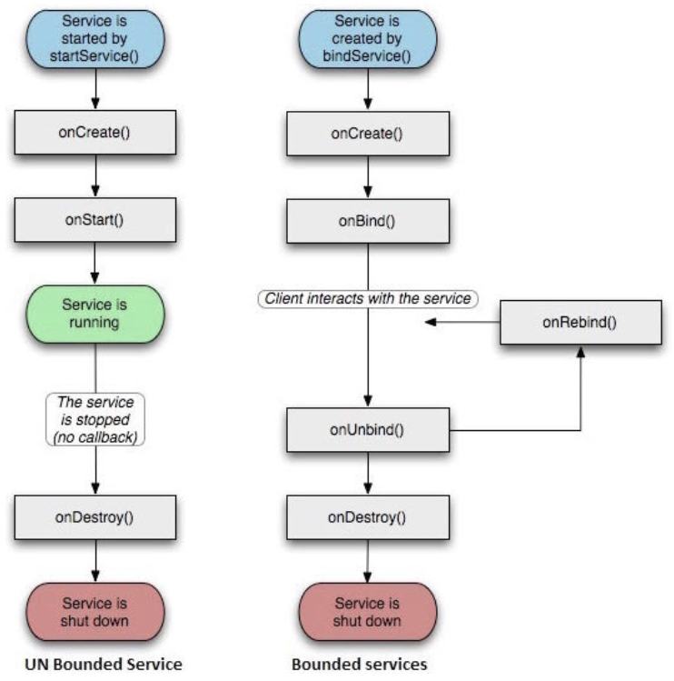

要创建服务，你需要创建一个继承自 Service 基类或者它的已知子类的 Java 类。 Service 基类定义了不同的回调方法和多数重要方法。你不需要实现所有的回调方法。虽然如此，理解所有的方法还是非常重要的。实现这些回调能确保你的应用以用户期望的方式实现。

| 回调             | 描述                                                         |
| :--------------- | :----------------------------------------------------------- |
| onStartCommand() | 其他组件(如活动)通过调用startService()来请求启动服务时，系统调用该方法。如果你实现该方法，你有责任在工作完成时通过stopSelf()或者stopService()方法来停止服务。 |
| onBind           | 当其他组件想要通过bindService()来绑定服务时，系统调用该方法。如果你实现该方法，你需要返回IBinder对象来提供一个接口，以便客户来与服务通信。你必须实现该方法，如果你不允许绑定，则直接返回null。 |
| onUnbind()       | 当客户中断所有服务发布的特殊接口时，系统调用该方法。         |
| onRebind()       | 当新的客户端与服务连接，且此前它已经通过onUnbind(Intent)通知断开连接时，系统调用该方法。 |
| onCreate()       | 当服务通过onStartCommand()和onBind()被第一次创建的时候，系统调用该方法。该调用要求执行一次性安装。 |
| onDestroy()      | 当服务不再有用或者被销毁时，系统调用该方法。你的服务需要实现该方法来清理任何资源，如线程，已注册的监听器，接收器等。 |

下面的主服务演示了每个方法的生命周期

```java
package com.runoob.androidservices;

import android.app.Service;
import android.os.IBinder;
import android.content.Intent;
import android.os.Bundle;

public class HelloService extends Service {

    /** 标识服务如果被杀死之后的行为 */
    int mStartMode;

    /** 绑定的客户端接口 */
    IBinder mBinder;

    /** 标识是否可以使用onRebind */
    boolean mAllowRebind;

    /** 当服务被创建时调用. */
    @Override
    public void onCreate() {

    }

    /** 调用startService()启动服务时回调 */
    @Override
    public int onStartCommand(Intent intent, int flags, int startId) {
        return mStartMode;
    }

    /** 通过bindService()绑定到服务的客户端 */
    @Override
    public IBinder onBind(Intent intent) {
        return mBinder;
    }

    /** 通过unbindService()解除所有客户端绑定时调用 */
    @Override
    public boolean onUnbind(Intent intent) {
        return mAllowRebind;
    }

    /** 通过bindService()将客户端绑定到服务时调用*/
    @Override
    public void onRebind(Intent intent) {

    }

    /** 服务不再有用且将要被销毁时调用 */
    @Override
    public void onDestroy() {

    }
}
```

### 6.2 例子

这个例子将通过简单地步骤为你展示如何创建自己的Android服务。按照下面的步骤来修改之前在Hello World实例章节中创建的Android应用程序:

| 步骤 | 描述                                                         |
| :--- | :----------------------------------------------------------- |
| 1    | 使用Android Studio IDE来创建Android应用程序并在com.runoob.androidservices包下命名为androidservices。 |
| 2    | 修改主活动文件MainActivity.java来添加startService()和stopService()方法。 |
| 3    | 在包com.runoob.androidservices下创建新的Java文件MyService.java。这个文件将实现Android服务相关的方法。 |
| 4    | 在AndroidManifest.xml文件中使用<service.../>标签来定义服务。应用程序可以有一个或多个服务，没有任何限制。 |
| 5    | 修改 res/layout/activity_main.xml 文件中的默认布局，在线性布局中包含两个按钮。 |
| 6    | 不要对 res/values/strings.xml 文件中的任何常量进行修改。 Android Studio 会注意字符串值。 |
| 7    | 启动 Android 模拟器来运行应用程序，并验证应用程序所做改变的结果。 |

下面是主活动文件 `src/com.runoob.androidservices/MainActivity.java` 文件所修改的内容。这个文件包含所有基本的生命周期方法。我们添加了 `startService()` 和 `stopService()` 方法来启动和停止服务。

```java
package com.runoob.androidservices;

import android.app.Activity;
import android.os.Bundle;
import android.view.Menu;

import android.content.Intent;
import android.view.View;

public class MainActivity extends Activity {

    @Override
    public void onCreate(Bundle savedInstanceState) {
        super.onCreate(savedInstanceState);
        setContentView(R.layout.activity_main);
    }

    @Override
    public boolean onCreateOptionsMenu(Menu menu) {
        getMenuInflater().inflate(R.menu.menu_main, menu);
        return true;
    }

    // Method to start the service
    public void startService(View view) {
        startService(new Intent(getBaseContext(), MyService.class));
    }

    // Method to stop the service
    public void stopService(View view) {
        stopService(new Intent(getBaseContext(), MyService.class));
    }
}
```

以下是 `src/com.runoob.androidservices/MyService.java` 的内容。这个文件可以基于需求实现一个或多个服务关联的方法。对于新人，我们只实现 `onStartCommand()` 和 `onDestroy()`

```java
package com.runoob.androidservices;

import android.app.Service;
import android.content.Intent;
import android.os.IBinder;
import android.widget.Toast;

public class MyService extends Service {

    @Override
    public IBinder onBind(Intent arg0) {
        return null;
    }

    @Override
    public int onStartCommand(Intent intent, int flags, int startId) {
        // Let it continue running until it is stopped.
        Toast.makeText(this, "服务已经启动", Toast.LENGTH_LONG).show();
        return START_STICKY;
    }

    @Override
    public void onDestroy() {
        super.onDestroy();
        Toast.makeText(this, "服务已经停止", Toast.LENGTH_LONG).show();
    }
}
```

下面将修改 `AndroidManifest.xml` 文件。这里添加 `<service.../>` 标签来包含我们的服务：

```xml
<?xml version="1.0" encoding="utf-8"?>
<manifest xmlns:android="http://schemas.android.com/apk/res/android"
    package="com.runoob.androidservices"
    android:versionCode="1"
    android:versionName="1.0">

    <uses-sdk
        android:minSdkVersion="13"
        android:targetSdkVersion="22" />

    <application
        android:icon="@drawable/ic_launcher"
        android:label="@string/app_name"
        android:theme="@style/AppTheme" >

        <activity
            android:name=".MainActivity"
            android:label="@string/title_activity_main" >

            <intent-filter>
                <action android:name="android.intent.action.MAIN" />
                <category android:name="android.intent.category.LAUNCHER"/>
            </intent-filter>

        </activity>

        <service android:name=".MyService" />

    </application>

</manifest>
```

以下是 `res/layout/activity_main.xml` 文件的内容，包含两个按钮：

```xml
<RelativeLayout xmlns:android="http://schemas.android.com/apk/res/android"
    xmlns:tools="http://schemas.android.com/tools" android:layout_width="match_parent"
    android:layout_height="match_parent" android:paddingLeft="@dimen/activity_horizontal_margin"
    android:paddingRight="@dimen/activity_horizontal_margin"
    android:paddingTop="@dimen/activity_vertical_margin"
    android:paddingBottom="@dimen/activity_vertical_margin" tools:context=".MainActivity">

    <TextView
        android:id="@+id/textView1"
        android:layout_width="wrap_content"
        android:layout_height="wrap_content"
        android:text="Android 服务实例"
        android:layout_alignParentTop="true"
        android:layout_centerHorizontal="true"
        android:textSize="30dp" />

    <TextView
        android:id="@+id/textView2"
        android:layout_width="wrap_content"
        android:layout_height="wrap_content"
        android:text="www.runoob.com"
        android:textColor="#ff87ff09"
        android:textSize="30dp"
        android:layout_above="@+id/imageButton"
        android:layout_centerHorizontal="true"
        android:layout_marginBottom="40dp" />

    <ImageButton
        android:layout_width="wrap_content"
        android:layout_height="wrap_content"
        android:id="@+id/imageButton"
        android:src="@drawable/ic_launcher"
        android:layout_centerVertical="true"
        android:layout_centerHorizontal="true" />

    <Button
        android:layout_width="wrap_content"
        android:layout_height="wrap_content"
        android:id="@+id/button2"
        android:text="启动服务"
        android:onClick="startService"
        android:layout_below="@+id/imageButton"
        android:layout_centerHorizontal="true" />

    <Button
        android:layout_width="wrap_content"
        android:layout_height="wrap_content"
        android:text="停止服务"
        android:id="@+id/button"
        android:onClick="stopService"
        android:layout_below="@+id/button2"
        android:layout_alignLeft="@+id/button2"
        android:layout_alignStart="@+id/button2"
        android:layout_alignRight="@+id/button2"
        android:layout_alignEnd="@+id/button2" />

</RelativeLayout>
```

下面是 `res/values/strings.xml` 的内容，来定义两个新的常量：

```xml
<?xml version="1.0" encoding="utf-8"?>
<resources>

    <string name="app_name">Android Services</string>
    <string name="title_activity_main">MainActivity</string>
    <string name="menu_settings">Settings</string>
    <string name="action_settings">Settings</string>

</resources>
```

让我们运行刚刚修改的 My Application 应用程序。我假设你已经在安装环境时创建了AVD。打开你的项目中的活动文件，点击工具栏中的图标来在Android Studio中运行应用程序。Android Studio 在 AVD 上安装应用程序并启动它。如果一切顺利，将在模拟器窗口上显示如下：

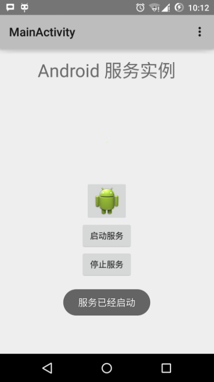

现在点击"启动服务"按钮来启动服务，这将执行我们编写的 onStartCommand() 方法，一条"服务已经启动"的消息在模拟器的底部出现，如下：

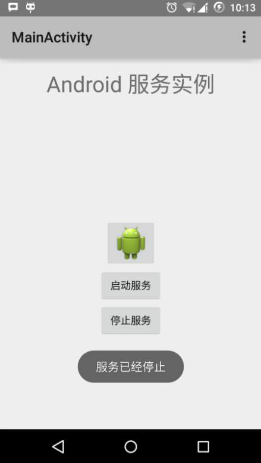

## 7. Android 广播接收器(Broadcast Receivers)

广播接收器用于响应来自其他应用程序或者系统的广播消息。这些消息有时被称为事件或者意图。例如，应用程序可以初始化广播来让其他的应用程序知道一些数据已经被下载到设备，并可以为他们所用。这样广播接收器可以定义适当的动作来拦截这些通信。

有以下两个重要的步骤来使系统的广播意图配合广播接收器工作。

- 创建广播接收器
- 注册广播接收器

还有一个附加的步骤，要实现自定义的意图，你必须创建并广播这些意图。

### 7.1 创建广播接收器

广播接收器需要实现为 BroadcastReceiver 类的子类，并重写 onReceive() 方法来接收以 Intent对象 为参数的消息。

```java
public class MyReceiver extends BroadcastReceiver {
   @Override
   public void onReceive(Context context, Intent intent) {
      Toast.makeText(context, "Intent Detected.", Toast.LENGTH_LONG).show();
   }
}
```

### 7.2 注册广播接收器

应用程序通过在AndroidManifest.xml中注册广播接收器来监听制定的广播意图。假设我们将要注册MyReceiver来监听系统产生的ACTION_BOOT_COMPLETED事件。该事件由Android系统的启动进程完成时发出。

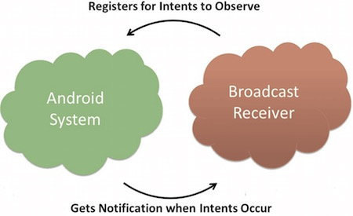

```xml
<application
   android:icon="@drawable/ic_launcher"
   android:label="@string/app_name"
   android:theme="@style/AppTheme" >
   <receiver android:name="MyReceiver">

      <intent-filter>
         <action android:name="android.intent.action.BOOT_COMPLETED">
         </action>
      </intent-filter>

   </receiver>
</application>
```

现在，无论什么时候 `Android设备` 被启动，都将被广播接收器 `MyReceiver` 所拦截，并且在 `onReceive()` 中实现的逻辑将被执行。

有许多系统产生的事件被定义为类 `Intent` 中的静态常量值。下面的表格列举了重要的系统事件。

| 事件常量                              | 描述                                                 |
| :------------------------------------ | :--------------------------------------------------- |
| android.intent.action.BATTERY_CHANGED | 持久的广播，包含电池的充电状态，级别和其他信息。     |
| android.intent.action.BATTERY_LOW     | 标识设备的低电量条件。                               |
| android.intent.action.BATTERY_OKAY    | 标识电池在电量低之后，现在已经好了。                 |
| android.intent.action.BOOT_COMPLETED  | 在系统完成启动后广播一次。                           |
| android.intent.action.BUG_REPORT      | 显示报告bug的活动。                                  |
| android.intent.action.CALL            | 执行呼叫数据指定的某人。                             |
| android.intent.action.CALL_BUTTON     | 用户点击"呼叫"按钮打开拨号器或者其他拨号的合适界面。 |
| android.intent.action.DATE_CHANGED    | 日期发生改变。                                       |
| android.intent.action.REBOOT          | 设备重启。                                           |

### 7.3 广播自定义意图

如果你想要应用程序中生成并发送自定义意图，你需要在活动类中通过`sendBroadcast()` 来创建并发送这些意图。如果你使用 `sendStickyBroadcast(Intent)` 方法，则意图是持久的(sticky)，这意味着你发出的意图在广播完成后一直保持着。

```java
public void broadcastIntent(View view)
{
   Intent intent = new Intent();
   intent.setAction("com.runoob.CUSTOM_INTENT");
   sendBroadcast(intent);
}
```

com.runoob.CUSTOM_INTENT的意图可以像之前我们注册系统产生的意图一样被注册。

```xml
<application
   android:icon="@drawable/ic_launcher"
   android:label="@string/app_name"
   android:theme="@style/AppTheme" >
   <receiver android:name="MyReceiver">

      <intent-filter>
         <action android:name="com.runoob.CUSTOM_INTENT">
         </action>
      </intent-filter>

   </receiver>
</application>
```

### 7.4 实例

这个实例将解释如何创建广播接收器来拦截自定义意图。一旦你熟悉自定义意图，你可以为应用程序编程来拦截系统产生的意图。让我们按照下面的步骤来修改Hello World实例章节中我们创建的Android应用程序。

| 步骤 | 描述                                                         |
| :--- | :----------------------------------------------------------- |
| 1    | 使用Android Studio来创建Android应用程序并命名为broadcastreceiver，并放在Hello World实例章节中的com.runoob.broadcastreceiver包下。 |
| 2    | 修改主要活动文件MainActivity.java来添加broadcastIntent()方法。 |
| 3    | 在com.runoob.broadcastreceiver包下创建名为MyReceiver.java的新的Java文件来定义广播接收器。 |
| 4    | 应用程序可以处理一个或多个自定义或者系统的意图，没有任何限制。每个你想拦截的意图都需要使用<receiver.../>标签在AndroidManifest.xml中注册。 |
| 5    | 修改res/layout/activity_main.xml文件中的默认内容来包含一个广播意图的按钮。 |
| 6    | 不需要修改字符串文件，Android Studio会注意string.xml文件。   |
| 7    | 启动Android模拟器来运行应用程序，并验证应用程序所做改变的结果。 |

下面是修改的主要活动文件 `src/com.runoob.broadcastreceiver/MainActivity.java` 的内容。这个文件包含了每个基础的生命周期方法。我们添加了 `broadcastIntent()` 方法来广播自定义事件。

```java
package com.runoob.broadcastreceiver;

import android.os.Bundle;
import android.app.Activity;
import android.view.Menu;
import android.content.Intent;
import android.view.View;

public class MainActivity extends Activity {

    @Override
    public void onCreate(Bundle savedInstanceState) {
        super.onCreate(savedInstanceState);
        setContentView(R.layout.activity_main);
    }

    @Override
    public boolean onCreateOptionsMenu(Menu menu) {
        getMenuInflater().inflate(R.menu.menu_main, menu);
        return true;
    }

    // 广播自定义意图
    public void broadcastIntent(View view){
        Intent intent = new Intent();
        intent.setAction("cn.programmer.CUSTOM_INTENT");
        sendBroadcast(intent);
    }
}
```

下面是 `src/com.runoob.broadcastreceiver/MyReceiver.java` 的内容：

```java
package com.runoob.broadcastreceiver;

import android.content.BroadcastReceiver;
import android.content.Context;
import android.content.Intent;
import android.widget.Toast;

public class MyReceiver extends BroadcastReceiver {
    @Override
    public void onReceive(Context context, Intent intent) {
        Toast.makeText(context, "检测到意图。", Toast.LENGTH_LONG).show();
    }
}
```

接下来修改 `AndroidManifest.xml` 文件。这里通过添加 `<receiver.../>` 标签来包含我们的广播接收器：

```xml
<?xml version="1.0" encoding="utf-8"?>
<manifest xmlns:android="http://schemas.android.com/apk/res/android"
    package="com.runoob.broadcastreceiver"
    android:versionCode="1"
    android:versionName="1.0" >

    <uses-sdk
        android:minSdkVersion="8"
        android:targetSdkVersion="22" />

    <application
        android:icon="@drawable/ic_launcher"
        android:label="@string/app_name"
        android:theme="@style/AppTheme" >

        <activity
            android:name=".MainActivity"
            android:label="@string/title_activity_main" >

            <intent-filter>
                <action android:name="android.intent.action.MAIN" />
                <category android:name="android.intent.category.LAUNCHER"/>
            </intent-filter>

        </activity>

        <receiver android:name="MyReceiver">

            <intent-filter>
                <action android:name="cn.programmer.CUSTOM_INTENT">
                </action>
            </intent-filter>

        </receiver>

    </application>

</manifest>
```

下面是 `res/layout/activity_main.xml` 文件的内容，包含广播自定义意图的按钮。

```xml
<RelativeLayout xmlns:android="http://schemas.android.com/apk/res/android"
    xmlns:tools="http://schemas.android.com/tools" android:layout_width="match_parent"
    android:layout_height="match_parent" android:paddingLeft="@dimen/activity_horizontal_margin"
    android:paddingRight="@dimen/activity_horizontal_margin"
    android:paddingTop="@dimen/activity_vertical_margin"
    android:paddingBottom="@dimen/activity_vertical_margin" tools:context=".MainActivity">

    <TextView
        android:id="@+id/textView1"
        android:layout_width="wrap_content"
        android:layout_height="wrap_content"
        android:text="广播实例"
        android:layout_alignParentTop="true"
        android:layout_centerHorizontal="true"
        android:textSize="30dp" />

    <TextView
        android:id="@+id/textView2"
        android:layout_width="wrap_content"
        android:layout_height="wrap_content"
        android:text="www.runoob.com"
        android:textColor="#ff87ff09"
        android:textSize="30dp"
        android:layout_above="@+id/imageButton"
        android:layout_centerHorizontal="true"
        android:layout_marginBottom="40dp" />

    <ImageButton
        android:layout_width="wrap_content"
        android:layout_height="wrap_content"
        android:id="@+id/imageButton"
        android:src="@drawable/ic_launcher"
        android:layout_centerVertical="true"
        android:layout_centerHorizontal="true" />

    <Button
        android:layout_width="wrap_content"
        android:layout_height="wrap_content"
        android:id="@+id/button2"
        android:text="广播意图"
        android:onClick="broadcastIntent"
        android:layout_below="@+id/imageButton"
        android:layout_centerHorizontal="true" />

</RelativeLayout>
```

下面是 `res/values/strings.xml` 文件的内容，定义了两个新的常量。

```xml
<?xml version="1.0" encoding="utf-8"?>
<resources>

    <string name="app_name">Android Broadcast Receiver</string>
    <string name="action_settings">Settings</string>
    <string name="menu_settings">Settings</string>
    <string name="title_activity_main">Main Activity</string>

</resources>
```

让我们运行刚刚修改的Hello World!应用程序。我假设你已经在安装环境时创建了AVD。打开你的项目中的活动文件，点击工具栏中的图标来在Android Studio中运行应用程序。Android Studio在AVD上安装应用程序并启动它。如果一切顺利，将在模拟器窗口上显示如下：

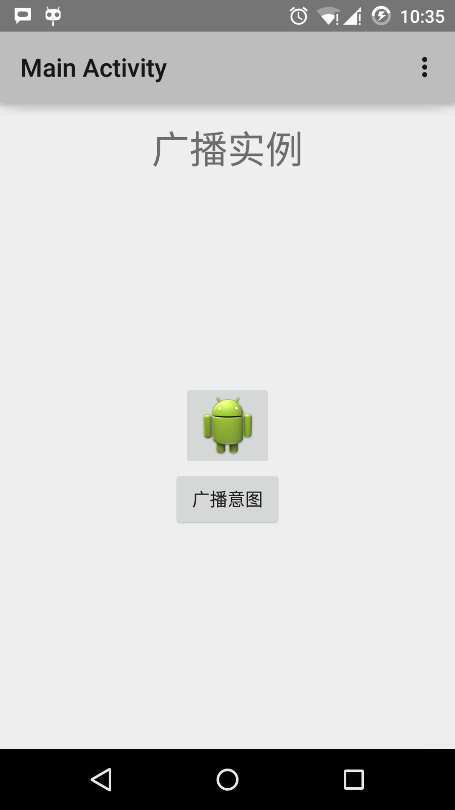

现在点击"广播意图"按钮来广播我们的自定义意图。这将广播我们的自定义意图"cn.programmer.CUSTOM_INTENT"，在我们注册的广播接收器MyReceiver中拦截并执行我们实现的逻辑。模拟器的底部将出现toast。如下：

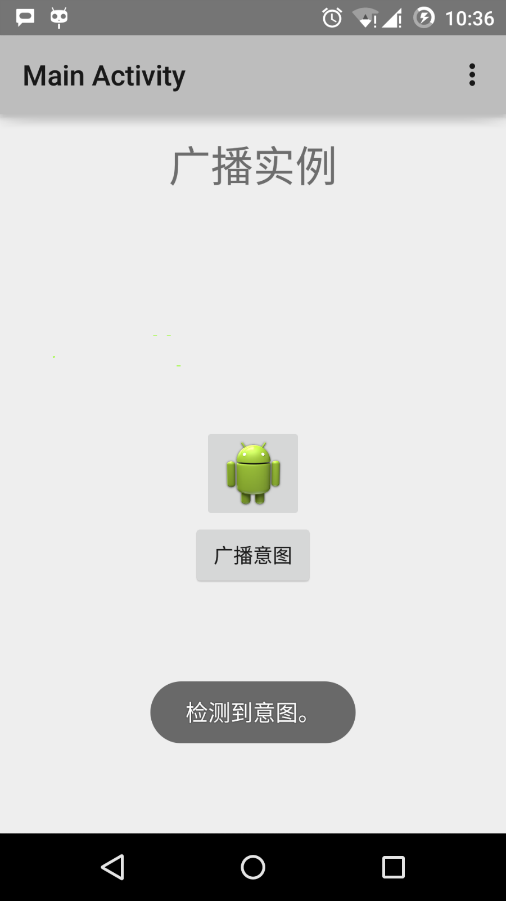

## 8. Android - 内容提供者(Content Provider)

### 8.1 概述

内容提供者组件通过请求从一个应用程序向其他的应用程序提供数据。这些请求由类 ContentResolver 的方法来处理。内容提供者可以使用不同的方式来存储数据。数据可以被存放在数据库，文件，甚至是网络。

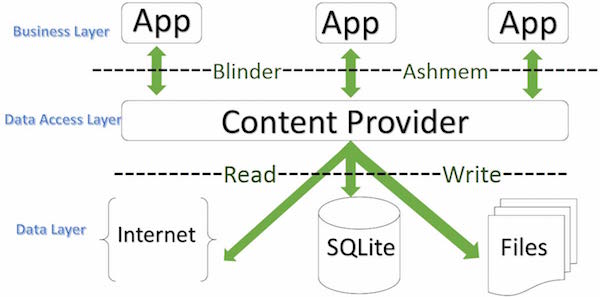

有时候需要在应用程序之间共享数据。这时内容提供者变得非常有用。

内容提供者可以让内容集中，必要时可以有多个不同的应用程序来访问。内容提供者的行为和数据库很像。你可以查询，编辑它的内容，使用 `insert()`， `update()`， `delete()` 和 `query()` 来添加或者删除内容。多数情况下数据被存储在 SQLite 数据库。

内容提供者被实现为类 `ContentProvider` 类的子类。需要实现一系列标准的 API，以便其他的应用程序来执行事务。

```java
public class MyApplication extends  ContentProvider {

}
```

### 8.2 内容URI

要查询内容提供者，你需要以如下格式的URI的形式来指定查询字符串：

```
<prefix>://<authority>/<data_type>/<id>
```

以下是URI中各部分的具体说明：

| 部分      | 说明                                                         |
| :-------- | :----------------------------------------------------------- |
| prefix    | 前缀：一直被设置为content://                                 |
| authority | 授权：指定内容提供者的名称，例如联系人，浏览器等。第三方的内容提供者可以是全名，如：cn.programmer.statusprovider |
| data_type | 数据类型：这个表明这个特殊的内容提供者中的数据的类型。例如：你要通过内容提供者Contacts来获取所有的通讯录，数据路径是people，那么URI将是下面这样：content://contacts/people |
| id        | 这个指定特定的请求记录。例如：你在内容提供者Contacts中查找联系人的ID号为5，那么URI看起来是这样：content://contacts/people/5 |

### 8.3 创建内容提供者

这里描述创建自己的内容提供者的简单步骤。

- 首先，你需要继承类 ContentProviderbase 来创建一个内容提供者类。
- 其次，你需要定义用于访问内容的你的内容提供者URI地址。
- 接下来，你需要创建数据库来保存内容。通常，Android 使用 SQLite 数据库，并在框架中重写 onCreate() 方法来使用 SQLiteOpenHelper 的方法创建或者打开提供者的数据库。当你的应用程序被启动，它的每个内容提供者的 onCreate() 方法将在应用程序主线程中被调用。
- 最后，使用 `<provider.../>` 标签在 `AndroidManifest.xml` 中注册内容提供者。

以下是让你的内容提供者正常工作，你需要在类 `ContentProvider` 中重写的一些方法：

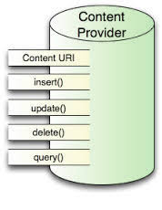

- onCreate():当提供者被启动时调用。
- query():该方法从客户端接受请求。结果是返回指针(Cursor)对象。
- insert():该方法向内容提供者插入新的记录。
- delete():该方法从内容提供者中删除已存在的记录。
- update():该方法更新内容提供者中已存在的记录。
- getType():该方法为给定的URI返回元数据类型。

### 8.4 实例

该实例解释如何创建自己的内容提供者。让我们按照下面的步骤：

| 步骤 | 描述                                                         |
| :--- | :----------------------------------------------------------- |
| 1    | 使用 Android Studio 创建 Android 应用程序并命名为 Content Provider，在包com.runoob.contentprovider 下，并建立空活动。 |
| 2    | 修改主要活动文件 MainActivity.java 来添加两个新的方法 onClickAddName() 和 onClickRetrieveStudents()。 |
| 3    | 在包 com.runoob.contentprovider 下创建新的 Java 文件 StudentsProvider.java 来定义实际的提供者，并关联方法。 |
| 4    | 使用<provider.../>标签在 AndroidManifest.xml 中注册内容提供者。 |
| 5    | 修改 res/layout/activity_main.xml 文件的默认内容来包含添加学生记录的简单界面。 |
| 6    | 无需修改 strings.xml，Android Studio 会注意 strings.xml 文件。 |
| 7    | 启动 Android 模拟器来运行应用程序，并验证应用程序所做改变的结果。 |

下面是修改的主要活动文件 src/com.runoob.contentprovider/MainActivity.java 的内容。该文件包含每个基础的生命周期方法。我们添加了两个新的方法，onClickAddName() 和 onClickRetrieveStudents() 来让应用程序处理用户交互。

```java
package com.runoob.contentprovider;

import android.net.Uri;
import android.os.Bundle;
import android.app.Activity;
import android.content.ContentValues;
import android.content.CursorLoader;
import android.database.Cursor;
import android.view.Menu;
import android.view.View;
import android.widget.EditText;
import android.widget.Toast;
import com.runoob.contentprovider.R;

public class MainActivity extends Activity {

    @Override
    protected void onCreate(Bundle savedInstanceState) {
        super.onCreate(savedInstanceState);
        setContentView(R.layout.activity_main);
    }

    @Override
    public boolean onCreateOptionsMenu(Menu menu) {
        getMenuInflater().inflate(R.menu.menu_main, menu);
        return true;
    }

    public void onClickAddName(View view) {
        // Add a new student record
        ContentValues values = new ContentValues();

        values.put(StudentsProvider.NAME,
                ((EditText)findViewById(R.id.editText2)).getText().toString());

        values.put(StudentsProvider.GRADE,
                ((EditText)findViewById(R.id.editText3)).getText().toString());

        Uri uri = getContentResolver().insert(
                StudentsProvider.CONTENT_URI, values);

        Toast.makeText(getBaseContext(),
                uri.toString(), Toast.LENGTH_LONG).show();
    }

    public void onClickRetrieveStudents(View view) {

        // Retrieve student records
        String URL = "content://com.example.provider.College/students";

        Uri students = Uri.parse(URL);
        Cursor c = managedQuery(students, null, null, null, "name");

        if (c.moveToFirst()) {
            do{
                Toast.makeText(this,
                        c.getString(c.getColumnIndex(StudentsProvider._ID)) +
                                ", " +  c.getString(c.getColumnIndex( StudentsProvider.NAME)) +
                                ", " + c.getString(c.getColumnIndex( StudentsProvider.GRADE)),
                        Toast.LENGTH_SHORT).show();
            } while (c.moveToNext());
        }
    }
}
```

在包 `com.runoob.contentprovider` 下创建新的文件 `StudentsProvider.java` 。以下是 `src/com.runoob.contentprovider/StudentsProvider.java` 的内容。

```java
package com.runoob.contentprovider;

import java.util.HashMap;

import android.content.ContentProvider;
import android.content.ContentUris;
import android.content.ContentValues;
import android.content.Context;
import android.content.UriMatcher;

import android.database.Cursor;
import android.database.SQLException;
import android.database.sqlite.SQLiteDatabase;
import android.database.sqlite.SQLiteOpenHelper;
import android.database.sqlite.SQLiteQueryBuilder;

import android.net.Uri;
import android.text.TextUtils;

public class StudentsProvider extends ContentProvider {

    static final String PROVIDER_NAME = "com.example.provider.College";
    static final String URL = "content://" + PROVIDER_NAME + "/students";
    static final Uri CONTENT_URI = Uri.parse(URL);

    static final String _ID = "_id";
    static final String NAME = "name";
    static final String GRADE = "grade";

    private static HashMap<String, String> STUDENTS_PROJECTION_MAP;

    static final int STUDENTS = 1;
    static final int STUDENT_ID = 2;

    static final UriMatcher uriMatcher;
    static{
        uriMatcher = new UriMatcher(UriMatcher.NO_MATCH);
        uriMatcher.addURI(PROVIDER_NAME, "students", STUDENTS);
        uriMatcher.addURI(PROVIDER_NAME, "students/#", STUDENT_ID);
    }

    /**
     * 数据库特定常量声明
     */
    private SQLiteDatabase db;
    static final String DATABASE_NAME = "College";
    static final String STUDENTS_TABLE_NAME = "students";
    static final int DATABASE_VERSION = 1;
    static final String CREATE_DB_TABLE =
            " CREATE TABLE " + STUDENTS_TABLE_NAME +
                    " (_id INTEGER PRIMARY KEY AUTOINCREMENT, " +
                    " name TEXT NOT NULL, " +
                    " grade TEXT NOT NULL);";

    /**
     * 创建和管理提供者内部数据源的帮助类.
     */
    private static class DatabaseHelper extends SQLiteOpenHelper {
        DatabaseHelper(Context context){
            super(context, DATABASE_NAME, null, DATABASE_VERSION);
        }

        @Override
        public void onCreate(SQLiteDatabase db)
        {
            db.execSQL(CREATE_DB_TABLE);
        }

        @Override
        public void onUpgrade(SQLiteDatabase db, int oldVersion, int newVersion) {
            db.execSQL("DROP TABLE IF EXISTS " +  STUDENTS_TABLE_NAME);
            onCreate(db);
        }
    }

    @Override
    public boolean onCreate() {
        Context context = getContext();
        DatabaseHelper dbHelper = new DatabaseHelper(context);

        /**
         * 如果不存在，则创建一个可写的数据库。
         */
        db = dbHelper.getWritableDatabase();
        return (db == null)? false:true;
    }

    @Override
    public Uri insert(Uri uri, ContentValues values) {
        /**
         * 添加新学生记录
         */
        long rowID = db.insert( STUDENTS_TABLE_NAME, "", values);

        /**
         * 如果记录添加成功
         */

        if (rowID > 0)
        {
            Uri _uri = ContentUris.withAppendedId(CONTENT_URI, rowID);
            getContext().getContentResolver().notifyChange(_uri, null);
            return _uri;
        }
        throw new SQLException("Failed to add a record into " + uri);
    }

    @Override
    public Cursor query(Uri uri, String[] projection, String selection,String[] selectionArgs, String sortOrder) {
        SQLiteQueryBuilder qb = new SQLiteQueryBuilder();
        qb.setTables(STUDENTS_TABLE_NAME);

        switch (uriMatcher.match(uri)) {
            case STUDENTS:
                qb.setProjectionMap(STUDENTS_PROJECTION_MAP);
                break;

            case STUDENT_ID:
                qb.appendWhere( _ID + "=" + uri.getPathSegments().get(1));
                break;

            default:
                throw new IllegalArgumentException("Unknown URI " + uri);
        }

        if (sortOrder == null || sortOrder == ""){
            /**
             * 默认按照学生姓名排序
             */
            sortOrder = NAME;
        }
        Cursor c = qb.query(db, projection, selection, selectionArgs,null, null, sortOrder);

        /**
         * 注册内容URI变化的监听器
         */
        c.setNotificationUri(getContext().getContentResolver(), uri);
        return c;
    }

    @Override
    public int delete(Uri uri, String selection, String[] selectionArgs) {
        int count = 0;

        switch (uriMatcher.match(uri)){
            case STUDENTS:
                count = db.delete(STUDENTS_TABLE_NAME, selection, selectionArgs);
                break;

            case STUDENT_ID:
                String id = uri.getPathSegments().get(1);
                count = db.delete( STUDENTS_TABLE_NAME, _ID +  " = " + id +
                        (!TextUtils.isEmpty(selection) ? " AND (" + selection + ')' : ""), selectionArgs);
                break;

            default:
                throw new IllegalArgumentException("Unknown URI " + uri);
        }

        getContext().getContentResolver().notifyChange(uri, null);
        return count;
    }

    @Override
    public int update(Uri uri, ContentValues values, String selection, String[] selectionArgs) {
        int count = 0;

        switch (uriMatcher.match(uri)){
            case STUDENTS:
                count = db.update(STUDENTS_TABLE_NAME, values, selection, selectionArgs);
                break;

            case STUDENT_ID:
                count = db.update(STUDENTS_TABLE_NAME, values, _ID + " = " + uri.getPathSegments().get(1) +
                        (!TextUtils.isEmpty(selection) ? " AND (" +selection + ')' : ""), selectionArgs);
                break;

            default:
                throw new IllegalArgumentException("Unknown URI " + uri );
        }
        getContext().getContentResolver().notifyChange(uri, null);
        return count;
    }

    @Override
    public String getType(Uri uri) {
        switch (uriMatcher.match(uri)){
            /**
             * 获取所有学生记录
             */
            case STUDENTS:
                return "vnd.android.cursor.dir/vnd.example.students";

            /**
             * 获取一个特定的学生
             */
            case STUDENT_ID:
                return "vnd.android.cursor.item/vnd.example.students";

            default:
                throw new IllegalArgumentException("Unsupported URI: " + uri);
        }
    }
}
```

以下是修改后的 AndroidManifest.xml 文件。这里添加了 <provider.../> 标签来包含我们的内容提供者：

```xml
<?xml version="1.0" encoding="utf-8"?>
<manifest xmlns:android="http://schemas.android.com/apk/res/android"
    package="com.runoob.contentprovider"
    android:versionCode="1"
    android:versionName="1.0" >

    <uses-sdk
        android:minSdkVersion="8"
        android:targetSdkVersion="22" />

    <application
        android:allowBackup="true"
        android:icon="@drawable/ic_launcher"
        android:label="@string/app_name"
        android:theme="@style/AppTheme" >

        <activity
            android:name="com.runoob.contentprovider.MainActivity"
            android:label="@string/app_name" >

            <intent-filter>
                <action android:name="android.intent.action.MAIN" />
                <category android:name="android.intent.category.LAUNCHER" />
            </intent-filter>

        </activity>

        <provider android:name="StudentsProvider"
            android:authorities="com.example.provider.College" >
        </provider>

    </application>

</manifest>
```

下面是 `res/layout/activity_main.xml` 文件的内容：

```xml
<RelativeLayout xmlns:android="http://schemas.android.com/apk/res/android"
    xmlns:tools="http://schemas.android.com/tools" android:layout_width="match_parent"
    android:layout_height="match_parent" android:paddingLeft="@dimen/activity_horizontal_margin"
    android:paddingRight="@dimen/activity_horizontal_margin"
    android:paddingTop="@dimen/activity_vertical_margin"
    android:paddingBottom="@dimen/activity_vertical_margin" tools:context=".MainActivity">

    <TextView
        android:id="@+id/textView1"
        android:layout_width="wrap_content"
        android:layout_height="wrap_content"
        android:text="内容提供者实例"
        android:layout_alignParentTop="true"
        android:layout_centerHorizontal="true"
        android:textSize="30dp" />

    <TextView
        android:id="@+id/textView2"
        android:layout_width="wrap_content"
        android:layout_height="wrap_content"
        android:text="www.runoob.com"
        android:textColor="#ff87ff09"
        android:textSize="30dp"
        android:layout_below="@+id/textView1"
        android:layout_centerHorizontal="true" />

    <ImageButton
        android:layout_width="wrap_content"
        android:layout_height="wrap_content"
        android:id="@+id/imageButton"
        android:src="@drawable/ic_launcher"
        android:layout_below="@+id/textView2"
        android:layout_centerHorizontal="true" />

    <Button
        android:layout_width="wrap_content"
        android:layout_height="wrap_content"
        android:id="@+id/button2"
        android:text="添加"
        android:layout_below="@+id/editText3"
        android:layout_alignRight="@+id/textView2"
        android:layout_alignEnd="@+id/textView2"
        android:layout_alignLeft="@+id/textView2"
        android:layout_alignStart="@+id/textView2"
        android:onClick="onClickAddName"/>

    <EditText
        android:layout_width="wrap_content"
        android:layout_height="wrap_content"
        android:id="@+id/editText"
        android:layout_below="@+id/imageButton"
        android:layout_alignRight="@+id/imageButton"
        android:layout_alignEnd="@+id/imageButton" />

    <EditText
        android:layout_width="wrap_content"
        android:layout_height="wrap_content"
        android:id="@+id/editText2"
        android:layout_alignTop="@+id/editText"
        android:layout_alignLeft="@+id/textView1"
        android:layout_alignStart="@+id/textView1"
        android:layout_alignRight="@+id/textView1"
        android:layout_alignEnd="@+id/textView1"
        android:hint="姓名"
        android:textColorHint="@android:color/holo_blue_light" />

    <EditText
        android:layout_width="wrap_content"
        android:layout_height="wrap_content"
        android:id="@+id/editText3"
        android:layout_below="@+id/editText"
        android:layout_alignLeft="@+id/editText2"
        android:layout_alignStart="@+id/editText2"
        android:layout_alignRight="@+id/editText2"
        android:layout_alignEnd="@+id/editText2"
        android:hint="年级"
        android:textColorHint="@android:color/holo_blue_bright" />

    <Button
        android:layout_width="wrap_content"
        android:layout_height="wrap_content"
        android:text="查询"
        android:id="@+id/button"
        android:layout_below="@+id/button2"
        android:layout_alignRight="@+id/editText3"
        android:layout_alignEnd="@+id/editText3"
        android:layout_alignLeft="@+id/button2"
        android:layout_alignStart="@+id/button2"
        android:onClick="onClickRetrieveStudents"/>

</RelativeLayout>
```

确保 `res/values/strings.xml` 文件中有以下内容：

```xml
<?xml version="1.0" encoding="utf-8"?>
<resources>

    <string name="app_name">Content Provider</string>
    <string name="action_settings">Settings</string>

</resources>
```

让我们运行刚刚修改的 Content Provider 应用程序。我假设你已经在安装环境时创建了 AVD。打开你的项目中的活动文件，点击工具栏中的图标来在 Android Studio 中运行应用程序。Android Studio 在 AVD 上安装应用程序并启动它。如果一切顺利，将在模拟器窗口上显示如下：

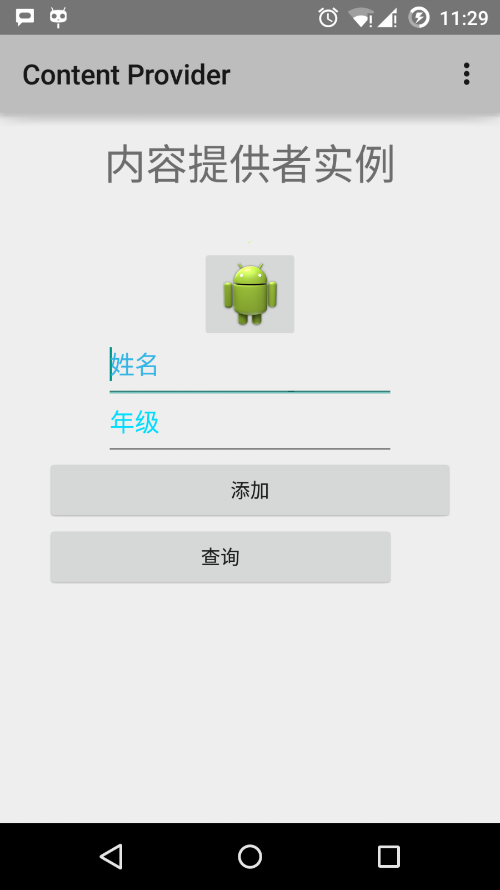

输入姓名和年级，并点击"添加"按钮，这将在数据中添加一条学生记录，并在底部删除一条信息。信息内容显示包含添加进数据库的记录数的内容提供者URI。这个操作使用了insert()方法。重复这个过程在我们的内容提供者的数据库中添加更多的学生。

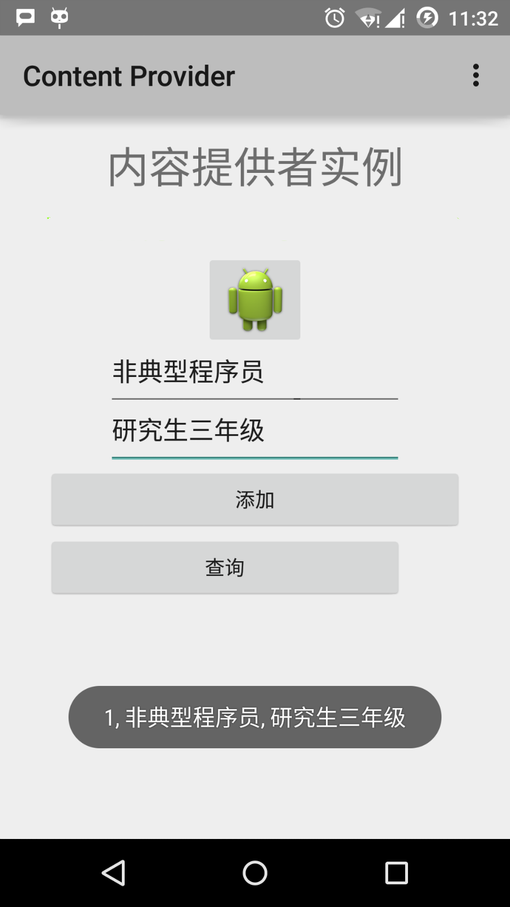

一旦你完成数据库记录的添加，是时候向内容提供者要求给回这些记录。点击"查询"按钮，这将通过实现的 query() 方法来获取并显示所有的数据记录。

你可以在 MainActivity.java 中提供回调方法，来编写更新和删除的操作，并修改用户界面来添加更新和删除操作。

你可以通过这种方式使用已有的内容提供者，如通讯录。你也可以通过这种方式来开发一个优秀的面向数据库的应用，你可以像上面介绍的实例那样来执行素有的数据库操作，如读、写、更新和删除。

## 9. Android 碎片(Fragment)

### 9.1 概述

碎片是活动的一部分，使得活动更加的模块化设计。我们可以认为碎片是一种子活动。

下面是关于碎片的重要知识点 -

- 碎片拥有自己的布局，自己的行为及自己的生命周期回调。
- 当活动在运行的时候，你可以在活动中添加或者移除碎片。
- 你可以合并多个碎片在一个单一的活动中来构建多栏的UI。
- 碎片可以被用在多个活动中。
- 碎片的生命周期和它的宿主活动紧密关联。这意味着活动被暂停，所有活动中的碎片被停止。
- 碎片可以实现行为而没有用户界面组件。
- 碎片是 Android API 版本11中被加入到 Android API。

通过继承 Fragment 类来创建碎片。可以通过使用 元素在活动的布局文件中声明碎片来在你的活动中插入碎片。

在引入碎片之前，由于每次给定的一个时间点在屏幕上只能显示单一的活动，因此我们有一个局限。我们无法分割设备屏幕并且独立的控制不同的部分。伴随着碎片的引入，我们获得了更大的灵活性，并使得一个时间点只能在屏幕上有一个单一活动的限制被移除。现在我们可以有单一的活动，但每个活动由多个碎片组装，每个碎片有自己的布局，事件和完整的生命周期。

下面是一个典型的示例演示如何让两个由碎片定义的UI模块，在为平板设计的活动中组合，在为手持设备设计的活动中分离。


当运行在在平板尺寸的设备上，这个应用程序可以在活动A中嵌入两个碎片。在手机设备屏幕上，由于没有足够的空间，活动A仅包含有文章列表的碎片，当用户点击文章时，启动包含第二个碎片的活动B来阅读文章。

### 9.2 碎片的生命周期

Android 的碎片拥有自己的生命周期，与 Android 的活动很相似。下面简单介绍它生命周期的不同阶段。


这是在类fragment中你可以重写的方法列表：

- onAttach(): 碎片实例被关联到活动实例。碎片和活动还没有完全初始化。通常，你在该方法中获取到活动的引用，在碎片将来的初始化工作中被使用。
- onCreate(): 当创建碎片时，系统调用该方法。你需要初始化一些碎片的必要组件。这些组件是当碎片被暂停、停止时需要保留的，以便被恢复。
- onCreateView(): 当碎片将要第一次绘制它的用户界面时系统调用该方法。为了绘制碎片的UI，你需要从该方法中返回一个代表碎片根布局的View组件。如果该碎片不提供用户界面，直接返回null。
- onActivityCreated: 当宿主活动被创建，在onCreateView()方法之后调用该方法。活动和碎片实例与活动的视图层级被创建。这时，视图可以通过findViewById()方法来访问。在这个方法中，你可以实例化需要Context对象的对象。
- onStart(): 碎片可见时调用该方法。
- onResume(): 碎片可交互时调用该方法。
- onPause(): 当首次表明用户将要离开碎片时系统调用该方法。通常，这里你需要提交任何的会超出用户会话的持久化的变化。
- onStop(): 碎片将要被停止时调用。
- onDestroyView(): 调用该方法后，碎片将要被销毁。
- onDestroy(): 该方法被用来清理碎片的状态。但在Android平台并不保证一定被调用。

### 9.3 如何使用碎片？

这里介绍创建碎片的简单步骤。

- 首先决定在活动中需要使用多少个碎片。例如，我们需要使用两个碎片来处理设备的横屏和竖屏两种模式。
- 下一步，基于碎片数量，创建继承自类Fragment的类。类Fragment包含上面提到的回调函数。根据你的需求重写任意的方法。
- 对应每个片段，你需要在XML文件中创建布局。这些文件中包含已定义的碎片的布局。
- 最后，基于需求修改活动文件来定义实际的碎片替换逻辑。

### 9.4 碎片类型

基本的碎片可以分为如下所示的三种：

- [单帧碎片](https://m.runoob.com/android/android-single-fragment.html) - 单帧碎片被如移动电话之类的手持设备使用。一个碎片如同一个视频一样显示。
- [列表碎片](https://m.runoob.com/android/android-list-fragment.html) - 包含有特殊列表视图的碎片被叫做列表碎片。
- [碎片过渡](https://m.runoob.com/android/android-fragment-transitions.html) - 与碎片事务一起使用。可以从一个碎片移动到另外一个碎片。

#### 9.4.1 Android 单帧碎片

**单帧碎片**：单帧碎片是为小屏幕设备所设计的，如手持设备（移动电话），Android 3.0 以上版本支持。

##### 9.4.1.1 实例

该实例解释如何创建自己的碎片。这里我们创建两个碎片，其中一个被使用在设备是横屏的时候，另一个被使用在设备是竖屏的时候。下面让我们按照步骤开始吧。

| 步骤 | 描述                                                         |
| :--- | :----------------------------------------------------------- |
| 1    | 使用 Android Studio IDE 来创建一个 Android 应用程序，命名为 Single Fragments，包名 cn.uprogrammer.singlefragments。 |
| 2    | 修改如下所示的主活动文件 MainActivity.java。这里我们将要检查设备的方向，并基于此切换不同的碎片。 |
| 3    | 在 cn.uprogrammer.singlefragments 包下创建 PortraitFragment.java 和 LandscapeFragment.java 两个文件，并关联方法。 |
| 4    | 创建布局文件 res/layout/landscape_fragment.xml 和 res/layout/portrait_fragment.xml 来定义两个碎片的布局。 |
| 5    | 修改 res/layout/activity_main.xml 来包含两个碎片。           |
| 6    | 在 res/values/strings.xml 中定义需要的常量。                 |
| 7    | 启动Android模拟器来运行应用程序，并验证应用程序所做改变的结果。 |

下面是主要活动文件 src/cn.uprogrammer.singlefragments/MainActivity.java 的内容：

```java
package cn.uprogrammer.singlefragment;

import android.os.Bundle;
import android.app.Activity;
import android.app.FragmentManager;
import android.app.FragmentTransaction;
import android.content.res.Configuration;

public class MainActivity extends Activity {

    @Override
    protected void onCreate(Bundle savedInstanceState) {
        super.onCreate(savedInstanceState);

        Configuration config = getResources().getConfiguration();

        FragmentManager fragmentManager = getFragmentManager();
        FragmentTransaction fragmentTransaction =
                fragmentManager.beginTransaction();

        /**
         * 检测设备方向，并做相应地操作。
         */
        if (config.orientation == Configuration.ORIENTATION_LANDSCAPE) {
            /**
             * 设备的横屏模式。
             */
            LandscapeFragment ls_fragment = new LandscapeFragment();
            fragmentTransaction.replace(android.R.id.content, ls_fragment);
        }else{
            /**
             * 设备的竖屏模式。
             */
            PortraitFragment pm_fragment = new PortraitFragment();
            fragmentTransaction.replace(android.R.id.content, pm_fragment);
        }
        fragmentTransaction.commit();
    }
}
```

在包 cn.uprogrammer.singlefragments 下创建两个碎片文件 LandscapeFragment.java 和 PortraitFragment.java。

以下是 LandscapeFragment.java 文件的内容：

```java
package cn.uprogrammer.singlefragment;

import android.app.Fragment;
import android.os.Bundle;
import android.view.LayoutInflater;
import android.view.View;
import android.view.ViewGroup;


public class LandscapeFragment extends Fragment {

    @Override
    public View onCreateView(LayoutInflater inflater,
                             ViewGroup container, Bundle savedInstanceState) {
        /**
         * Inflate the layout for this fragment
         */
        return inflater.inflate(
                R.layout.landscape_fragment, container, false);
    }

}
```

以下是 PortraitFragment.java 文件的内容：

```java
package cn.uprogrammer.singlefragment;

import android.app.Fragment;
import android.os.Bundle;
import android.view.LayoutInflater;
import android.view.View;
import android.view.ViewGroup;

public class PortraitFragment extends Fragment {

    @Override
    public View onCreateView(LayoutInflater inflater,
                             ViewGroup container, Bundle savedInstanceState) {
        /**
         * Inflate the layout for this fragment
         */
        return inflater.inflate(
                R.layout.portrait_fragment, container, false);
    }
}
```

在目录 res/layout 目录下创建2个布局文件 landscape_fragment.xml 和 portrait_fragment.xml。

以下是 landscape_fragment.xml 文件的内容：

```xml
<?xml version="1.0" encoding="utf-8"?>
<LinearLayout
    xmlns:android="http://schemas.android.com/apk/res/android"
    android:orientation="vertical"
    android:layout_width="fill_parent"
    android:layout_height="fill_parent"
    android:background="#7bae16">

    <TextView
        android:layout_width="fill_parent"
        android:layout_height="wrap_content"
        android:text="@string/landscape_message"
        android:textColor="#000000"
        android:textSize="28sp" />

    <!-- More GUI components go here  -->

</LinearLayout>
```

以下是 portrait_fragment.xml 文件的内容：

```xml
<?xml version="1.0" encoding="utf-8"?>
<LinearLayout
    xmlns:android="http://schemas.android.com/apk/res/android"
    android:orientation="horizontal"
    android:layout_width="fill_parent"
    android:layout_height="fill_parent"
    android:background="#666666">

    <TextView
        android:layout_width="fill_parent"
        android:layout_height="wrap_content"
        android:text="@string/portrait_message"
        android:textColor="#000000"
        android:textSize="28sp" />

    <!-- More GUI components go here  -->

</LinearLayout>
```

以下是 res/layout/activity_main.xml 文件的内容，其中包含两个碎片：

```xml
<?xml version="1.0" encoding="utf-8"?>
<LinearLayout xmlns:android="http://schemas.android.com/apk/res/android"
    xmlns:tools="http://schemas.android.com/tools"
    android:layout_width="fill_parent"
    android:layout_height="fill_parent"
    android:orientation="horizontal">

    <fragment
        android:id="@+id/landscape_fragment"
        android:layout_weight="1"
        android:layout_width="0dp"
        android:layout_height="match_parent" />

    <fragment
        android:id="@+id/portrait_fragment"
        android:layout_weight="2"
        android:layout_width="0dp"
        android:layout_height="match_parent" />

</LinearLayout>
```

确保 res/values/strings.xml 文件包含如下内容：

```xml
<?xml version="1.0" encoding="utf-8"?>
<resources>

    <string name="app_name">Single Fragment</string>
    <string name="hello_world">Hello world!</string>
    <string name="action_settings">Settings</string>
    <string name="landscape_message">这是横屏模式碎片</string>
    <string name="portrait_message">这是竖屏模式碎片</string>
</resources>
```

让我们运行刚刚修改的 Single Fragments 应用程序。我假设你已经在安装环境时创建了 AVD。打开你的项目中的活动文件，点击工具栏中的图标来在 Android Studio 中运行应用程序。Android Studio 在 AVD 上安装应用程序并启动它。如果一切顺利，将在模拟器窗口上显示如下：

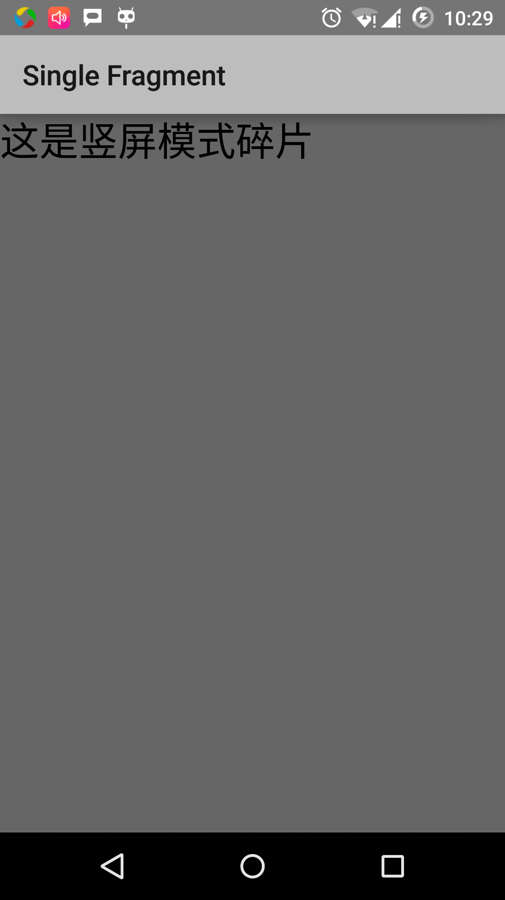

按照下列操作来改变模拟器屏幕的方向模式：

- fn+control+F11 在mac上改变横屏为竖屏，反之亦然
- ctrl+F11 在windows上
- ctrl+F11 在Linux上

当你修改模式，你将看到适用于横屏模式的页面实现：

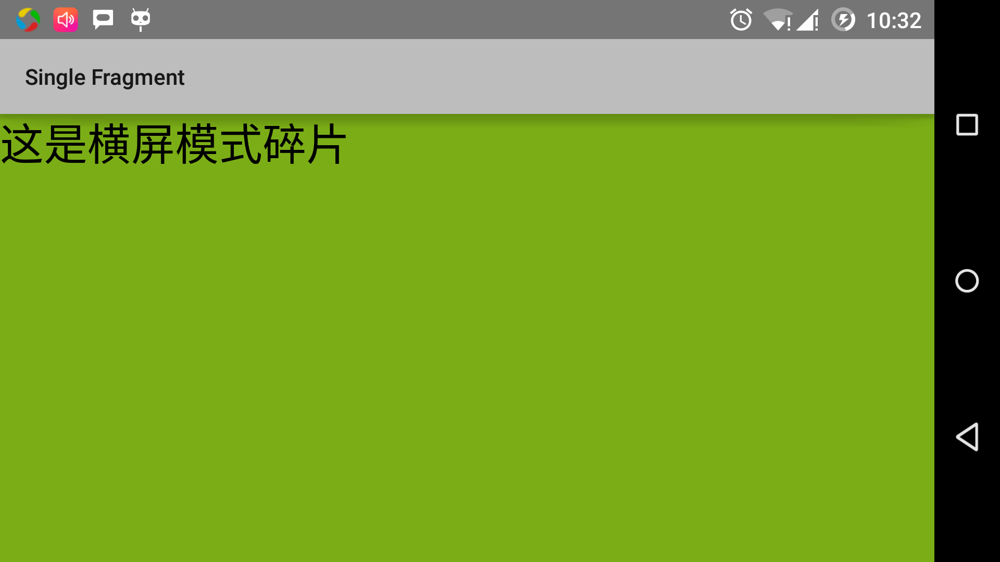

通过这种方法，你可以在同一个活动中通过使用不用的碎片来实现不同的界面。可以按照你的需求使用不同类型的界面组件来构建界面。

#### 9.4.2 Android 列表碎片

列表碎片的基本实现是用来在碎片中创建项目列表

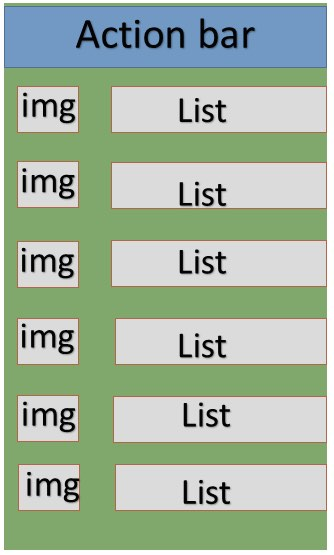

##### 9.4.2.1 实例

这个实例解释如何基于 ArrayAdapter 来创建列表碎片。让我们按照下面的步骤开始：

| 步骤 | 描述                                                         |
| :--- | :----------------------------------------------------------- |
| 1    | 使用 Android Studio 创建 Android 应用程序，命名为 List Fragment，包名为 cn.uprogrammer.listfragment |
| 2    | 修改字符串文件，在 res/values/string.xml 中添加新的字符串常量 |
| 3    | 在 res/layout 下创建名为 list_fragment.xml 的布局文件来定义列表碎片，并在 activity_main.xml 中添加 标签 |
| 4    | 创建 MyListFragment.java 文件，其中包含 onCreateView(), onActivityCreated() 和 OnItemClickListener()。 |
| 5    | 启动Android模拟器来运行应用程序，并验证应用程序所做改变的结果。 |

在开始编码前，在 res/values 目录下的 string.xml 中初始化字符串常量。

```xml
<?xml version="1.0" encoding="utf-8"?>
<resources>
    <string name="app_name">listfragment</string>
    <string name="action_settings">Settings</string>
    <string name="hello_world">Hello world!</string>
    <string name="title_activity_main">List Fragment Demo</string>
    <string name="imgdesc">imgdesc</string>

    <string-array name="Planets">
        <item>Sun</item>
        <item>Mercury</item>
        <item>Venus</item>
        <item>Earth</item>
        <item>Mars</item>
        <item>Jupiter</item>
        <item>Saturn</item>
        <item>Uranus</item>
        <item>Neptune</item>
    </string-array>

</resources>
```

以下是 res/layout/activity_main.xml 文件的内容，其中包含线性布局和碎片标签。

```xml
<?xml version="1.0" encoding="utf-8"?>
<LinearLayout
    xmlns:android="http://schemas.android.com/apk/res/android"
    android:layout_width="match_parent"
    android:layout_height="match_parent"
    android:orientation="vertical" >

    <fragment
        android:id="@+id/fragment1"
        android:name="cn.uprogrammer.listfragment.MyListFragment"
        android:layout_width="match_parent"
        android:layout_height="match_parent" />

</LinearLayout>
```

以下是 res/layout/list_fragment.xml 文件的内容，其中包含线性布局，列表视图 和 TextView。

```xml
<?xml version="1.0" encoding="utf-8"?>
<LinearLayout
    xmlns:android="http://schemas.android.com/apk/res/android"
    android:layout_width="match_parent"
    android:layout_height="match_parent"
    android:orientation="vertical" >

    <ListView
        android:id="@android:id/list"
        android:layout_width="match_parent"
        android:layout_height="wrap_content" >
    </ListView>

    <TextView
        android:id="@android:id/empty"
        android:layout_width="match_parent"
        android:layout_height="wrap_content" >
    </TextView>

</LinearLayout>
```

以下是 src/cn.uprogrammer.listfragment/MyListFragment.java 文件的内容。在开始编码之前，需要按照如下的几个步骤：

- 创建 MyListFragment 类，继承自 ListFragment。
- 在 onCreateView() 方法内，使用上面定义的 list_fragment xml 布局来填充视图。
- 在 onActivityCreated() 方法内， 使用 在 string.xml 中定义的字符串数组 R.array.planet 资源来创建一个 ArrayAdapter，并将适配器设置到列表视图，并设置列表项的点击监听器
- 在 OnItemClickListener() 方法内，以土司消息的方式来显示被点击项的位置

```java
package cn.uprogrammer.listfragment;

import android.app.ListFragment;

import android.annotation.SuppressLint;
import android.app.ListFragment;
import android.os.Bundle;

import android.view.LayoutInflater;
import android.view.View;
import android.view.ViewGroup;

import android.widget.AdapterView;
import android.widget.AdapterView.OnItemClickListener;
import android.widget.ArrayAdapter;
import android.widget.Toast;

public class MyListFragment extends ListFragment implements OnItemClickListener {
    @Override
    public View onCreateView(LayoutInflater inflater, ViewGroup container, Bundle savedInstanceState) {
        View view = inflater.inflate(R.layout.list_fragment, container, false);
        return view;
    }

    @Override
    public void onActivityCreated(Bundle savedInstanceState) {
        super.onActivityCreated(savedInstanceState);
        ArrayAdapter adapter = ArrayAdapter.createFromResource(getActivity(), R.array.Planets, android.R.layout.simple_list_item_1);
        setListAdapter(adapter);
        getListView().setOnItemClickListener(this);
    }

    @Override
    public void onItemClick(AdapterView<?> parent, View view, int position,long id) {
        Toast.makeText(getActivity(), "Item: " + position, Toast.LENGTH_SHORT).show();
    }
}
```

以下代码是 MainActivity.java 的内容：

```java
package cn.uprogrammer.listfragment;

import android.app.Activity;
import android.os.Bundle;

public class MainActivity extends Activity {

    @Override
    protected void onCreate(Bundle savedInstanceState) {
        super.onCreate(savedInstanceState);
        setContentView(R.layout.activity_main);
    }
}
```

以下是 AndroidManifest.xml 文件的内容：

```xml
<?xml version="1.0" encoding="utf-8"?>
<manifest xmlns:android="http://schemas.android.com/apk/res/android"
    package="cn.uprogrammer.listfragment">

    <application
        android:icon="@drawable/ic_launcher"
        android:label="@string/app_name"
        android:theme="@style/AppTheme" >

        <activity
            android:name=".MainActivity"
            android:label="@string/title_activity_main" >

            <intent-filter>
                <action android:name="android.intent.action.MAIN" />
                <category android:name="android.intent.category.LAUNCHER"/>
            </intent-filter>

        </activity>

    </application>
</manifest>
```

让我们运行刚刚修改的 List Fragment 应用程序。我假设你已经在安装环境时创建了AVD。打开你的项目中的活动文件，点击工具栏中的图标来在Android Studio中运行应用程序。Android Studio在AVD上安装应用程序并启动它。如果一切顺利，将在模拟器窗口上显示如下：

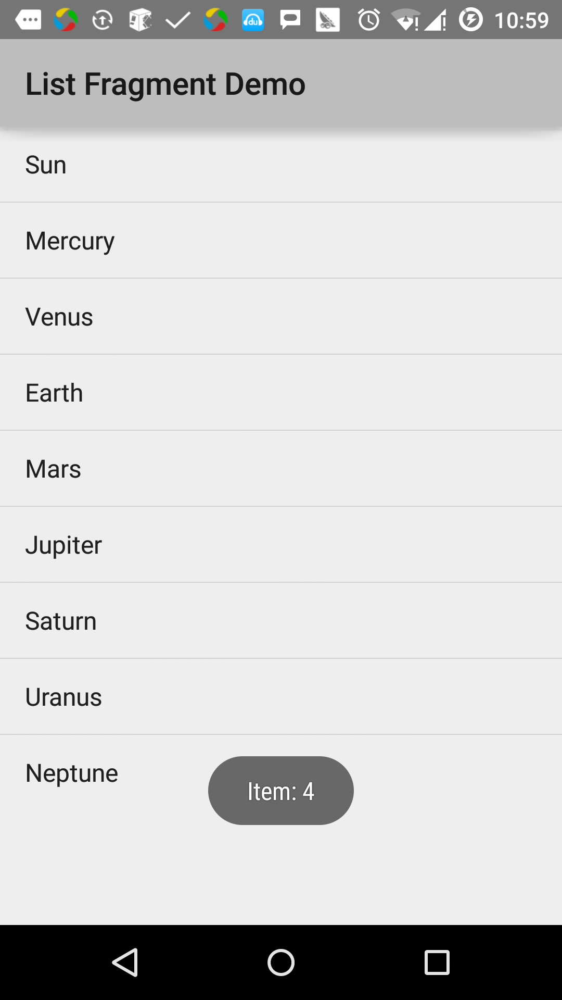

#### 9.4.3 Android 碎片过渡

Lollipop (Android 5.0) 中的活动和碎片过渡建立在一些相对新的 Android 特性上，叫做 过渡。在 KitKat 中引入，过渡框架提供了一系列方便的 API 来在应用程序的不同的 UI 状态间 提供动画。这个框架围绕两个关键概念构建：场景和过渡。场景定义了应用程序 UI 给定的状态，过渡则定义了两个场景间的动画变化。

当一个场景变化，过渡有两个主要职责：

- 捕获开始和结束场景中每个视图的状态
- 创建一个动画绘制者 (Animator)，基于从一个场景到另一个场景需要动画的视图的不同。

##### 9.4.3.1 实例

这个实例解释如何使用碎片过渡来创建自定义的动画。让我们按照下面的步骤开始：

| 步骤 | 描述                                                         |
| :--- | :----------------------------------------------------------- |
| 1    | 使用 Android Studio 来创建 Android 应用程序，命名为 Fragment Custom Animation，包名为 cn.uprogrammer.fragmentcustomanimation. |
| 2    | 修改 res/layout/activity_main.xml 文件，添加一个 TextView    |
| 3    | 在 res/layout/ 下创建 fragment_stack.xml 的布局文件，定义碎片标签和按钮标签 |
| 4    | 在 res/ 下建立子目录 anim，并添加 fragment_slide_left.xml， fragment_slide_left_exit.xml， fragment_slide_right_exit.xml 和 fragment_slide_left_enter.xml |
| 5    | 在 MainActivity.java 中需要添加碎片栈，碎片管理器和 onCreateView() |
| 6    | 启动Android模拟器来运行应用程序，并验证应用程序所做改变的结果。 |

以下是 res/layout/activity_main.xml 文件的内容，其包含帧布局和按钮。

```xml
<?xml version="1.0" encoding="utf-8"?>
<LinearLayout
    xmlns:android="http://schemas.android.com/apk/res/android"
    android:layout_width="match_parent"
    android:layout_height="match_parent"
    android:orientation="vertical" >

    <FrameLayout
        android:id="@+id/fragment1"
        android:layout_width="match_parent"
        android:layout_height="0dp"
        android:layout_weight="1" />

    <Button
        android:id="@+id/new_fragment"
        android:layout_width="wrap_content"
        android:layout_height="wrap_content"
        android:text="添加新碎片" />

</LinearLayout>
```

以下是 res/anim/fragment_stack.xml 文件：

```xml
<?xml version="1.0" encoding="utf-8"?>
<LinearLayout xmlns:android="http://schemas.android.com/apk/res/android"
    android:orientation="vertical" android:layout_width="match_parent"
    android:layout_height="match_parent">
    <TextView
        android:id="@+id/text"
        android:layout_width="match_parent"
        android:layout_height="match_parent"
        android:gravity="center"/>
</LinearLayout>
```

以下是 res/animator/fragment_slide_left_enter.xml 文件的内容，其包含设置方法和动画绘制者对象标签。

```xml
<?xml version="1.0" encoding="utf-8"?>
<set xmlns:android="http://schemas.android.com/apk/res/android">
    <objectAnimator
        android:interpolator="@android:interpolator/decelerate_quint"
        android:valueFrom="100dp" android:valueTo="0dp"
        android:valueType="floatType"
        android:propertyName="translationX"
        android:duration="@android:integer/config_mediumAnimTime" />

    <objectAnimator
        android:interpolator="@android:interpolator/decelerate_quint"
        android:valueFrom="0.0" android:valueTo="1.0"
        android:valueType="floatType"
        android:propertyName="alpha"
        android:duration="@android:integer/config_mediumAnimTime" />
</set>
```

以下是 res/animator/fragment_slide_left_exit.xml 文件的内容，其包含设置方法和动画绘制者对象标签。

```xml
<?xml version="1.0" encoding="utf-8"?>
<set xmlns:android="http://schemas.android.com/apk/res/android">
    <objectAnimator
        android:interpolator="@android:interpolator/decelerate_quint"
        android:valueFrom="0dp" android:valueTo="-100dp"
        android:valueType="floatType"
        android:propertyName="translationX"
        android:duration="@android:integer/config_mediumAnimTime" />

    <objectAnimator
        android:interpolator="@android:interpolator/decelerate_quint"
        android:valueFrom="1.0" android:valueTo="0.0"
        android:valueType="floatType"
        android:propertyName="alpha"
        android:duration="@android:integer/config_mediumAnimTime" />
</set>
```

以下是 res/animator/fragment_slide_right_enter.xml 文件的内容，其包含设置方法和动画绘制者对象标签。

```xml
<?xml version="1.0" encoding="utf-8"?>
<set xmlns:android="http://schemas.android.com/apk/res/android">
    <objectAnimator
        android:interpolator="@android:interpolator/decelerate_quint"
        android:valueFrom="-100dp" android:valueTo="0dp"
        android:valueType="floatType"
        android:propertyName="translationX"
        android:duration="@android:integer/config_mediumAnimTime" />

    <objectAnimator
        android:interpolator="@android:interpolator/decelerate_quint"
        android:valueFrom="0.0" android:valueTo="1.0"
        android:valueType="floatType"
        android:propertyName="alpha"
        android:duration="@android:integer/config_mediumAnimTime" />
</set>
```

以下是 res/animator/fragment_slide_right_exit.xml 文件的内容，其包含设置方法和动画绘制者对象标签。

```xml
<?xml version="1.0" encoding="utf-8"?>
<set xmlns:android="http://schemas.android.com/apk/res/android">
    <objectAnimator
        android:interpolator="@android:interpolator/decelerate_quint"
        android:valueFrom="0dp" android:valueTo="100dp"
        android:valueType="floatType"
        android:propertyName="translationX"
        android:duration="@android:integer/config_mediumAnimTime" />

    <objectAnimator
        android:interpolator="@android:interpolator/decelerate_quint"
        android:valueFrom="1.0" android:valueTo="0.0"
        android:valueType="floatType"
        android:propertyName="alpha"
        android:duration="@android:integer/config_mediumAnimTime" />
</set>
```

以下是 src/cn.uprogrammer.fragmentcustomanimation/MainActivity.java 文件的内容，包含按钮监听器，CountingFragment 和 onCreateView()：

```java
package cn.uprogrammer.fragmentcustomanimation;

import android.app.Activity;
import android.app.Fragment;
import android.app.FragmentTransaction;
import android.os.Bundle;

import android.view.LayoutInflater;
import android.view.View;
import android.view.View.OnClickListener;
import android.view.ViewGroup;

import android.widget.Button;
import android.widget.TextView;

/**
 * 演示在碎片事务中使用自定义动画.
 */
public class MainActivity extends Activity {
    int mStackLevel = 1;

    @Override
    protected void onCreate(Bundle savedInstanceState) {
        super.onCreate(savedInstanceState);
        setContentView(R.layout.activity_main);

        Button button = (Button)findViewById(R.id.new_fragment);

        button.setOnClickListener(new OnClickListener() {
            public void onClick(View v) {
                addFragmentToStack();
            }
        });

        if (savedInstanceState == null) {
            // 添加初始碎片
            Fragment newFragment = CountingFragment.newInstance(mStackLevel);
            FragmentTransaction ft = getFragmentManager().beginTransaction();
            ft.add(R.id.fragment1, newFragment).commit();
        }
        else
        {
            mStackLevel = savedInstanceState.getInt("level");
        }
    }

    @Override
    public void onSaveInstanceState(Bundle outState) {
        super.onSaveInstanceState(outState);
        outState.putInt("level", mStackLevel);
    }

    void addFragmentToStack() {
        mStackLevel++;

        // 实例化新的碎片
        Fragment newFragment = CountingFragment.newInstance(mStackLevel);

        // 添加碎片到活动，并将其放入后退栈中
        FragmentTransaction ft = getFragmentManager().beginTransaction();
        ft.setCustomAnimations(R.animator.fragment_slide_left_enter,
                R.animator.fragment_slide_left_exit,
                R.animator.fragment_slide_right_enter,
                R.animator.fragment_slide_right_exit);
        ft.replace(R.id.fragment1, newFragment);
        ft.addToBackStack(null);
        ft.commit();
    }

    public static class CountingFragment extends Fragment {
        int mNum;
        /**
         * 创建CountingFragment的实例，提供"num"作为参数
         */
        static CountingFragment newInstance(int num) {
            CountingFragment f = new CountingFragment();

            Bundle args = new Bundle();
            args.putInt("num", num);
            f.setArguments(args);
            return f;
        }

        /**
         * 在创建时，获取实例的number参数.
         */
        @Override
        public void onCreate(Bundle savedInstanceState) {
            super.onCreate(savedInstanceState);
            mNum = getArguments() != null ? getArguments().getInt("num") : 1;
        }
        /**
         * 碎片的界面仅包含一个TextView，用于显示number
         */
        @Override
        public View onCreateView(LayoutInflater inflater, ViewGroup container,Bundle savedInstanceState) {
            View v = inflater.inflate(R.layout.fragment_stack, container, false);
            View tv = v.findViewById(R.id.text);
            ((TextView)tv).setText("Fragment #" + mNum);
            tv.setBackgroundDrawable(getResources().getDrawable(android.R.drawable.gallery_thumb));
            return v;
        }
    }
}
```

以下是 AndroidManifest.xml 文件的内容：

```xml
<?xml version="1.0" encoding="utf-8"?>
<manifest xmlns:android="http://schemas.android.com/apk/res/android"
    package="cn.uprogrammer.fragmentcustomanimation"
    android:versionCode="1"
    android:versionName="1.0" >

    <application
        android:allowBackup="true"
        android:icon="@drawable/ic_launcher"
        android:label="@string/app_name"
        android:theme="@style/AppTheme" >

        <activity
            android:name=".MainActivity"
            android:label="@string/app_name" >

            <intent-filter>
                <action android:name="android.intent.action.MAIN" />
                <category android:name="android.intent.category.LAUNCHER" />
            </intent-filter>

        </activity>

    </application>
</manifest>
```

让我们运行刚刚修改的 Fragment Custom Animation 应用程序。我假设你已经在安装环境时创建了 AVD。打开你的项目中的活动文件，点击工具栏中的图标来在 Android Studio 中运行应用程序。Android Studio 在 AVD 上安装应用程序并启动它。如果一切顺利，将在模拟器窗口上显示如下：

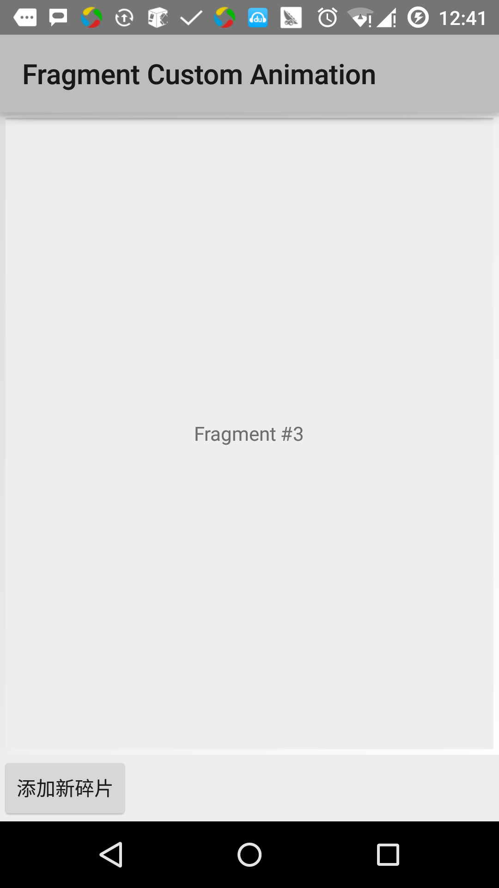

## 10. Android 意图(Intent)和过滤器(Filter)

### 10.1 概述

Android意图是一个要执行的操作的抽象描述。它可以通过 startActivity 来启动一个活动，broadcastIntent 来发送广播到任何对它感兴趣的广播接受器组件，startService(Intent) 或者bindService(Intent， ServiceConnection, int) 来与后台服务通讯。

意图本身（一个 Intent 对象）是一个被动的数据结构，保存着要执行操作的抽象描述。

例如，你有一个活动，需要打开邮件客户端并通过 Android 设备来发送邮件。为了这个目的，你的活动需要发送一个带有合适选择器的 ACTION_SEND 到 Android 意图处理者。指定的选择器给定合适的界面来让用户决定如何发送他的邮件数据。

```java
Intent email = new Intent(Intent.ACTION_SEND, Uri.parse("mailto:"));
email.putExtra(Intent.EXTRA_EMAIL, recipients);
email.putExtra(Intent.EXTRA_SUBJECT, subject.getText().toString());
email.putExtra(Intent.EXTRA_TEXT, body.getText().toString());
startActivity(Intent.createChooser(email, "Choose an email client from..."));
```

上面的语法调用 startActivity 方法来开启邮件活动，代码运行结果看起来像这样：

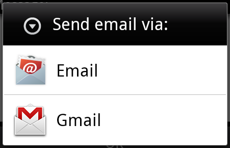

例如，你有一个活动，需要在 Android 设备上通过浏览器打开一个URL。为了这个目的，你的活动发送 ACTION_WEB_SEARCH 意图到 Android 意图处理器来在浏览器中打开给定的 URL 。意图处理器通过解析一系列活动，并选择最适合你的意图的一个活动，在这个例子中，是 Web 浏览器活动。意图处理器传递你的网页地址到 Web 浏览器，并打开 Web 浏览器活动。

```java
String q = "https://www.runoob.com";
Intent intent = new Intent(Intent.ACTION_WEB_SEARCH );
intent.putExtra(SearchManager.QUERY, q);
startActivity(intent);
```

上面的例子将在Android搜索引擎上查找"www.runoob.com"，并在一个活动上给出关键词的结果。

对于每一个组件-活动，服务，广播接收器都有独立的机制来传递意图。

| 序号 | 方法和描述                                                   |
| :--- | :----------------------------------------------------------- |
| 1    | Context.startActivity():意图传递给该方法，用于启动一个新的活动或者让已存在的活动做一些新的事情。 |
| 2    | Context.startService():意图传递给该方法，将初始化一个服务，或者新的信息到一个持续存在的服务。 |
| 3    | Context.sendBroadcast():意图传递给该方法，信息将传递到所有对此感兴趣的广播接收器。 |

### 10.2 意图对象

意图对象是一包的信息，用于组件接收到的意图就像 Android 系统接受到的信息。

意图对象包括如下的组件，具体取决于要通信或者执行什么。

#### 10.2.1 动作(Action)

这是意图对象中必须的部分，被表现为一个字符串。在广播的意图中，动作一旦发生，将会被报告。动作将很大程度上决定意图的其他部分如何被组织。Intent 类定义了一系列动作常量对应不同的意图。这里是一份[Android意图标准动作 ](https://m.runoob.com/android/android-intents-filters.html)列表。

意图对象中的动作可以通过 setAction() 方法来设置，通过 getAction() 方法来读取。

#### 10.2.2 数据(Data)

添加数据规格到意图过滤器。这个规格可以只是一个数据类型(如元类型属性)，一条 URI ，或者同时包括数据类型和 URI 。 URI 则由不同部分的属性来指定。

这些指定 URL 格式的属性是可选的，但是也相互独立 -

- 如果意图过滤器没有指定模式，所有其他的 URI 属性将被忽略。
- 如果没有为过滤器指定主机，端口属性和所有路径属性将被忽略。

setData() 方法只能以 URI 来指定数据，setType() 只能以元类型指定数据，setDataAndType() 可以同时指定 URI 和元类型。URI 通过 getData() 读取，类型通过 getType() 读取。

以下是动作/数据组的一些实例 -

| 序号 | 动作/数据组和描述                                            |
| :--- | :----------------------------------------------------------- |
| 1    | ACTION_VIEW content://contacts/people/1：显示ID为1的用户的信息。 |
| 2    | ACTION_DIAL content://contacts/people/1：显示电话拨号器，并填充用户1的数据。 |
| 3    | ACTION_VIEW tel:123：显示电话拨号器，并填充给定的号码。      |
| 4    | ACTION_DIAL tel:123：显示电话拨号器，并填充给定的号码。      |
| 5    | ACTION_EDIT content://contacts/people/1：编辑ID为1的用户信息。 |
| 6    | ACTION_VIEW content://contacts/people/：显示用户列表，以便查看。 |
| 7    | ACTION_SET_WALLPAPER：显示选择壁纸设置。                     |
| 8    | ACTION_SYNC：同步数据，默认的值为：android.intent.action.SYNC |
| 9    | ACTION_SYSTEM_TUTORIAL：开启平台定义的教程（默认教程或者启动教程） |
| 10   | ACTION_TIMEZONE_CHANGED：当时区被改变时通知                  |
| 11   | ACTION_UNINSTALL_PACKAGE：运行默认的卸载器                   |

##### 10.2.2.1 类别

类别是意图中可选的部分，是一个字符串，包含该类型组件需要处理的意图的附加信息。addCategory() 方法为意图对象添加类别，removeCategory() 方法删除之前添加的类别，getCategories() 获取所有被设置到意图对象中的类别。这里是[Android意图标准类别](https://m.runoob.com/android/android-intents-filters.html)列表。

可以查看下面章节中的意图过滤器来了解我们如何使用类别来通过对应的意图选择合适的活动。

##### 10.2.2.2 附加数据

这是传递给需要处理意图的组件的以键值对描述的附加信息。通过 putExtras() 方法设置，getExtras() 方法读取。这里是[Android意图标准附加数据](https://m.runoob.com/android/android-intents-filters.html)列表。

##### 10.2.2.3 标记

这些标记是意图的可选部分，说明Android系统如何来启动活动，启动后如何处理等。

| 序号 | 标记和说明                                                   |
| :--- | :----------------------------------------------------------- |
| 1    | FLAG_ACTIVITY_CLEAR_TASK :如果在意图中设置，并通过 Context.startActivity 传递，这个标记将导致与该活动相关联的所有已存在的任务在活动启动前被清空。活动将成为一个空任务的根，所有旧的活动被结束。该标记可以与 FLAG_ACTIVITY_NEW_TASK 结合使用。 |
| 2    | FLAG_ACTIVITY_CLEAR_TOP :如果设置该标记，活动将在当前运行的任务中被启动。这并不会启动一个新的活动实例，所有的在它之上的活动被关闭，这个意图作为一个新的意图被传递到已有的（目前在顶部的）活动。 |
| 3    | FLAG_ACTIVITY_NEW_TASK :这个标记一般用于使得活动用于"启动器"风格的行为：为用户提供一个可以独立完成运行的数据，并启动完整儿独立的活动。 |

##### 10.2.2.4 组件名称

组件名称对象是一个可选的域，代表活动、服务或者广播接收器类。如果设置，则意图对象被传递到实现设计好的类的实例，否则，Android 使用其他意图中的其他信息来定位一个合适的目标。组件名称通过 setComponent()，setClass()或者 setClassName() 来设置，通过 getComponent() 获取。

##### 10.2.2.5 意图的类型

Android 支持两种类型的意图。


###### 10.2.2.5.1 显式意图

显式意图用于连接应用程序的内部世界，假设你需要连接一个活动到另外一个活动，我们可以通过显示意图，下图显示通过点击按钮连接第一个活动到第二个活动。

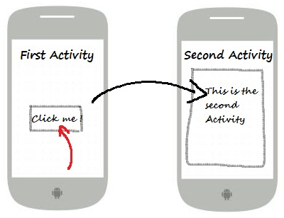

这些意图通过名称指定目标组件，一般用于应用程序内部信息 - 比如一个活动启动一个下属活动或者启动一个兄弟活动。举个例子：

```java
// 通过指定类名的显式意图
Intent i = new Intent(FirstActivity.this, SecondAcitivity.class);

// 启动目标活动
startActivity(i);
```

###### 10.2.2.5.2 隐式意图

这些意图没有为目标命名，组件名称的域为空。隐式意图经常用于激活其他应用程序的组件。举个例子：

```java
Intent read1=new Intent();
read1.setAction(android.content.Intent.ACTION_VIEW);
read1.setData(ContactsContract.Contacts.CONTENT_URI);
startActivity(read1);
```

上面的代码将给出如下结果：

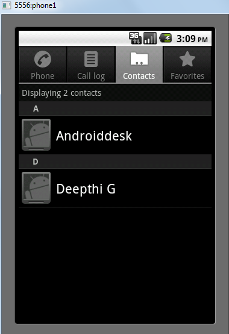

目标组件接收到意图，可以使用getExtras()方法来获取由源组件发送的附加数据。例如：

```java
// 在代码中的合适位置获取包对象
Bundle extras = getIntent().getExtras();

// 通过键解压数据
String value1 = extras.getString("Key1");
String value2 = extras.getString("Key2");
```

###### 10.2.2.5.3 实例

下面的实例演示使用 Android 意图来启动各种 Android 内置应用程序的功能。

| 步骤 | 描述                                                         |
| :--- | :----------------------------------------------------------- |
| 1    | 使用 Android Studio IDE 创建 Android 应用程序，并命名为Intent filter，包名为 com.runoob.intentfilter。当创建项目时，确保目标 SDK 和用最新版本的 Android SDK 进行编译使用高级的API。 |
| 2    | 修改src/com.runoob.intentfilter/MainActivity.java文件，并添加代码定义两个监听器来对应两个按钮"启动浏览器"和"启动电话" |
| 3    | 修改res/layout/activity_main.xml布局文件，在线性布局中添加3个按钮。 |
| 4    | 启动Android模拟器来运行应用程序，并验证应用程序所做改变的结果。 |

以下是src/com.runoob.intentfilter/MainActivity.java文件的内容：

```java
package com.runoob.intentfilter;

import android.content.Intent;
import android.net.Uri;
import android.support.v7.app.ActionBarActivity;
import android.os.Bundle;
import android.view.Menu;
import android.view.MenuItem;
import android.view.View;
import android.widget.Button;


public class MainActivity extends ActionBarActivity {
    Button b1,b2;

    @Override
    protected void onCreate(Bundle savedInstanceState) {
        super.onCreate(savedInstanceState);
        setContentView(R.layout.activity_main);

        b1=(Button)findViewById(R.id.button);
        b1.setOnClickListener(new View.OnClickListener() {

            @Override
            public void onClick(View v) {
                Intent i = new Intent(android.content.Intent.ACTION_VIEW, Uri.parse("https://www.runoob.com"));
                startActivity(i);
            }
        });

        b2=(Button)findViewById(R.id.button2);
        b2.setOnClickListener(new View.OnClickListener() {
            @Override
            public void onClick(View v) {
                Intent i = new Intent(android.content.Intent.ACTION_VIEW,Uri.parse("tel:9510300000"));
                startActivity(i);
            }
        });
    }

    @Override
    public boolean onCreateOptionsMenu(Menu menu) {
        getMenuInflater().inflate(R.menu.menu_main, menu);
        return true;
    }

    @Override
    public boolean onOptionsItemSelected(MenuItem item) {
        // Handle action bar item clicks here. The action bar will
        // automatically handle clicks on the Home/Up button, so long
        // as you specify a parent activity in AndroidManifest.xml.

        int id = item.getItemId();

        //noinspection SimplifiableIfStatement
        if (id == R.id.action_settings) {
            return true;
        }
        return super.onOptionsItemSelected(item);
    }
}
```

下面是res/layout/activity_main.xml文件的内容：

```xml
<RelativeLayout xmlns:android="http://schemas.android.com/apk/res/android"
    xmlns:tools="http://schemas.android.com/tools"
    android:layout_width="match_parent"
    android:layout_height="match_parent"
    android:paddingLeft="@dimen/activity_horizontal_margin"
    android:paddingRight="@dimen/activity_horizontal_margin"
    android:paddingTop="@dimen/activity_vertical_margin"
    android:paddingBottom="@dimen/activity_vertical_margin"
    tools:context=".MainActivity">

    <TextView
        android:id="@+id/textView1"
        android:layout_width="wrap_content"
        android:layout_height="wrap_content"
        android:text="意图实例"
        android:layout_alignParentTop="true"
        android:layout_centerHorizontal="true"
        android:textSize="30dp" />

    <TextView
        android:id="@+id/textView2"
        android:layout_width="wrap_content"
        android:layout_height="wrap_content"
        android:text="www.runoob.com"
        android:textColor="#ff87ff09"
        android:textSize="30dp"
        android:layout_below="@+id/textView1"
        android:layout_centerHorizontal="true" />

    <ImageButton
        android:layout_width="wrap_content"
        android:layout_height="wrap_content"
        android:id="@+id/imageButton"
        android:src="@drawable/ic_launcher"
        android:layout_below="@+id/textView2"
        android:layout_centerHorizontal="true" />

    <EditText
        android:layout_width="wrap_content"
        android:layout_height="wrap_content"
        android:id="@+id/editText"
        android:layout_below="@+id/imageButton"
        android:layout_alignRight="@+id/imageButton"
        android:layout_alignEnd="@+id/imageButton" />

    <Button
        android:layout_width="wrap_content"
        android:layout_height="wrap_content"
        android:text="启动浏览器"
        android:id="@+id/button"
        android:layout_alignTop="@+id/editText"
        android:layout_alignRight="@+id/textView1"
        android:layout_alignEnd="@+id/textView1"
        android:layout_alignLeft="@+id/imageButton"
        android:layout_alignStart="@+id/imageButton" />

    <Button
        android:layout_width="wrap_content"
        android:layout_height="wrap_content"
        android:text="启动电话"
        android:id="@+id/button2"
        android:layout_below="@+id/button"
        android:layout_alignLeft="@+id/button"
        android:layout_alignStart="@+id/button"
        android:layout_alignRight="@+id/textView2"
        android:layout_alignEnd="@+id/textView2" />
</RelativeLayout>
```

下面是res/values/strings/xml的内容，定义了两个新的常量。

```xml
<?xml version="1.0" encoding="utf-8"?>
<resources>
   <string name="app_name">Intent filter</string>
   <string name="action_settings">Settings</string>
</resources>
```

下面是默认的AndroidManifest.xml的内容：

```xml
<?xml version="1.0" encoding="utf-8"?>
<manifest xmlns:android="http://schemas.android.com/apk/res/android"
    package="com.runoob.intentfilter"
    android:versionCode="1"
    android:versionName="1.0" >

    <uses-sdk
        android:minSdkVersion="8"
        android:targetSdkVersion="22" />

    <application
        android:allowBackup="true"
        android:icon="@drawable/ic_launcher"
        android:label="@string/app_name"
        android:theme="@style/Base.Theme.AppCompat" >

        <activity
            android:name="com.runoob.intentfilter.MainActivity"
            android:label="@string/app_name" >

            <intent-filter>
                <action android:name="android.intent.action.MAIN" />
                <category android:name="android.intent.category.LAUNCHER" />
            </intent-filter>

        </activity>

    </application>
</manifest>
```

让我们运行刚刚修改的 Intent filter 应用程序。我假设你已经在安装环境时创建了 AVD。打开你的项目中的活动文件，点击工具栏中的图标来在 Android Studio 中运行应用程序。Android Studio 在 AVD 上安装应用程序并启动它。如果一切顺利，将在模拟器窗口上显示如下：

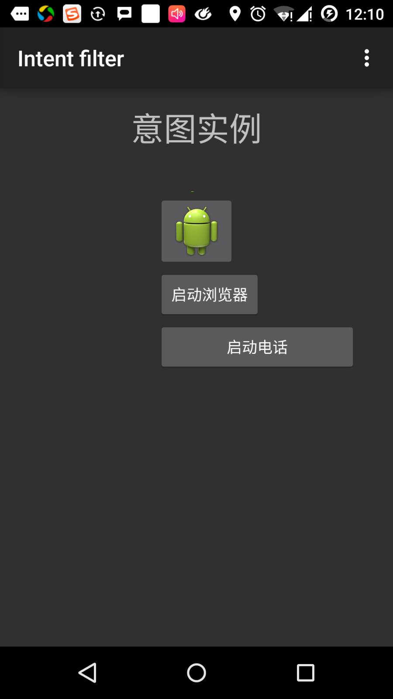

现在点击"启动浏览器"按钮，这将根据配置启动一个浏览器，并且显示https://www.runoob.com如下：

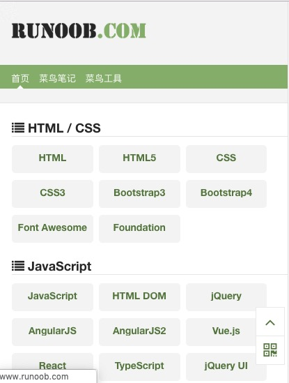

类似的方式，你可以点击"启动电话"按钮来打开电话界面，这将允许你拨打已经给定的电话号码。

###### 10.2.2.5.4 意图过滤器

你已经看到如何使用意图来调用另外的活动。 Android 操作系统使用过滤器来指定一系列活动、服务和广播接收器处理意图，需要借助于意图所指定的动作、类别、数据模式。在 `manifest` 文件中使用 `<intent-filter>` 元素在活动，服务和广播接收器中列出对应的动作，类别和数据类型。

下面的实例展示 AndroidManifest.xml 文件的一部分，指定一个活动 `com.runoob.intentfilter.CustomActivity` 可以通过设置的动作，类别及数据来调用：

```xml
<activity android:name=".CustomActivity"
   android:label="@string/app_name">

   <intent-filter>
      <action android:name="android.intent.action.VIEW" />
      <action android:name="com.example.MyApplication.LAUNCH" />
      <category android:name="android.intent.category.DEFAULT" />
      <data android:scheme="http" />
   </intent-filter>

</activity>
```

当活动被上面的过滤器所定义，其他活动就可以通过下面的方式来调用这个活动。使用  `android.intent.action.VIEW` ，使用  `com.runoob.intentfilter.LAUNCH` 动作，并提供 `android.intent.category.DEFAULT` 类别。

元素指定要被调用的活动所期望的数据类型。上面的实例中，自定义活动期望的数据由"http://"开头。

有这样的情况，通过过滤器，意图将被传递到多个的活动或者服务，用户将被询问启动哪个组件。如果没有找到目标组件，将发生一个异常。

在调用活动之前，有一系列的 Android 检查测试：

- 过滤器  `<intent-filter>`  需要列出一个或者多个的动作，不能为空；过滤器至少包含一个 元素，否则将阻塞所有的意图。如果多个动作被提到，Android 在调用活动前尝试匹配其中提到的一个动作。
- 过滤器  `<intent-filter>`  可能列出 `0个`，`1个` 或者 `多个` 类别。如果没有类别被提到，`Android` 通过这个测试，如果有多个类别被提及，意图通过类型测试，每个意图对象的分类必须匹配过滤器中的一个分类。
- 每个 元素可以指定一个 `URI` 和一个数据类型(元媒体类型)。这里有独立的属性，如 `URI` 中的每个部分：模式，主机，端口和路径。意图包含有 URI 和类型，只有它的类型匹配了过滤器中列出的某个类型，则通过数据类型部分的测试。

###### 10.2.2.5.5 实例

下面的实例是上面实例的一些修改。这里我们将看到如果一个意图调用定义的两个活动，Android 如何来解决冲突；如何使用过滤器来调用自定义活动；如果没有为意图定义合适的活动，则会出现异常。

| 步骤 | 说明                                                         |
| :--- | :----------------------------------------------------------- |
| 1    | 使用Android Studio IDE创建Android应用程序，并命名为Intent filter，包名为com.runoob.intentfilter。当创建项目时，确保目标 SDK 和用最新版本的 Android SDK 进行编译使用高级的API。 |
| 2    | 修改 src/com.runoob.intentfilter/MainActivity.java 文件，添加代码来定义三个监听器来对应布局文件中定义的三个按钮。 |
| 3    | 添加 src/com.runoob.intentfilter/CustomActivity.java 文件来包含一个活动，可以被不同的意图调用。 |
| 4    | 修改 res/layout/activity_main.xml 文件在线性布局中添加三个按钮。 |
| 5    | 添加 res/lauout/custom_view.xml 布局文件，添加简单地 来显示通过 intent 传递的数据。 |
| 6    | 修改 AndroidManifest.xml 文件，添加 <intent-filter> 定义意图的规则来调用自定义活动。 |
| 7    | 启动 Android 模拟器来运行应用程序，并验证应用程序所做改变的结果。 |

以下是src/com.runoob.intentfilter/MainActivity.java的内容：

```java
package com.runoob.intentfilter;

import android.content.Intent;
import android.net.Uri;
import android.support.v7.app.ActionBarActivity;
import android.os.Bundle;
import android.view.Menu;
import android.view.MenuItem;
import android.view.View;
import android.widget.Button;


public class MainActivity extends ActionBarActivity {
    Button b1,b2,b3;

    @Override
    protected void onCreate(Bundle savedInstanceState) {
        super.onCreate(savedInstanceState);
        setContentView(R.layout.activity_main);
        b1=(Button)findViewById(R.id.button);

        b1.setOnClickListener(new View.OnClickListener() {

            @Override
            public void onClick(View v) {
                Intent i = new Intent(android.content.Intent.ACTION_VIEW,Uri.parse("https://www.runoob.com"));
                startActivity(i);
            }
        });

        b2=(Button)findViewById(R.id.button2);
        b2.setOnClickListener(new View.OnClickListener() {

            @Override
            public void onClick(View v) {
                Intent i = new Intent("com.runoob.intentfilter.LAUNCH",Uri.parse("https://www.runoob.com"));
                startActivity(i);
            }
        });

        b3=(Button)findViewById(R.id.button3);
        b3.setOnClickListener(new View.OnClickListener() {

            @Override
            public void onClick(View v) {
                Intent i = new Intent("com.runoob.intentfilter.LAUNCH",Uri.parse("https://www.runoob.com"));
                startActivity(i);
            }
        });
    }

    @Override
    public boolean onCreateOptionsMenu(Menu menu) {
        // Inflate the menu; this adds items to the action bar if it is present.
        getMenuInflater().inflate(R.menu.menu_main, menu);
        return true;
    }

    @Override
    public boolean onOptionsItemSelected(MenuItem item) {
        // Handle action bar item clicks here. The action bar will
        // automatically handle clicks on the Home/Up button, so long
        // as you specify a parent activity in AndroidManifest.xml.

        int id = item.getItemId();

        //noinspection SimplifiableIfStatement
        if (id == R.id.action_settings) {
            return true;
        }
        return super.onOptionsItemSelected(item);
    }
}
```

下面是src/com.runoob.intentfilter/CustomActivity.java的内容：

```java
package com.runoob.intentfilter;

import android.app.Activity;
        import android.net.Uri;
        import android.os.Bundle;
        import android.widget.TextView;

public class CustomActivity extends Activity {
    @Override
    public void onCreate(Bundle savedInstanceState) {
        super.onCreate(savedInstanceState);
        setContentView(R.layout.custom_view);
        TextView label = (TextView) findViewById(R.id.show_data);
        Uri url = getIntent().getData();
        label.setText(url.toString());
    }
}
```

下面是res/layout/activity_main.xml 的内容：

```xml
<RelativeLayout xmlns:android="http://schemas.android.com/apk/res/android"
    xmlns:tools="http://schemas.android.com/tools"
    android:layout_width="match_parent"
    android:layout_height="match_parent"
    android:paddingLeft="@dimen/activity_horizontal_margin"
    android:paddingRight="@dimen/activity_horizontal_margin"
    android:paddingTop="@dimen/activity_vertical_margin"
    android:paddingBottom="@dimen/activity_vertical_margin"
    tools:context=".MainActivity">

    <TextView
        android:id="@+id/textView1"
        android:layout_width="wrap_content"
        android:layout_height="wrap_content"
        android:text="意图实例"
        android:layout_alignParentTop="true"
        android:layout_centerHorizontal="true"
        android:textSize="30dp" />

    <TextView
        android:id="@+id/textView2"
        android:layout_width="wrap_content"
        android:layout_height="wrap_content"
        android:text="www.runoob.com"
        android:textColor="#ff87ff09"
        android:textSize="30dp"
        android:layout_below="@+id/textView1"
        android:layout_centerHorizontal="true" />

    <ImageButton
        android:layout_width="wrap_content"
        android:layout_height="wrap_content"
        android:id="@+id/imageButton"
        android:src="@drawable/ic_launcher"
        android:layout_below="@+id/textView2"
        android:layout_centerHorizontal="true" />

    <EditText
        android:layout_width="wrap_content"
        android:layout_height="wrap_content"
        android:id="@+id/editText"
        android:layout_below="@+id/imageButton"
        android:layout_alignRight="@+id/imageButton"
        android:layout_alignEnd="@+id/imageButton" />

    <Button
        android:layout_width="wrap_content"
        android:layout_height="wrap_content"
        android:text="通过View动作启动浏览器"
        android:id="@+id/button"
        android:layout_alignTop="@+id/editText"
        android:layout_alignRight="@+id/textView1"
        android:layout_alignEnd="@+id/textView1"
        android:layout_alignLeft="@+id/imageButton"
        android:layout_alignStart="@+id/imageButton" />

    <Button
        android:layout_width="wrap_content"
        android:layout_height="wrap_content"
        android:text="通过Launch动作启动浏览器"
        android:id="@+id/button2"
        android:layout_below="@+id/button"
        android:layout_alignLeft="@+id/button"
        android:layout_alignStart="@+id/button"
        android:layout_alignRight="@+id/textView2"
        android:layout_alignEnd="@+id/textView2" />

    <Button
        android:layout_width="wrap_content"
        android:layout_height="wrap_content"
        android:text="异常情况"
        android:id="@+id/button3"
        android:layout_below="@+id/button2"
        android:layout_alignLeft="@+id/button2"
        android:layout_alignStart="@+id/button2"
        android:layout_alignRight="@+id/textView2"
        android:layout_alignEnd="@+id/textView2" />

</RelativeLayout>
```

下面是res/layout/custom_view.xml文件的内容：

```xml
<?xml version="1.0" encoding="utf-8"?>
<LinearLayout xmlns:android="http://schemas.android.com/apk/res/android"
   android:orientation="vertical"
   android:layout_width="fill_parent"
   android:layout_height="fill_parent">

   <TextView android:id="@+id/show_data"
      android:layout_width="fill_parent"
      android:layout_height="400dp"/>

</LinearLayout>
```

下面是res/values/strings.xml文件的内容：

```xml
<?xml version="1.0" encoding="utf-8"?>
<resources>
   <string name="app_name">My Application</string>
   <string name="action_settings">Settings</string>
</resources>
```

下面是AndroidManifest.xml文件的内容：

```xml
<?xml version="1.0" encoding="utf-8"?>
<manifest xmlns:android="http://schemas.android.com/apk/res/android"
    package="com.runoob.intentfilter"
    android:versionCode="1"
    android:versionName="1.0" >

    <uses-sdk
        android:minSdkVersion="8"
        android:targetSdkVersion="22" />

    <application
        android:allowBackup="true"
        android:icon="@drawable/ic_launcher"
        android:label="@string/app_name"
        android:theme="@style/Base.Theme.AppCompat" >

        <activity
            android:name="com.runoob.intentfilter.MainActivity"
            android:label="@string/app_name" >

            <intent-filter>
                <action android:name="android.intent.action.MAIN" />
                <category android:name="android.intent.category.LAUNCHER" />
            </intent-filter>

        </activity>

        <activity android:name="com.runoob.intentfilter.CustomActivity"
            android:label="@string/app_name">

        <intent-filter>
            <action android:name="android.intent.action.VIEW" />
            <action android:name="com.runoob.intentfilter.LAUNCH" />
            <category android:name="android.intent.category.DEFAULT" />
            <data android:scheme="http" />
        </intent-filter>

        </activity>

    </application>
</manifest>
```

让我们运行刚刚修改的 Intent filter 应用程序。我假设你已经在安装环境时创建了 AVD 。打开你的项目中的活动文件，点击工具栏中的图标来在 Android Studio 中运行应用程序。 Android Studio 在 AVD 上安装应用程序并启动它。如果一切顺利，将在模拟器窗口上显示如下：

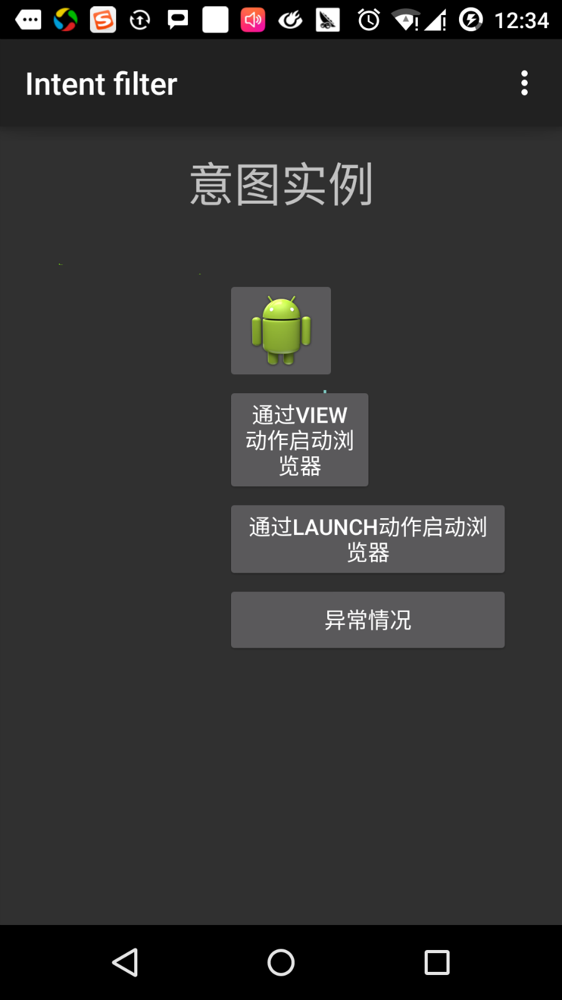

点击第一个按钮"使用View动作启动浏览器"。这里我们定义我们自定义的活动包含"android.intent.action.VIEW"，并且 Android 系统已经定义了默认的活动来对应VIEW动作来启动Web浏览器，因此 Android 显示下面的选项来选择你想要启动的活动：

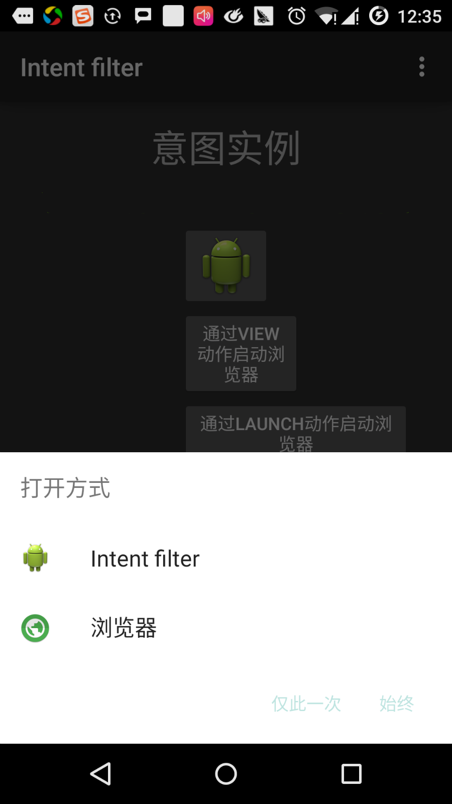

如果你选择浏览器， Android 将启动 Web 浏览器，并打开 www.runoob.com 网站。如果你选择 IntentDemo选项，Android 将启动 CustomActivity，该活动什么都没有做，仅仅是捕获并在TextView中显示传递的数据。

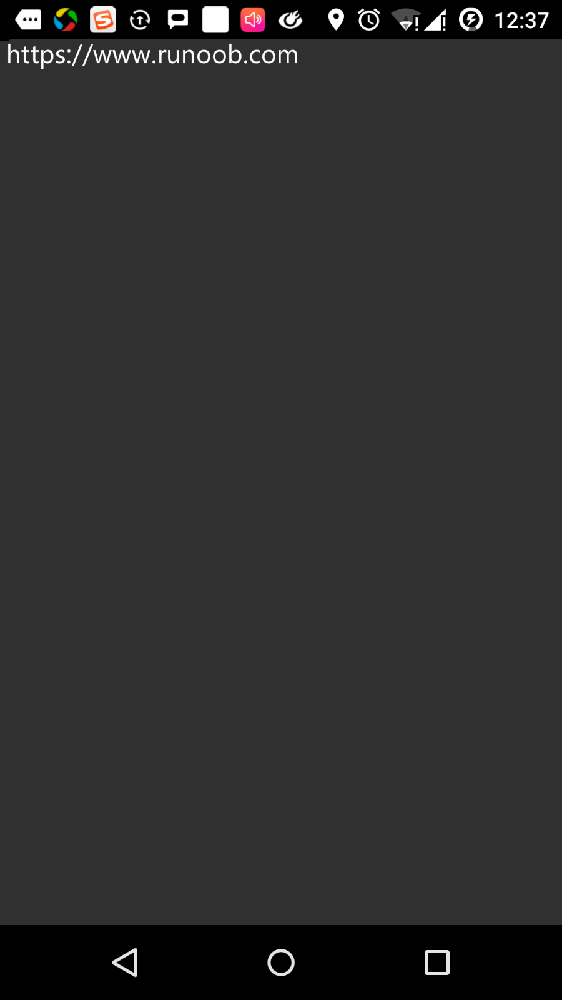

现在，通过返回按钮返回并点击"通过Launch动作启动浏览器"按钮，这里 Android 应用过滤器来选择定义的活动，并简单启动自定义活动。

再次使用返回按钮返回，并点击"异常条件"按钮，这里Android尝试找到一个由意图给定的有效的过滤器，但没有找到一个定义的有效的活动。因为我们使用 https 代替 http 的数据，并给定了正确的动作，一次 Android 产生了一个异常。如下：

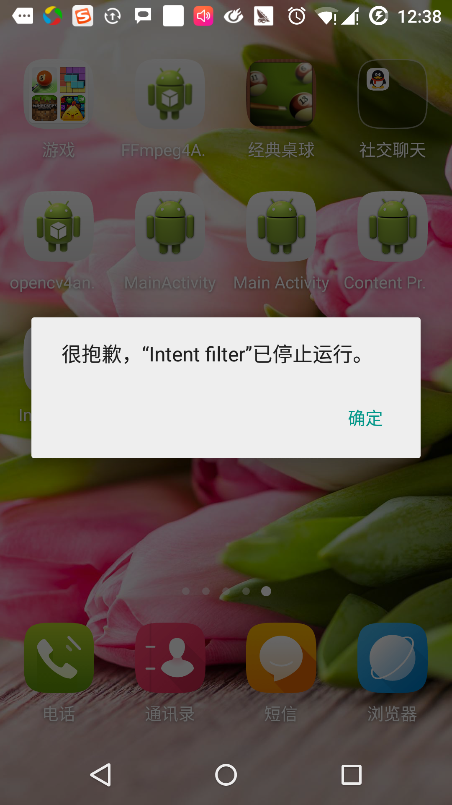
